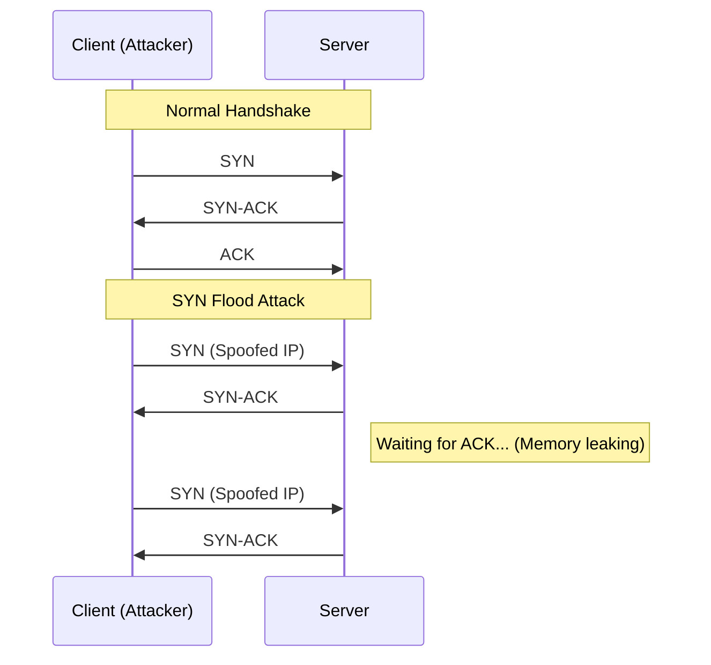

# Networking Fundamentals: The Plumbing of the Internet

## 1. Beginner-friendly Hinglish Explanation 🇮🇳
Bhai, bina "Networking" ke security seekhna aisa hai jaise bina "Pipe" ki samajh ke plumber banna. Internet ek jagah se dusri jagah data "Packets" ke form mein bhejta hai. 

Socho ek chitti (Letter) hai. Uspe "From Address" (IP) aur "To Address" (IP) hota hai. Uske andar "Contents" (Data) hota hai. Aur use kaise bhejna hai (Speed se ya reliability se) woh define karta hai **TCP** (Reliable) ya **UDP** (Fast). Security engineer ke liye, tumhe yeh pata hona chahiye ki chitti raste mein kahan-kahan ja rahi hai (Routing), kaun use beech mein khol sakta hai (Interception), aur kaise hum use lock kar sakte hain (**HTTPS/TLS**).

---

## 2. Deep Technical Explanation
Networking is governed by the **OSI Model** (7 Layers) and the **TCP/IP Model** (4 Layers).
- **Layer 2 (Data Link)**: MAC addresses, ARP.
- **Layer 3 (Network)**: IP addresses, Routing (BGP, OSPF).
- **Layer 4 (Transport)**: TCP (Connection-oriented, 3-way handshake), UDP (Connectionless).
- **Layer 7 (Application)**: HTTP, DNS, SMTP, SSH.

Key protocols for security:
- **DNS**: Translating names to IPs (Vulnerable to poisoning).
- **ARP**: Mapping IPs to MACs (Vulnerable to spoofing).
- **TLS**: Encrypting Layer 7 data.

---

## 3. Attack Flow Diagrams
**TCP 3-Way Handshake & SYN Flood Attack:**

---

## 4. Real-world Attack Examples
- **BGP Hijacking**: An ISP accidentally (or maliciously) tells the internet "I own Google's IP address range," causing all Google traffic to flow through their servers first.
- **DNS Poisoning**: Changing the IP address of `bank.com` in a DNS cache to a hacker's IP, so users land on a fake login page.

---

## 5. Defensive Mitigation Strategies
- **Segmentation**: Using VLANs to separate the "Public Guest Wi-Fi" from the "Internal HR Database."
- **Encryption**: Using TLS 1.3 for everything. Never use plain HTTP, FTP, or Telnet.
- **DDoS Protection**: Using services like Cloudflare to absorb 100Gbps traffic spikes.

---

## 6. Failure Cases
- **Maximum Transmission Unit (MTU) Mismatch**: If packets are too big for a link, they get fragmented or dropped, leading to mysterious "Slow internet" or "Broken connections."
- **DNS Leaks**: Even if you use a VPN, if your DNS queries go to your local ISP, your privacy is compromised.

---

## 7. Debugging and Investigation Guide
- **nmap**: Scanning a server to see which ports (pipes) are open.
- **traceroute**: Seeing every hop a packet takes between you and the target.
- **tcpdump / Wireshark**: Capturing the raw traffic to see exactly what is being sent over the wire.

---

## 8. Tradeoffs
| Protocol | Pros | Cons |
|---|---|---|
| TCP | Reliable (Retries) | Slower (Handshake overhead) |
| UDP | Faster (Real-time) | Unreliable (No retries) |
| IPv6 | Huge address space | Complex routing/security |

---

## 9. Security Best Practices
- **Disable Unused Ports**: If a server only needs to serve web pages, close everything except 80 and 443.
- **Use Static ARP**: To prevent ARP spoofing in critical internal networks.

---

## 10. Production Hardening Techniques
- **BGP RPKI**: Using cryptographic signatures to prove you actually own an IP range.
- **HSTS (HTTP Strict Transport Security)**: Telling the browser "Never try to connect to me via HTTP; only use HTTPS."

---

## 11. Monitoring and Logging Considerations
- **NetFlow / IPFIX**: Logging metadata about connections (Who talked to who for how long) without storing the actual data (saves storage).
- **IDS/IPS Alerts**: Automated systems that block traffic matching "Attack Signatures."

---

## 12. Common Mistakes
- **Trusting the IP Address**: Thinking "If it's from internal IP 192.168.1.10, it must be safe." (IPs can be spoofed).
- **Ignoring IPv6**: Thinking "I only secured my IPv4 network." Hackers can often bypass firewalls via the default IPv6 configuration.

---

## 13. Compliance Implications
- **Data Sovereignty**: Ensuring that data packets don't cross borders that are restricted by laws (e.g., GDPR data staying in the EU).

---

## 14. Interview Questions
1. Explain the TCP 3-way handshake in detail.
2. What is the difference between a Hub, a Switch, and a Router?
3. How does DNS lookup work from a browser to a root server?

---

## 15. Latest 2026 Security Patterns and Threats
- **HTTP/3 (QUIC) Security**: QUIC uses UDP but adds its own encryption. Securing it requires new types of firewalls that understand QUIC's state.
- **Network-as-Code (NaC)**: Defining your entire network security policy in a Git repo (Terraform/Pulumi) to avoid manual configuration errors.
- **Zero-Trust Network Access (ZTNA)**: Moving away from VPNs to "Identity-aware proxies" that verify you for every single app you use.
