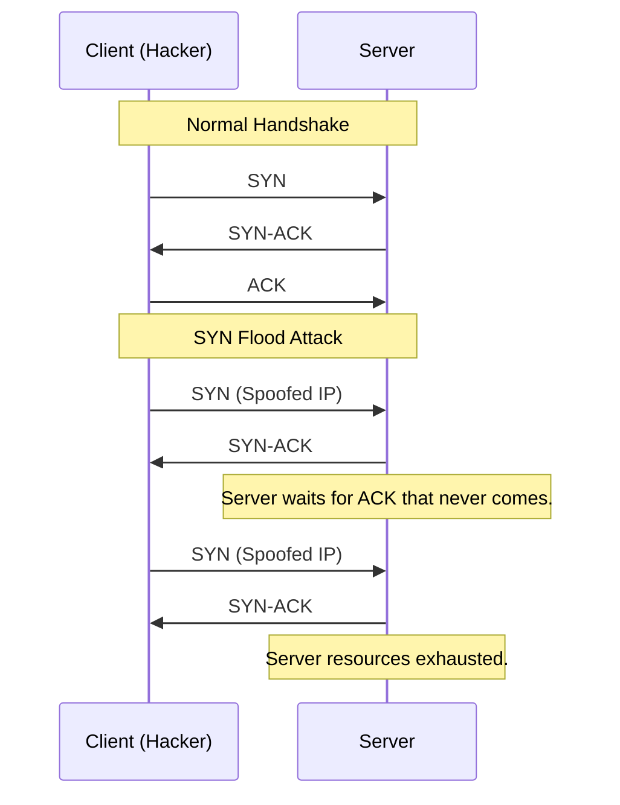

# TCP/IP Deep Dive: The Engine of the Internet

## 1. Beginner-friendly Hinglish Explanation 🇮🇳
Bhai, **TCP/IP** internet ki "Language" hai. 

Socho internet ek bada courier system hai. **IP (Internet Protocol)** ka kaam hai "Address" dhoondna (ghar ka pata). Aur **TCP (Transmission Control Protocol)** ka kaam hai yeh ensure karna ki "Packet" sahi salamat pahuncha hai ya nahi. Agar koi packet kho jaye, toh TCP use dobara bhejta hai. Security mein humein yeh seekhna hai ki kaise hackers TCP ke "Handshake" ko attack karke server ko crash karte hain (SYN Flood).

---

## 2. Deep Technical Explanation
- **TCP (Layer 4)**: Connection-oriented, reliable, used for HTTP, SSH, Email.
    - **3-Way Handshake**: SYN -> SYN-ACK -> ACK.
- **UDP (Layer 4)**: Connectionless, fast, used for DNS, Video Streaming, Gaming.
- **IP (Layer 3)**: Addressing and routing.
    - **IPv4**: 32-bit addresses (e.g., 192.168.1.1).
    - **IPv6**: 128-bit addresses (e.g., 2001:0db8...).
- **ICMP**: Used for diagnostic and error messages (Ping/Traceroute).

---

## 3. Attack Flow Diagrams
**The TCP 3-Way Handshake vs. SYN Flood:**

---

## 4. Real-world Attack Examples
- **Ping of Death**: Sending an oversized ICMP packet that crashes a server. (Modern systems are immune).
- **Smurf Attack**: A DDoS attack where many ICMP Echo Request packets are sent to a broadcast address using the victim's spoofed IP.

---

## 5. Defensive Mitigation Strategies
- **SYN Cookies**: A technique used to resist SYN flood attacks without storing connection state.
- **Rate Limiting**: Restricting the number of packets from a single IP.
- **IPv6 Privacy Extensions**: Changing the temporary IPv6 address to prevent tracking.

---

## 6. Failure Cases
- **MTU Issues**: If packets are too large, they get "Fragmented." Attackers can use "IP Fragmentation" to bypass firewalls.
- **Default TTL**: Hackers can use the Time-To-Live (TTL) value to guess the OS of a remote server (e.g., Linux=64, Windows=128).

---

## 7. Debugging and Investigation Guide
- **`netstat -ano`**: Seeing all active TCP connections.
- **`ss -tlpn`**: Fast alternative to netstat in Linux.
- **`hping3`**: A powerful tool to craft custom TCP/IP packets for testing.

---

## 8. Tradeoffs
| Feature | TCP | UDP |
|---|---|---|
| Reliability | High | Low |
| Speed | Slower | Faster |
| Security Attack Surface | Higher (Handshake) | Lower (Spoofing) |

---

## 9. Security Best Practices
- **Disable Unused Protocols**: If you don't need ICMP, block it at the firewall.
- **Harden the Stack**: Tweaking OS settings to handle more concurrent connections.

---

## 10. Production Hardening Techniques
- **TCP Keepalive**: Detecting "Dead" connections and cleaning them up to save resources.
- **Strict Reverse Path Forwarding (uRPF)**: Checking if a packet's source IP is reachable via the same interface it arrived on (prevents spoofing).

---

## 11. Monitoring and Logging Considerations
- **Connection Spikes**: Monitoring the number of "Half-open" connections (SYN_RECV state).
- **Traffic baselining**: Knowing your normal TCP/UDP ratio.

---

## 12. Common Mistakes
- **Assuming 'UDP is safer'**: While it has no handshake, it's easier to use for "Reflection" DDoS attacks.
- **Ignoring IPv6**: Many security engineers secure IPv4 but leave IPv6 open and unmonitored.

---

## 13. Compliance Implications
- **NIST SP 800-44**: Guidance on securing network infrastructure, including TCP/IP stack hardening.

---

## 14. Interview Questions
1. Explain the TCP 3-Way Handshake.
2. What is 'SYN Cookies' and how does it help against DDoS?
3. What is the difference between IPv4 and IPv6 from a security perspective?

---

## 15. Latest 2026 Security Patterns and Threats
- **AI-Native TCP Fingerprinting**: AI that can identify a specific device based on microscopic differences in how it handles TCP packets.
- **Encrypted Client Hello (ECH)**: A new standard that hides the website name even before the SSL connection is established.
- **Massive IPv6 Scans**: Hackers now have the compute power to scan large parts of the IPv6 address space using AI to predict active IPs.
