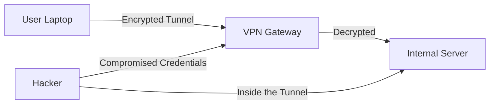

# VPNs & Tunneling: Secret Tunnels in Public Space

## 1. Beginner-friendly Hinglish Explanation 🇮🇳
Bhai, socho tum ek public coffee shop mein baithe ho aur wahan ka Wi-Fi use kar rahe ho. Coffee shop ka malik ya koi dusra hacker tumhara saara data dekh sakta hai. 

**VPN (Virtual Private Network)** wahi "Gupt Rasta" (Secret Tunnel) hai jo tumhare computer aur tumhare office ke server ke beech mein banta hai. Jab tum data bhejte ho, toh woh ek encrypted "Box" mein band hota hai. Coffee shop wale ko sirf woh box dikhega, uske andar kya hai woh nahi dekh sakta. **Tunneling** ka matlab hai ek protocol ke andar dusra protocol chhupana, jaise "Dhoodh ke packet mein sharab bhej dena" (Packet encapsulation).

---

## 2. Deep Technical Explanation
- **VPN Protocols**:
    - **IPsec**: Operates at Layer 3. Very secure, often used for Site-to-Site VPNs.
    - **OpenVPN**: Highly flexible, uses SSL/TLS.
    - **WireGuard**: The modern standard (2026). Extremely fast, uses state-of-the-art cryptography (ChaCha20).
- **Tunneling Mechanics**:
    - **Encapsulation**: Taking a private packet and wrapping it inside a public IP packet.
    - **GRE (Generic Routing Encapsulation)**: A simple tunneling protocol with no encryption (needs IPsec for security).
    - **SSH Tunneling**: Using an SSH connection to "Port Forward" traffic from a local port to a remote server.

---

## 3. Attack Flow Diagrams
**VPN Hijacking / Session Interception:**

---

## 4. Real-world Attack Examples
- **Split Tunneling Attack**: An attacker hacks a user's laptop while it's connected to a VPN. If split tunneling is enabled, the hacker can use the user's laptop as a "Bridge" to jump from the internet into the private office network.
- **VPN Vulnerabilities**: In 2024, many companies were hacked because they used old Pulse Secure or Ivanti VPNs that had "Zero-day" bugs allowing hackers to enter without a password.

---

## 5. Defensive Mitigation Strategies
- **MFA on VPN**: Never allow a VPN connection with just a password. Always require a hardware token or push notification.
- **No Split Tunneling**: Force all traffic (even Google/Facebook) through the VPN so it can be inspected by the company's security tools.

---

## 6. Failure Cases
- **MTU Issues**: Because tunneling adds "Headers" to a packet, the packet becomes too big for some routers, leading to it being dropped. This causes VPNs to "Hang" or disconnect.
- **Dead Peer Detection (DPD)**: If the VPN server thinks the client is dead but they are still trying to talk, the connection gets stuck.

---

## 7. Debugging and Investigation Guide
- **Checking MTU**: Using `ping -f -l 1472 google.com` to find the maximum packet size your network can handle without fragmentation.
- **WireGuard Logs**: Using `wg show` to see if a peer is actually connected and sending data.

---

## 8. Tradeoffs
| Protocol | Speed | Security | Complexity |
|---|---|---|---|
| WireGuard | High | Very High | Low |
| OpenVPN | Medium | High | High |
| IPsec | Medium | High | Very High |

---

## 9. Security Best Practices
- **Certificate-Based Auth**: Use digital certificates instead of passwords for VPN authentication.
- **Perfect Forward Secrecy (PFS)**: Ensure that even if a hacker steals the VPN's master key today, they can't decrypt old traffic from last year.

---

## 10. Production Hardening Techniques
- **Geo-blocking**: If your company only operates in India, block all VPN login attempts from other countries.
- **Client Health Checks**: Only allow the VPN to connect if the user's laptop has its antivirus updated and its firewall turned on.

---

## 11. Monitoring and Logging Considerations
- **Session Duration Monitoring**: Alerts for users who stay logged into the VPN for 72 hours straight (sign of a hijacked session).
- **IP Reputation**: Blocking VPN logins from known "Malicious IPs" or "Tor Exit Nodes."

---

## 12. Common Mistakes
- **Leaking DNS**: Forgetting to route DNS queries through the VPN tunnel, revealing which websites the user is visiting.
- **Using PPTP or L2TP**: These are old protocols with known security holes. Never use them in 2026.

---

## 13. Compliance Implications
- **FIPS 140-2**: Federal compliance requirement that VPNs must use approved cryptographic modules.

---

## 14. Interview Questions
1. How does a VPN protect your data on a public Wi-Fi?
2. What is the difference between Site-to-Site and Remote Access VPN?
3. Explain the concept of "Encapsulation" in tunneling.

---

## 15. Latest 2026 Security Patterns and Threats
- **ZTNA (Zero Trust Network Access)**: Replacing VPNs with "Software Defined Perimeters" (SDP). Instead of giving you a tunnel to the whole network, ZTNA only gives you access to specific apps.
- **Post-Quantum VPNs**: Using algorithms that can't be broken by quantum computers to secure the VPN tunnel.
- **SD-WAN Security**: Managing VPN tunnels across 100s of office locations automatically through a central cloud controller.
