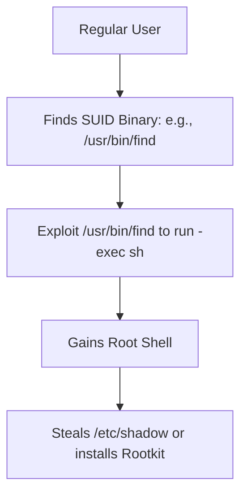

# Linux Security: Hardening the Heart of the Server

## 1. Beginner-friendly Hinglish Explanation 🇮🇳
Bhai, duniya ke 90% servers Linux par chalte hain. Agar tumhe "Linux Security" nahi aati, toh tum adhure Security Engineer ho. 

Linux ek bohot powerful ghar ki tarah hai, lekin agar tumne khidkiyan khuli chhodi (Wrong permissions) ya chabi (Root password) sabko de di, toh koi bhi ghus jayega. Is module mein hum seekhenge ki kaise **Root** account ko restrict karein, **Permissions** (rwx) ko sahi karein, aur **SSH** ko lock karein. Linux security sirf commands ratna nahi hai, balki system ke internal structure (Kernel, Users, Services) ko secure karna hai.

---

## 2. Deep Technical Explanation
Linux security is built on several layers of abstraction:
- **DAC (Discretionary Access Control)**: Standard `rwxrwxrwx` permissions.
- **MAC (Mandatory Access Control)**: Using **SELinux** or **AppArmor** to enforce security policies even if a user is `root`.
- **Capabilities**: Breaking down "Root power" into smaller pieces (e.g., `CAP_NET_BIND_SERVICE` allows a service to bind to port 80 without full root access).
- **Kernel Hardening**: Using `sysctl` to disable IPv6, source routing, and ICMP redirects.
- **Auditd**: A kernel-level auditing system that logs every file access and system call.

---

## 3. Attack Flow Diagrams
**Privilege Escalation via SUID Bit:**

---

## 4. Real-world Attack Examples
- **Dirty COW (CVE-2016-5195)**: A race condition in the Linux kernel's memory subsystem that allowed a local user to gain root access in seconds.
- **Log4Shell on Linux**: While it was a Java bug, the impact on Linux servers was massive as it allowed attackers to run arbitrary shell commands with the permissions of the web server user.

---

## 5. Defensive Mitigation Strategies
- **No Password SSH**: Using SSH keys instead of passwords.
- **Fail2Ban**: Automatically blocking IPs that try to guess your password too many times.
- **Sudo restricted**: Never use `root` directly. Use `sudo` and only allow specific commands in the `/etc/sudoers` file.

---

## 6. Failure Cases
- **Recursive Perms**: Accidentally running `chmod -R 777 /` - This makes your entire system un-securable and likely broken.
- **Zombie Processes**: Exploiting a process that stays in the process table to leak information or hide activity.

---

## 7. Debugging and Investigation Guide
- **ls -l**: Checking who owns a file.
- **ps aux**: Seeing what is running.
- **journalctl -u ssh**: Looking for failed login attempts.
- **lynis**: An automated security auditing tool for Linux.

---

## 8. Tradeoffs
| Metric | SELinux (Enforcing) | SELinux (Disabled) |
|---|---|---|
| Security | Ultra-High | Zero MAC protection |
| Complexity | High (Hard to config) | Easy |
| Performance | Minimal overhead | Max performance |

---

## 9. Security Best Practices
- **Minimize the OS**: Use "Minimal" or "JeOS" installs. Fewer packages = Smaller attack surface.
- **Separate Partitions**: Use different partitions for `/var` and `/tmp` to prevent a "Log flood" from crashing the main system.

---

## 10. Production Hardening Techniques
- **SSH Hardening**: `PermitRootLogin no`, `PasswordAuthentication no`, `Port 2222`.
- **Mount Options**: Mounting `/tmp` and `/var/tmp` with `nosuid` and `noexec` to prevent hackers from running scripts from there.

---

## 11. Monitoring and Logging Considerations
- **Logwatch**: Summarizing your server logs into a daily email.
- **Rsyslog / Forwarding**: Sending logs to a remote server so an attacker can't hide their tracks by deleting local logs.

---

## 12. Common Mistakes
- **Running services as Root**: If your Nginx is running as root and gets hacked, the hacker has root. Always run as `www-data` or `nginx` user.
- **Ignoring Software Updates**: A single `apt update && apt upgrade` can fix 1000 known vulnerabilities.

---

## 13. Compliance Implications
- **NIST 800-53**: Requires specific Linux hardening controls (like session timeouts and banner messages).

---

## 14. Interview Questions
1. What is the difference between a Soft Link and a Hard Link in security?
2. Explain the difference between `chmod` and `chown`.
3. What does the `SUID` bit do, and why is it dangerous?

---

## 15. Latest 2026 Security Patterns and Threats
- **eBPF-based Monitoring**: Using tools like Tetragon (Cilium) to monitor kernel activity in real-time with zero performance hit.
- **Confidential Computing**: Using Enclaves (like Intel SGX) to run code where even the "Root" user cannot see the data in memory.
- **Immutable Linux Distros**: Using OSs like Fedora CoreOS or Talos where the system files are read-only, making it impossible for malware to persist.
