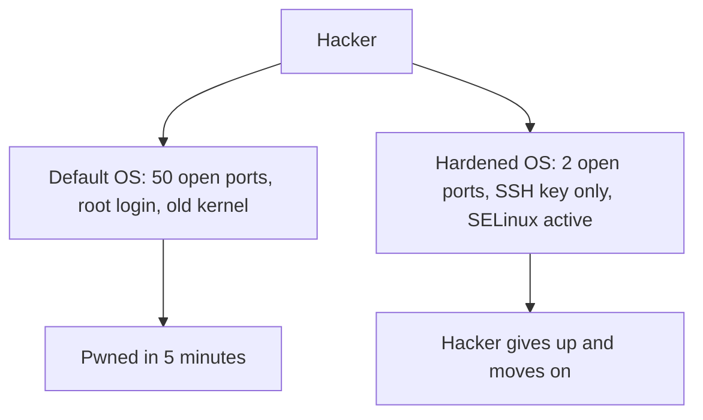

# OS Hardening: Turning a Server into a Fortress

## 1. Beginner-friendly Hinglish Explanation 🇮🇳
Bhai, socho tumne ek naya phone kharida. Usmein bohot saari faltu apps (Bloatware) aati hain aur default settings bohot "Open" hoti hain. Tum kya karte ho? Faltu apps delete karte ho, privacy settings sahi karte ho, aur ek achha lock lagate ho. 

**OS Hardening** wahi process hai servers ke liye. Ek standard Windows ya Linux install security ke liye "Taiyaar" nahi hota. Hum use "Hard" banate hain—faltu services band karke, firewall rules lagake, kernel ko restrict karke, aur access control tight karke. Hardening ka goal hai "Attack Surface" ko chota karna, taaki hacker ko ghusne ke liye koi jagah hi na mile.

---

## 2. Deep Technical Explanation
OS Hardening is a systematic process of reducing vulnerabilities.
- **CIS Benchmarks**: Following industry-standard checklists (Center for Internet Security) for specific OS versions.
- **Service Minimization**: Disabling every service that is not essential (e.g., `avahi-daemon`, `cups`, `rpcbind`).
- **Kernel Hardening**: Tweaking `/etc/sysctl.conf` to prevent IP spoofing, ignore ICMP redirects, and enable ASLR.
- **User Auditing**: Removing default accounts (`guest`, `games`) and enforcing strong password policies.
- **Filesystem Security**: Using `noexec`, `nosuid`, and `nodev` mount options for partitions like `/tmp` and `/dev/shm`.

---

## 3. Attack Flow Diagrams
**Hardening vs. Default Install:**

---

## 4. Real-world Attack Examples
- **Equifax Breach**: Hackers exploited a server that was running an unpatched version of Apache Struts. If the server had been "Hardened" to block outgoing connections from the web server, the hackers couldn't have stolen the data.
- **Mirai Botnet**: Exploited millions of IoT devices that had default hardcoded passwords (`admin/admin`). Proper hardening (changing passwords) would have prevented this global DDoS attack.

---

## 5. Defensive Mitigation Strategies
- **Automated Patching**: Using tools like `unattended-upgrades` (Ubuntu) or Windows Update for Business to fix bugs automatically.
- **Host-Based Intrusion Detection (HIDS)**: Using **Wazuh** or **OSSEC** to monitor system files for unauthorized changes.

---

## 6. Failure Cases
- **Over-Hardening**: Disabling a service that you thought was "Faltu" but was actually needed for a critical app to start (e.g., `dbus`).
- **Manual Hardening**: Hardening one server but forgetting to do the same for the other 99, creating a "Weak Link."

---

## 7. Debugging and Investigation Guide
- **lynis audit system**: A command-line tool that gives your Linux server a "Security Score" and a list of hardening tips.
- **Microsoft Security Compliance Toolkit**: Checking if your Windows server matches the recommended security baselines.

---

## 8. Tradeoffs
| Action | Benefit | Cost |
|---|---|---|
| Disabling GUI | Smaller surface, more RAM | Harder to manage for beginners |
| SELinux Enforcing | Blocks complex attacks | High config time |
| Monthly Patching | Fixes known bugs | Risk of breaking apps |

---

## 9. Security Best Practices
- **Least Privilege**: Services should run as non-privileged users.
- **Banner Messages**: Removing the "OS Version" string from SSH/Web headers so hackers don't know exactly what version you are running.

---

## 10. Production Hardening Techniques
- **SSH Hardening**:
    - `Protocol 2` (only)
    - `PermitRootLogin no`
    - `MaxAuthTries 3`
    - `AllowUsers alice bob`
- **Control Groups (cgroups)**: Limiting the amount of RAM/CPU a single service can use to prevent DoS.

---

## 11. Monitoring and Logging Considerations
- **FIM (File Integrity Monitoring)**: Checking `/etc/passwd` or `/bin/bash` every hour to ensure they haven't been tampered with.
- **Audit Logs**: Recording every `sudo` command ever executed.

---

## 12. Common Mistakes
- **Set and Forget**: Hardening a server once and then never checking it again for 2 years.
- **Trusting the "Internal" Network**: Not hardening internal servers because they aren't "Internet-facing."

---

## 13. Compliance Implications
- **PCI-DSS / HIPAA**: Mandatory requirement to follow a documented hardening standard (like CIS).

---

## 14. Interview Questions
1. Name 3 things you would change to "Harden" a fresh Ubuntu install.
2. What is the purpose of the `nosuid` mount option?
3. How do you find which services are currently listening on your network?

---

## 15. Latest 2026 Security Patterns and Threats
- **Immutable Infrastructure (Infrastructure as Code)**: Using Terraform to build a "Golden Image" that is already hardened and deploying it everywhere.
- **EBPF-based Hardening**: Using the kernel to automatically block any process that tries to "Spawn a shell" from a web server.
- **Attestation**: Using TPM (Trusted Platform Module) chips to "Prove" that the OS hasn't been tampered with during boot (Secure Boot).
