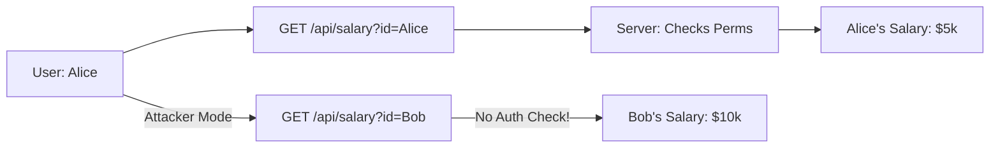

# Permissions & Access Control: The Gatekeepers

## 1. Beginner-friendly Hinglish Explanation 🇮🇳
Bhai, socho tumhare paas ek office hai jismein 50 log kaam karte hain. Kya tum HR ke personal files "Intern" ko dikhaoge? Ya kya koi "Peon" office ke database ko delete kar sakta hai? Nahi na. 

**Permissions aur Access Control** wahi "Rules" hain jo decide karte hain ki kaun kis file ko "Read" kar sakta hai, "Write" (Badal) sakta hai, ya "Execute" (Run) sakta hai. Yeh security ka sabse basic aur sabse zaruri part hai. Agar tumne permissions sahi nahi rakhi, toh ek choti si galti se puri company ka data leak ho sakta hai.

---

## 2. Deep Technical Explanation
Access control models define how subjects (users/processes) interact with objects (files/databases):
- **DAC (Discretionary Access Control)**: The owner of the object decides who gets access (e.g., standard Linux/Windows files).
- **MAC (Mandatory Access Control)**: A central authority/policy decides access (e.g., SELinux labels). Users cannot bypass these rules.
- **RBAC (Role-Based Access Control)**: Permissions are assigned to "Roles" (e.g., Admin, Editor, Viewer), and users are assigned to those roles.
- **ABAC (Attribute-Based Access Control)**: Permissions depend on attributes (e.g., "Allow access if User is in HR AND Time is between 9 AM-5 PM AND Location is Office").

---

## 3. Attack Flow Diagrams
**Insecure Direct Object Reference (IDOR) / Permission Bypass:**

---

## 4. Real-world Attack Examples
- **Bypassing `sudo`**: A hacker finds a script that has `777` permissions and is called by a root cronjob. They edit the script to add their own user to the `sudoers` file.
- **Dropbox Data Exposure**: In the past, some cloud folders were accidentally set to "Public," allowing anyone with the URL to download private company secrets because the DAC was too loose.

---

## 5. Defensive Mitigation Strategies
- **Principle of Least Privilege (PoLP)**: Start with `Deny All`. Only add permissions as requested and justified.
- **Implicit Deny**: If a permission isn't explicitly granted, it must be denied.
- **Two-Person Integrity**: Requiring two different admins to approve a sensitive change (e.g., deleting a production database).

---

## 6. Failure Cases
- **Permission Creep**: A person changes roles inside a company but keeps all their old permissions, eventually becoming a "Super User" without anyone knowing.
- **Broken Access Control**: A website checks if a user is logged in but forgets to check if that user is an *Admin* before showing the admin panel.

---

## 7. Debugging and Investigation Guide
- **Linux**: `ls -la`, `getfacl <file>`.
- **Windows**: `icacls <file>`, checking the "Effective Access" tab in file properties.
- **Cloud**: AWS IAM Policy Simulator to see if a user can actually delete an S3 bucket.

---

## 8. Tradeoffs
| Model | Flexibility | Security | Management Cost |
|---|---|---|---|
| DAC | High | Low | Low |
| RBAC | Medium | High | Medium |
| ABAC | High | Ultra-High | High |

---

## 9. Security Best Practices
- **Never use 777**: There is almost no reason for any file to have `chmod 777`.
- **Use Groups, not Users**: Assign permissions to groups like `developers`, then add people to that group. It's much easier to manage.

---

## 10. Production Hardening Techniques
- **File Integrity Monitoring (FIM)**: Tools like Osquery or Tripwire that alert you the second a critical file's permissions are changed.
- **Immutable Filesystem**: Making the root partition of your OS read-only so no malware can gain write access.

---

## 11. Monitoring and Logging Considerations
- **Log Permission Changes**: Every `chmod`, `chown`, or GPO update should trigger a log entry.
- **Privileged Access Management (PAM)**: Using a system that logs every single keystroke an admin makes during a session.

---

## 12. Common Mistakes
- **Confusing Authentication with Authorization**: Just because I know WHO you are (AuthN), doesn't mean I know what you are ALLOWED to do (AuthZ).
- **Hardcoding IDs**: Using `if (user_id == 1)` for admin checks. If user 1 is deleted or renamed, security breaks.

---

## 13. Compliance Implications
- **Sarbanes-Oxley (SOX)**: Requires strict control over who can access financial records and audit logs of all changes.

---

## 14. Interview Questions
1. What is the difference between RBAC and ABAC?
2. Explain the concept of "Insecure Direct Object Reference" (IDOR).
3. How would you secure a file so that only one specific service can read it?

---

## 15. Latest 2026 Security Patterns and Threats
- **Just-In-Time (JIT) Permissions**: Your developer account has 0 permissions by default. When you need to push code, you request access, it gets auto-approved for 2 hours, and then vanishes.
- **Policy as Code (OPA - Open Policy Agent)**: Writing your access rules in a language like Rego, so they can be tested and version-controlled like software.
- **AI-Based Behavioral Access**: "Alice is logging in from a new city and trying to download 50 files. This is not her normal pattern. Block access until MFA is completed."
