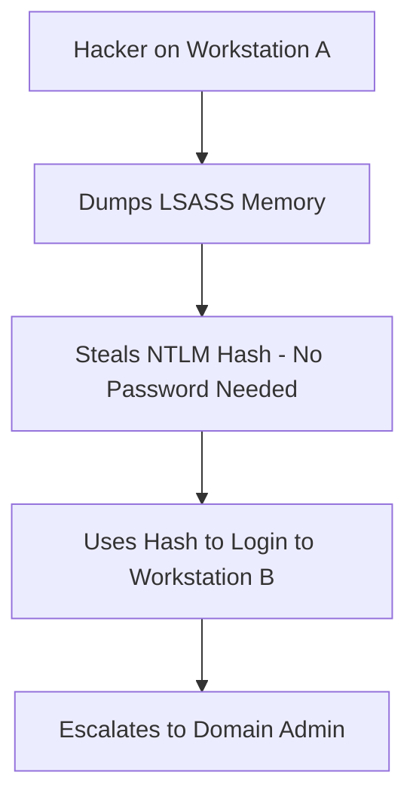

# Windows Security: Defending the Enterprise Desktop and Server

## 1. Beginner-friendly Hinglish Explanation 🇮🇳
Bhai, Windows sabse zyada "Targeted" OS hai kyunki yeh lagbhag har office mein use hota hai. Agar Windows security sahi nahi hai, toh ek "Phishing" email puri company ko khatam kar sakti hai. 

Windows security ka matlab sirf "Antivirus" dalna nahi hai. Ismein **Active Directory** (kaunsa user kya kar sakta hai), **Group Policy** (ek saath 1000 computers ke rules set karna), aur **BitLocker** (data encrypt karna) sab aata hai. Hum seekhenge ki kaise "PowerShell" ka galat use roka jaye aur "Ransomware" se kaise bacha jaye.

---

## 2. Deep Technical Explanation
Windows security is centered around the **Security Reference Monitor (SRM)** and the **LSASS (Local Security Authority Subsystem Service)**.
- **Active Directory (AD)**: Centralized management of users, computers, and permissions.
- **Group Policy Objects (GPO)**: Automated security configurations applied across the domain.
- **AppLocker / Windows Defender Application Control (WDAC)**: Whitelisting which applications are allowed to run.
- **LSASS**: Handles credentials in memory (Primary target for Mimikatz attacks).
- **Windows Defender**: An integrated EDR (Endpoint Detection and Response) platform.

---

## 3. Attack Flow Diagrams
**Pass-the-Hash (PtH) Attack:**

---

## 4. Real-world Attack Examples
- **WannaCry (2017)**: Exploited the `EternalBlue` vulnerability in the SMB protocol to spread ransomware globally, infecting 200,000+ computers in hours.
- **SolarWinds Breach**: Attackers used compromised Windows systems to move laterally through the internal network of government and tech companies.

---

## 5. Defensive Mitigation Strategies
- **Credential Guard**: Uses virtualization-based security to isolate LSASS so hackers can't dump hashes from memory.
- **Privileged Access Workstations (PAW)**: Requiring admins to use a separate, ultra-secure computer for management tasks.
- **BitLocker**: Full-disk encryption so if a laptop is stolen, the data cannot be read.

---

## 6. Failure Cases
- **Legacy Compatibility**: Keeping SMBv1 (vulnerable to WannaCry) enabled because "One old printer needs it."
- **Over-privileged Users**: Making every employee a "Local Admin" so they can install software easily (and hackers can too).

---

## 7. Debugging and Investigation Guide
- **Event Viewer**: Checking `Security` logs for Event ID 4624 (Successful Logon) or 4625 (Failed Logon).
- **PowerShell Transcription**: Enabling logging of every PowerShell command run on every computer to detect malicious scripts.
- **Procmon (Sysinternals)**: Seeing every file and registry change in real-time.

---

## 8. Tradeoffs
| Feature | High Security (GPO) | Flexibility |
|---|---|---|
| User Experience | Hard (Restricted settings) | Easy |
| Admin Overhead | High | Low |
| Security | Very High | Low |

---

## 9. Security Best Practices
- **Disable LLMNR and NBT-NS**: These are old protocols used for name resolution that hackers love to spoof to steal hashes (using Responder).
- **LAPS (Local Administrator Password Solution)**: Automatically giving every computer a unique, complex local admin password that changes every 30 days.

---

## 10. Production Hardening Techniques
- **Server Core**: Running Windows Server without a GUI to reduce the attack surface.
- **Just-In-Time (JIT) Admin Access**: Giving an admin access only for 1 hour when they need to fix something.

---

## 11. Monitoring and Logging Considerations
- **Sysmon**: A powerful extension to standard Windows logs that tracks network connections, process creations, and file changes.
- **Windows Event Forwarding (WEF)**: Sending all logs from 1000s of computers to one central server for analysis.

---

## 12. Common Mistakes
- **Flat Domain Structures**: If one computer is hacked, the whole domain falls. (Use "Tiered Admin Model").
- **Ignoring Windows Updates**: "We'll update next month" is how ransomware wins.

---

## 13. Compliance Implications
- **HIPAA/SOC2**: Requires audit logs of all privileged access and proof of encryption for data-at-rest.

---

## 14. Interview Questions
1. What is the difference between Kerberos and NTLM?
2. Explain how a "Pass-the-Hash" attack works.
3. How does Windows Defender Credential Guard protect against Mimikatz?

---

## 15. Latest 2026 Security Patterns and Threats
- **Hypervisor-Protected Code Integrity (HVCI)**: Using the CPU's virtualization features to ensure that only trusted code can run in the Windows kernel.
- **Modern Phishing (Token Theft)**: Bypassing MFA by stealing the "Session Token" directly from the browser instead of the password.
- **Zero-Trust for Windows (Azure AD / Entra ID)**: Moving away from traditional AD to a purely identity-based, cloud-managed security model.
