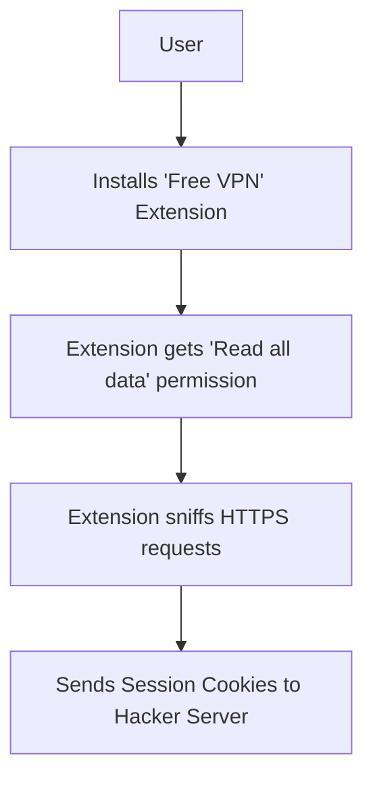

# Browser Security: Hardening the Client-Side

## 1. Beginner-friendly Hinglish Explanation 🇮🇳
Bhai, tumhara "Web Browser" (Chrome, Firefox) sirf ek software nahi hai, woh tumhara "Digital Personal Assistant" hai. Iske paas tumhare passwords hain, history hai, aur tumhara access hai har website par. 

**Browser Security** ka matlab hai browser ko ek "Safe Cage" banana. Browser ko aisi powers di jati hain ki woh `hacker.com` ko `bank.com` ka data na chori karne de (**Same-Origin Policy**). Is module mein hum seekhenge ki kaise modern browsers attacks ko rokte hain, kaise unsafe extensions se bacha jaye, aur kaise "Security Headers" ka use karke browser ko instruction di jaye ki woh "Extra Careful" rahe.

---

## 2. Deep Technical Explanation
The browser is an execution environment for untrusted code. Its security model is based on:
- **Same-Origin Policy (SOP)**: Restricts how a document or script loaded from one origin can interact with a resource from another origin.
- **Sandboxing**: Each tab in a modern browser (like Chrome) runs in a separate, highly restricted process. If one tab crashes or is hacked, it cannot easily access the memory of other tabs or the host OS.
- **Site Isolation**: Ensures that pages from different sites are always put into different processes.
- **Certificate Pinning / HSTS**: Forcing the browser to only accept specific, pre-defined SSL certificates for critical sites.
- **Permissions API**: Controlling which sites can access your Camera, Microphone, Location, etc.

---

## 3. Attack Flow Diagrams
**Browser Exploitation via Malicious Extension:**

---

## 4. Real-world Attack Examples
- **Magecart Attacks**: Hackers inject JS into the browser's context via a 3rd party script (like a chat widget). The script then steals credit card data *inside* the browser as the user types it.
- **The "Great Suspender" Hijack**: A popular Chrome extension was sold to a new owner who added malicious code to track users. Millions of browsers were compromised overnight.

---

## 5. Defensive Mitigation Strategies
- **Subresource Integrity (SRI)**: Verifying that the 3rd party scripts (like jQuery) haven't been tampered with.
- **Content Security Policy (CSP)**: The ultimate browser defense. Prevents unauthorized scripts from running.
- **Anti-Fingerprinting**: Blocking trackers that try to uniquely identify your browser based on screen resolution, fonts, and extensions.

---

## 6. Failure Cases
- **Legacy Browser Versions**: Using an old version of Chrome that has unpatched kernel/sandbox escape vulnerabilities.
- **Permission Fatigue**: Users clicking "Allow" on every notification/permission request without reading them.

---

## 7. Debugging and Investigation Guide
- **chrome://inspect**: Seeing what's happening inside service workers and extensions.
- **chrome://sandbox**: Checking the status of the browser's sandbox on your system.
- **Safe Browsing Status**: Checking if a URL is flagged as malicious by Google's global database.

---

## 8. Tradeoffs
| Feature | Security | Usability |
|---|---|---|
| Aggressive CSP | Blocks all XSS | Breaks many 3rd party ads/widgets |
| No Extensions | Ultra-Safe | Hard to use (No adblock, etc.) |
| Site Isolation | Very High Security | High RAM usage |

---

## 9. Security Best Practices
- **Use "Privacy-First" Browsers**: Like Brave or Firefox with strict settings.
- **Audit your Extensions**: If you haven't used an extension in 3 months, delete it. It's a potential backdoor.
- **Never click "Remember Me" on public computers**.

---

## 10. Production Hardening Techniques
- **Referrer-Policy**: Setting `no-referrer` or `same-origin` to avoid leaking private internal URLs to external sites.
- **COOP / COEP Headers**: New headers that enable "Cross-Origin Isolation," protecting against Spectre-style side-channel attacks in the browser.

---

## 11. Monitoring and Logging Considerations
- **Client-side Error Reporting**: Logging `SecurityError` exceptions in your Javascript to detect if someone is trying to mess with the browser's DOM.

---

## 12. Common Mistakes
- **Assuming HTTPS makes the Browser safe**: HTTPS only protects the data *in transit*. It doesn't stop an extension from reading the data *after* it's decrypted.
- **Using `eval()`**: This is a direct invitation for hackers to run malicious code in your browser's context.

---

## 13. Compliance Implications
- **COPPA/GDPR**: Storing user data in `localStorage` or `IndexedDB` without encryption can be a compliance failure if the browser is shared or stolen.

---

## 14. Interview Questions
1. How does the "Same-Origin Policy" (SOP) work?
2. What is "Site Isolation" in modern browsers?
3. What is a "DOM-based XSS" and how does the browser's "Trusted Types" help prevent it?

---

## 15. Latest 2026 Security Patterns and Threats
- **AI-Driven Adware**: Browser extensions that use local LLMs to "Modify" the content of the web pages you see in real-time, subtly pushing you towards specific products or opinions.
- **WebGPU Exploits**: New types of attacks that use the browser's access to your GPU for cryptomining or complex password cracking.
- **Passkeys as a Standard**: The death of the password. Browsers now act as a hardware-backed security vault for your biometric identity.
