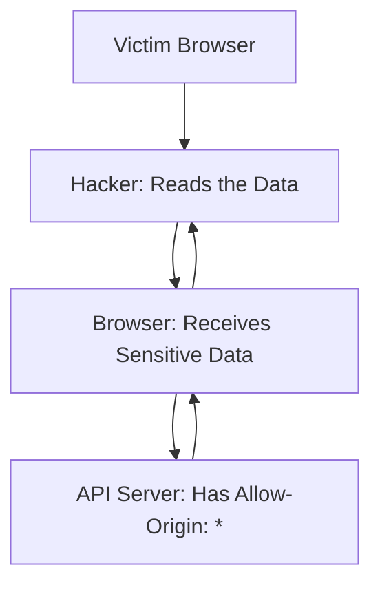

# CORS (Cross-Origin Resource Sharing): Opening the Door Safely

## 1. Beginner-friendly Hinglish Explanation 🇮🇳
Bhai, **CORS** koi "Attack" nahi hai, yeh ek "Security Feature" hai jo aksar developers ke liye dard-e-sir ban jata hai. 

Browser ka basic rule hai: "SOP" (Same-Origin Policy). Matlab `google.com` ka Javascript `facebook.com` ka data nahi padh sakta. Lekin aaj kal apps complex hain. Tumhara frontend `frontend.com` par hai aur API `api.com` par. Ab browser in dono ko baat nahi karne dega. **CORS** wahi "NOC" (No Objection Certificate) hai jo server browser ko deta hai: "Haan, `frontend.com` ko mere data lene ki ijazat hai." Agar tumne CORS galat set kiya (jaise `Access-Control-Allow-Origin: *`), toh koi bhi hacker tumhari API se data chura sakta hai.

---

## 2. Deep Technical Explanation
CORS is a mechanism that uses additional HTTP headers to tell browsers to give a web application running at one origin, access to selected resources from a different origin.
- **Pre-flight Request (OPTIONS)**: For "Complex" requests (like those with JSON or custom headers), the browser first sends an `OPTIONS` request to check if the server allows it.
- **Simple Requests**: GET, POST, or HEAD with standard headers don't trigger a pre-flight but are still subject to CORS checks on the response.
- **Key Headers**:
    - `Access-Control-Allow-Origin`: Which domains can access.
    - `Access-Control-Allow-Methods`: Which HTTP verbs are allowed.
    - `Access-Control-Allow-Headers`: Which custom headers are allowed.
    - `Access-Control-Allow-Credentials`: If cookies/auth headers are allowed.

---

## 3. Attack Flow Diagrams
**CORS Misconfiguration Attack:**

---

## 4. Real-world Attack Examples
- **Sensitive API Exposure**: A bank's API was misconfigured with `Access-Control-Allow-Origin: *` and `Access-Control-Allow-Credentials: true`. A hacker lured a user to their site, made a request to the bank's API, and stole their transaction history because the browser happily shared the bank's session cookie.

---

## 5. Defensive Mitigation Strategies
- **Whitelist Specific Origins**: Never use `*`. Explicitly list `https://your-frontend.com`.
- **Don't trust the `Origin` header blindly**: Attackers can spoof headers from a terminal (cURL), but the *Browser* enforces CORS for the user.
- **Vary Header**: Set `Vary: Origin` to prevent caches from serving a CORS response meant for one domain to another domain.

---

## 6. Failure Cases
- **The "Null" Origin**: Some developers use `Allow-Origin: null`. This is dangerous because a hacker can use a local HTML file or a specific iframe trick to send a "Null" origin and bypass the check.
- **Regex Mistakes**: Using a regex like `.*mysite\.com` which matches `hackermysite.com`.

---

## 7. Debugging and Investigation Guide
- **DevTools Network Tab**: Looking at the `OPTIONS` request and checking for the "CORS error" message in the console.
- **curl -v -H "Origin: https://hacker.com" -X OPTIONS https://api.com**: Checking if your API is too friendly to hackers.

---

## 8. Tradeoffs
| Strategy | Security | Complexity |
|---|---|---|
| Same-Origin Only | Maximum | High (Hard for multi-domain) |
| Whitelisted Origins | High | Medium |
| Wildcard (*) | Zero | Low |

---

## 9. Security Best Practices
- **Credentials and Wildcards**: You CANNOT use `Allow-Origin: *` AND `Allow-Credentials: true` together. Browsers will block this for security.
- **Avoid Reflecting Origin**: Don't just take the `Origin` header from the request and put it in the `Allow-Origin` response header.

---

## 10. Production Hardening Techniques
- **CORS at the Gateway**: Handle CORS at your Nginx or AWS API Gateway level rather than inside your application code. This makes it consistent across all microservices.
- **Short Pre-flight Cache**: Use `Access-Control-Max-Age` (e.g., 600 seconds) to reduce the number of OPTIONS requests and improve performance.

---

## 11. Monitoring and Logging Considerations
- **CORS Violation Logs**: Log every time a request is rejected due to an origin mismatch. It could be an attack or a misconfigured new frontend.

---

## 12. Common Mistakes
- **Applying CORS to GET only**: CORS must be applied to all methods that return sensitive data.
- **Thinking CORS is a Firewall**: CORS only protects **Browser users**. A hacker can still hit your API directly from their terminal. Use proper API keys/Auth for that.

---

## 13. Compliance Implications
- **Data Privacy (GDPR)**: If your CORS is misconfigured, you are effectively allowing anyone to "Query" your user's data from their browser, which is a massive privacy violation.

---

## 14. Interview Questions
1. What is a "Pre-flight" request in CORS?
2. Why is `Access-Control-Allow-Origin: *` dangerous for authenticated APIs?
3. What is the difference between CORS and SOP?

---

## 15. Latest 2026 Security Patterns and Threats
- **Private Network Access (PNA)**: A new browser feature that prevents public websites from making requests to your *internal* local network (e.g., your router or local dev server) without explicit CORS permission.
- **CORS Bypassing via Cache**: Using "Cache Poisoning" to trick a server into caching a response with a malicious `Allow-Origin` header.
- **Subdomain Takeover to CORS**: If a hacker takes over `old-test.mysite.com` and your CORS whitelist includes `*.mysite.com`, they can now steal data from your main API.
    
