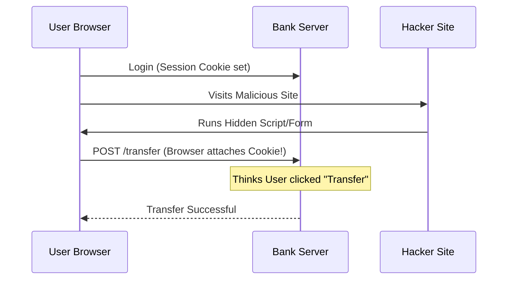

# CSRF (Cross-Site Request Forgery): The Proxy Attack

## 1. Beginner-friendly Hinglish Explanation 🇮🇳
Bhai, **CSRF** ka matlab hai "User ko ullu banana" taaki woh anjaane mein server ko ek command bhej de. 

Socho tumne apne Bank ki website par login kiya hai. Bank ne tumhare browser mein ek "Session Cookie" rakhi hai. Ab tumne ek dusri website kholi `free-movies.com`. Us website ne ek chhupa hua (hidden) button dabaya: `POST /bank/transfer?to=Hacker&amount=1000`. Kyunki tum Bank par pehle se login ho, tumhara browser Bank ke paas woh cookie bhej dega. Bank ko lagega ki "Tumne" hi yeh request bheji hai, aur paise transfer ho jayenge. CSRF mein hacker tumhare browser ki "Vishwasta" (Trust) ka galat fayda uthata hai.

---

## 2. Deep Technical Explanation
CSRF exploits the fact that browsers automatically include cookies (like session IDs) in every request to a domain, regardless of where the request originated.
- **State-changing Requests**: CSRF only matters for requests that *change* data (POST, PUT, DELETE). GET requests should never change state (Idempotency).
- **Condition for Success**:
    1. The victim must have an active session with the target site.
    2. The site must rely solely on cookies for authentication.
    3. The request must be predictable (no secret tokens).

---

## 3. Attack Flow Diagrams
**CSRF Attack Scenario:**

---

## 4. Real-world Attack Examples
- **Home Router CSRF**: Hackers created websites that, when visited, would try to send a request to `http://192.168.1.1/admin/change_password`. If the user was logged into their router settings, the password would be changed remotely.
- **Netflix CSRF (2006)**: A vulnerability allowed attackers to change a user's movie queue or even their shipping address via CSRF.

---

## 5. Defensive Mitigation Strategies
- **Anti-CSRF Tokens (Synchronizer Token Pattern)**: The server gives the browser a random, unique secret token. The browser must send this token back in the body of the POST request. Since the hacker can't "Read" this token (due to Same-Origin Policy), they can't forge the request.
- **SameSite Cookie Attribute**: Setting `SameSite=Strict` or `Lax` tells the browser: "Don't send this cookie if the request is coming from a different domain." This is the #1 defense in 2026.
- **Custom Request Headers**: Requiring a header like `X-Requested-With`. Since browsers don't allow cross-site requests to set custom headers easily (CORS pre-flight), this blocks CSRF.

---

## 6. Failure Cases
- **GET for State Change**: If you allow `GET /delete_user?id=1`, the hacker can just put that URL in an `` tag: ``.
- **Ignoring Lax/None**: If you set `SameSite=None`, you are explicitly telling the browser to be vulnerable to CSRF.

---

## 7. Debugging and Investigation Guide
- **Checking Headers**: Look for the `Referer` or `Origin` header in your logs. If a sensitive POST request is coming from `hacker.com`, it's an attack.
- **Testing with cURL**: Try to make a POST request without the CSRF token. If it succeeds, your site is vulnerable.

---

## 8. Tradeoffs
| Mitigation | Pros | Cons |
|---|---|---|
| SameSite Cookies | Easy to implement | Doesn't work on very old browsers |
| CSRF Tokens | Very Secure | Harder to implement with SPAs/APIs |
| Double Submit Cookie | Stateless | Vulnerable if subdomains are hacked |

---

## 9. Security Best Practices
- **Verify the Origin**: Always check the `Origin` header on the server side for sensitive requests.
- **Use "Strict" for sensitive cookies**: Like Login or Payment sessions.

---

## 10. Production Hardening Techniques
- **Re-authentication**: For very sensitive actions (like changing a password or transferring > $1000), ask for the password or MFA again. This kills CSRF completely.
- **Short Session Timeouts**: Reduces the "Window of opportunity" for an attacker.

---

## 11. Monitoring and Logging Considerations
- **CSRF Token Mismatch Alerts**: If you see thousands of "Invalid CSRF Token" errors, someone is likely trying to attack your users.

---

## 12. Common Mistakes
- **Putting the Token in a Cookie only**: The whole point is that the browser sends cookies automatically. The token MUST be in the request body or header.
- **Using predictable tokens**: Like `md5(username)`. Hacker can guess this easily.

---

## 13. Compliance Implications
- **OWASP Top 10**: CSRF was so common it was in the Top 10 for years. Compliance audits always check for CSRF protection.

---

## 14. Interview Questions
1. How does the `SameSite` attribute prevent CSRF?
2. Why is a GET request usually not vulnerable to CSRF (if followed correctly)?
3. What is a "Double Submit Cookie" and when is it used?

---

## 15. Latest 2026 Security Patterns and Threats
- **CSRF in Microservices**: When Service A calls Service B, ensuring the CSRF token "Context" is passed correctly is a major architectural challenge.
- **JSON-based CSRF**: Attackers are finding ways to send JSON payloads via `<form>` tags using specific `enctype` tricks, bypassing old "Form-only" CSRF filters.
- **Bypassing Lax**: If a site has "Same-Site Cookies" set to `Lax`, an attacker might find a "Safe" GET request on your site that they can exploit to perform an attack (XSS + CSRF).
