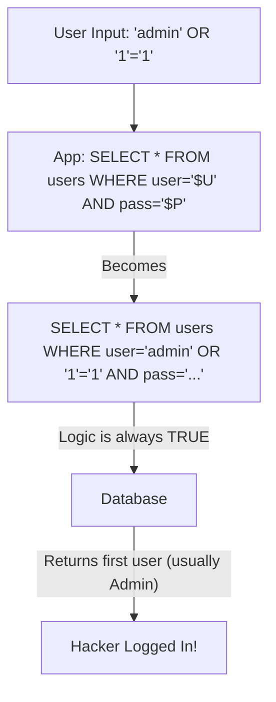

# Injection Attacks: SQL, NoSQL, and Command Injection

## 1. Beginner-friendly Hinglish Explanation 🇮🇳
Bhai, **Injection** ka matlab hai "User input ke naam par zeher (code) pilana." 

Socho ek website hai jahan aap apna `username` daalte ho login karne ke liye. Agar developer ne security ka dhyan nahi rakha, toh hacker username ki jagah ek "SQL Command" daal dega (jaise `' OR 1=1 --`). Database ko lagega ki yeh valid user hai aur woh hacker ko bina password ke andar jane dega. Isse **SQL Injection** kehte hain. Yeh sirf database par nahi, balki OS (Operating System) commands par bhi ho sakta hai. Injection se bachne ka ek hi mantra hai: "Kabhi bhi user ke input par bharosa mat karo."

---

## 2. Deep Technical Explanation
- **SQL Injection (SQLi)**: Injecting malicious SQL queries to view, delete, or modify data.
- **NoSQL Injection**: Attacking databases like MongoDB using operators like `$gt` (greater than) to bypass logic.
- **OS Command Injection**: Injecting shell commands (like `&& rm -rf /`) into an application that interacts with the server's OS.
- **Root Cause**: Concatenating user input directly into a query or command string instead of using safe methods.

---

## 3. Attack Flow Diagrams
**The Classic SQL Injection Login Bypass:**

---

## 4. Real-world Attack Examples
- **Sony Pictures Hack (2011)**: A simple SQL injection allowed hackers to steal the personal info of 1 million users.
- **Vulnerable Routers**: Many routers are hacked via Command Injection by sending a specialized "Ping" request that includes a command to open a backdoor shell.

---

## 5. Defensive Mitigation Strategies
- **Prepared Statements (Parameterized Queries)**: This is the #1 defense. It separates the "Code" from the "Data."
- **ORM (Object Relational Mapping)**: Using tools like **Prisma** or **Sequelize** which handle query safety for you.
- **Input Validation**: Only allow specific characters (e.g., Alphanumeric only) in input fields.

---

## 6. Failure Cases
- **Second-Order SQLi**: The hacker injects code into the DB (e.g., in their "Display Name"). The app looks fine until another part of the app reads that name and uses it in a vulnerable query later.
- **Blind SQLi**: The app doesn't show any error, but the hacker can still guess the data by asking "True/False" questions (e.g., "Is the first letter of the password 'a'?").

---

## 7. Debugging and Investigation Guide
- **`sqlmap`**: An automated tool to find and exploit SQL injection holes. (Only for authorized testing!).
- **Error Logs**: Look for "Syntax error in SQL statement" in your server logs—this is a huge red flag.

---

## 8. Tradeoffs
| Metric | Prepared Statements | WAF Filtering |
|---|---|---|
| Effectiveness | 100% (If used correctly) | 80% (Can be bypassed) |
| Speed | Fast | Fast |
| Implementation | Developers must do it | Security team can do it |

---

## 9. Security Best Practices
- **Principle of Least Privilege**: The database user used by the app should NOT be an `admin`. It should only have permissions to `SELECT`, `INSERT`, and `UPDATE` specific tables.
- **Escaping Input**: If you *must* concatenate strings (avoid this!), use a trusted escaping library.

---

## 10. Production Hardening Techniques
- **Stored Procedures**: Like prepared statements, these pre-compile the SQL on the database server.
- **Disabling Verbose Errors**: Never show the database engine (MySQL/PostgreSQL) or the query itself in the error response to the user.

---

## 11. Monitoring and Logging Considerations
- **SQL Query Length**: Monitoring for unusually long SQL queries or queries containing keywords like `UNION`, `SELECT`, or `--`.
- **SIEM Rules**: Alerting when multiple SQL errors happen from the same IP address in a short time.

---

## 12. Common Mistakes
- **Assuming 'NoSQL is safe'**: Thinking that because MongoDB doesn't use SQL, it can't be injected. (It uses JSON queries which are also vulnerable).
- **Client-side Validation Only**: Using JavaScript to check for "Bad characters." A hacker can easily bypass this using **Postman** or **Curl**.

---

## 13. Compliance Implications
- **PCI-DSS / SOC2**: Require evidence that your application code is audited for injection vulnerabilities.

---

## 14. Interview Questions
1. How do 'Prepared Statements' prevent SQL Injection?
2. What is the difference between 'Error-based' and 'Blind' SQLi?
3. Give an example of an OS Command Injection payload.

---

## 15. Latest 2026 Security Patterns and Threats
- **AI-Generated Payloads**: Hackers using LLMs to create highly complex SQLi payloads that bypass standard WAF rules.
- **Graph Database Injection**: New injection vectors for databases like **Neo4j** (Cypher injection).
- **Prompt Injection as the New SQLi**: In 2026, the biggest "Injection" risk is users tricking the app's internal AI into running unauthorized actions.
