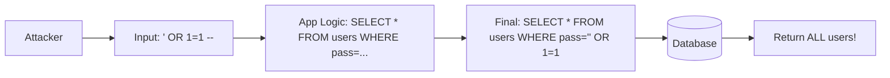

# OWASP Top 10: The Hacker's Checklist (2026 Edition)

## 1. Beginner-friendly Hinglish Explanation 🇮🇳
Bhai, **OWASP Top 10** koi boring rulebook nahi hai, yeh duniya ke sabse bade security experts ki "Warning List" hai. 

Har saal OWASP (Open Web Application Security Project) puri duniya ka data analyze karta hai aur batata hai ki hackers sabse zyada kaunse 10 tarike use kar rahe hain apps todne ke liye. Yeh tumhari "Bible" honi chahiye. Agar tumne in 10 cheezon se apni app bacha li, toh tumne 90% battle jeet li. Is module mein hum har saal ke badalte trends aur 2026 ki latest list ke baare mein baat karenge.

---

## 2. Deep Technical Explanation
The OWASP Top 10 is updated periodically based on community consensus and vulnerability data.
- **A01: Broken Access Control**: Users acting outside their intended permissions.
- **A02: Cryptographic Failures**: Weak encryption, cleartext passwords, or missing TLS.
- **A03: Injection**: SQL, NoSQL, OS command, and LDAP injection.
- **A04: Insecure Design**: Flaws in architecture (e.g., lack of threat modeling).
- **A05: Security Misconfiguration**: Default accounts, open S3 buckets, verbose error messages.
- **A06: Vulnerable and Outdated Components**: Using libraries with known CVEs (e.g., unpatched Log4j).
- **A07: Identification and Authentication Failures**: Weak passwords, missing MFA, session hijacking.
- **A08: Software and Data Integrity Failures**: Insecure deserialization, untrusted update sources.
- **A09: Security Logging and Monitoring Failures**: Not logging attacks or not responding to alerts.
- **A10: Server-Side Request Forgery (SSRF)**: Tricking a server into fetching internal resources.

---

## 3. Attack Flow Diagrams
**A03: Injection Attack Flow:**

---

## 4. Real-world Attack Examples
- **Equifax (A06)**: Used an outdated version of Apache Struts.
- **Uber (A01)**: A hacker used internal credentials to move laterally through the system due to broken internal access controls.
- **T-Mobile (A05)**: Misconfigured API allowed attackers to access data of 37 million customers.

---

## 5. Defensive Mitigation Strategies
- **A01**: Centralized authorization modules. Don't write `if(admin)` everywhere.
- **A03**: Use Parameterized Queries (Prepared Statements).
- **A06**: Automated dependency scanning (Snyk, Dependabot).
- **A10**: Whitelist domains that the server is allowed to fetch data from.

---

## 6. Failure Cases
- **Legacy Systems**: An old PHP app from 2010 that can't be updated, keeping the whole company vulnerable to A03.
- **Microservice Sprawl**: Having 1000 microservices where 10 have weak authentication (A07), providing a gateway for hackers.

---

## 7. Debugging and Investigation Guide
- **OWASP Juice Shop**: A deliberate vulnerable app to practice finding all Top 10 bugs.
- **Dynamic Analysis (DAST)**: Using tools like OWASP ZAP to find A05 and A10.
- **Static Analysis (SAST)**: Scanning code for A03 and A08 patterns.

---

## 8. Tradeoffs
| Top 10 Category | Ease of Fix | Business Impact |
|---|---|---|
| Injection | Easy (Code fix) | Very High |
| Broken Auth | Hard (Arch fix) | Ultra-High |
| Misconfig | Medium (Ops fix) | High |

---

## 9. Security Best Practices
- **Security by Design**: Implement A04 (Secure Design) from Day 1.
- **Shift Left**: Check for A06 (Vulnerable components) during development, not after deployment.

---

## 10. Production Hardening Techniques
- **Zero-Trust**: Mitigates A01 and A07.
- **Hardened Base Images**: Mitigates A05 and A06.
- **WAF with Payload Inspection**: Mitigates A03 and A10.

---

## 11. Monitoring and Logging Considerations
- **A09 Focus**: Ensure you log not just "Errors" but also "Security Events" (e.g., multiple failed logins, changed passwords).
- **SIEM Integration**: To detect patterns that a single app log can't see.

---

## 12. Common Mistakes
- **Fixing only the "Top 3"**: Hackers will look for the #10 if the #1 is blocked.
- **Assuming Cloud takes care of it**: AWS/Azure don't prevent your app from having A03 (Injection).

---

## 13. Compliance Implications
- **PCI-DSS Requirement 6.5**: Explicitly states that developers must be trained in the OWASP Top 10.

---

## 14. Interview Questions
1. What is the #1 vulnerability in the current OWASP Top 10?
2. Explain SSRF (Server-Side Request Forgery) with a real-world scenario.
3. How would you prevent "Insecure Deserialization" (A08)?

---

## 15. Latest 2026 Security Patterns and Threats
- **AI-Driven OWASP Checks**: Tools that use LLMs to explain *why* a specific line of code is vulnerable to the Top 10.
- **Supply Chain Security**: A massive focus on A06 as hackers target shared libraries (NPM, PyPI) rather than the app itself.
- **API Specific OWASP Top 10**: A separate list specifically for API-heavy architectures (like BOLA - Broken Object Level Authorization).
    
    
