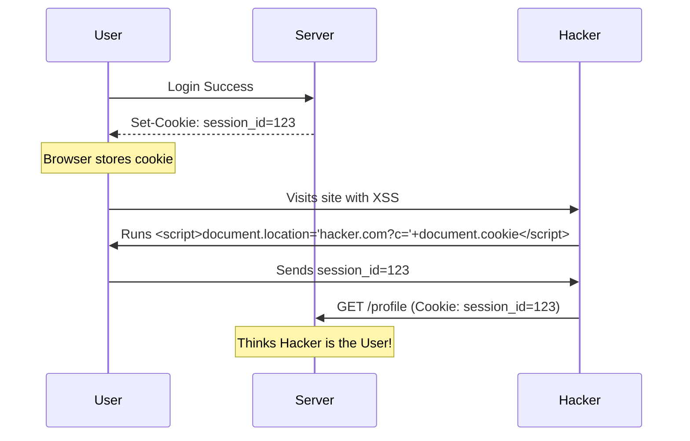

# Session Security: Protecting the Digital Handshake

## 1. Beginner-friendly Hinglish Explanation 🇮🇳
Bhai, jab tum ek baar login karte ho, toh website tumhe ek "ID Card" (Session ID या Token) deti hai. Ab har baar naye page par jane par tumhe password nahi dalna padta, tum bas woh ID card dikhate ho. 

**Session Security** ka matlab hai is ID card ko chori hone se bachana. Agar hacker ne tumhara session chura liya, toh woh "Bina password" ke tumhara account chala sakta hai. Isse hum **Session Hijacking** kehte hain. Is module mein hum seekhenge ki kaise cookies ko lock karein, tokens ko expire karein, aur session ko hacker ki pahunch se door rakhein.

---

## 2. Deep Technical Explanation
Session management can be stateful (Server-side) or stateless (Client-side/JWT).
- **Session IDs (Cookies)**: The server stores the session in a database/Redis and gives the client a random ID string in a cookie.
- **JWT (JSON Web Tokens)**: The session data is encoded, signed, and stored on the client. The server verifies the signature without needing a database lookup.
- **Session Lifecycle**:
    1. **Creation**: After valid AuthN.
    2. **Maintenance**: Refreshing and extending.
    3. **Expiration**: Idle timeout vs Absolute timeout.
    4. **Destruction**: Proper Logout.

---

## 3. Attack Flow Diagrams
**Session Hijacking via XSS:**

---

## 4. Real-world Attack Examples
- **Facebook Token Leak (2018)**: A bug in the "View As" feature allowed hackers to steal access tokens for 50 million accounts, allowing them to take over profiles without passwords.
- **Sidejacking (Firesheep)**: Before HTTPS was everywhere, a tool called Firesheep allowed anyone on a public Wi-Fi to sniff unencrypted session cookies and hijack Facebook/Twitter accounts in one click.

---

## 5. Defensive Mitigation Strategies
- **Cookie Hardening**:
    - `HttpOnly`: Prevents Javascript (XSS) from reading the cookie.
    - `Secure`: Ensures the cookie is only sent over HTTPS.
    - `SameSite=Lax/Strict`: Prevents CSRF.
- **Session Rotation**: Change the Session ID every time the user's privilege changes (e.g., after logging in or before checkout).
- **Short Idle Timeouts**: Automatically logout the user if they are inactive for 15 minutes.

---

## 6. Failure Cases
- **Session Fixation**: An attacker gives a victim a valid Session ID (e.g., in a link). After the victim logs in, the hacker uses the *same* ID to hijack the account. (Fix: Rotate ID on login).
- **JWT Secret Leak**: If you use a weak or hardcoded secret for your JWTs, a hacker can forge their own tokens and become an Admin.

---

## 7. Debugging and Investigation Guide
- **Checking Cookie Flags**: Using Chrome DevTools -> Application -> Cookies.
- **Decoding JWTs**: Using `jwt.io` to see what's inside the token (but remember, only the server can verify it).
- **Session Tracking**: Checking if your Redis/Database has an unusual number of active sessions from the same IP.

---

## 8. Tradeoffs
| Model | Pros | Cons |
|---|---|---|
| Server-Side Sessions | Easy to Revoke (Logout instantly) | Hard to scale (needs Redis/DB) |
| Stateless JWT | Ultra-Fast / Scalable | Hard to Revoke (Blacklisting needed) |
| Persistent Login | Better UX | Higher risk if device is stolen |

---

## 9. Security Best Practices
- **Sign Out Everywhere**: Give users a button to "Logout of all devices."
- **Use Cryptographically Secure IDs**: Don't use `user_id_123`. Use a long, random UUID.
- **Verify User-Agent/IP**: If a session suddenly jumps from Chrome in Delhi to Firefox in Russia, kill it.

---

## 10. Production Hardening Techniques
- **Concurrent Session Limit**: Don't allow a user to be logged in from more than 3 devices at once.
- **Enclave Storage**: In mobile apps, store tokens in the "Keychain" or "Keystore" rather than local storage.

---

## 11. Monitoring and Logging Considerations
- **Multiple Login Alerts**: If a user logs in from 10 different countries in 1 hour, it's an automated attack.
- **Token Usage Patterns**: Monitor for tokens being used from IPs that aren't the one that requested the token.

---

## 12. Common Mistakes
- **Storing sensitive data in JWT**: Never put passwords or PII in a JWT. Anyone can decode it.
- **Incomplete Logout**: Deleting the cookie in the browser but leaving the session active in the server's Redis.

---

## 13. Compliance Implications
- **PCI-DSS**: Requires that session IDs be at least 128 bits long and that sessions timeout after 15 minutes of inactivity.

---

## 14. Interview Questions
1. What is the difference between a Session and a JWT?
2. How do you prevent "Session Fixation" attacks?
3. Why should you never store a JWT in `localStorage`? (XSS risk).

---

## 15. Latest 2026 Security Patterns and Threats
- **Token Binding**: Linking a session token to the specific TLS connection or hardware key, so even if stolen, it can't be used on another device.
- **OIDC Back-channel Logout**: A modern standard for ensuring that when you logout of a central system (like Okta), you are logged out of all connected apps automatically.
- **AI-Based Session Fingerprinting**: Using mouse movements and typing speed to verify that the person using the session is still the same person who logged in.
