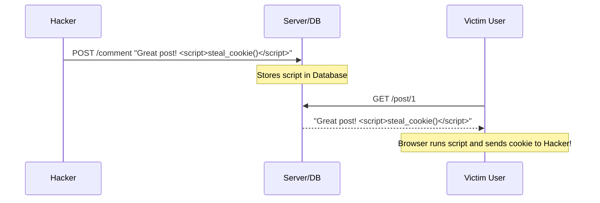

# XSS (Cross-Site Scripting): Injecting the Virus

## 1. Beginner-friendly Hinglish Explanation 🇮🇳
Bhai, **XSS** ka matlab hai ek aisi chori jismein hacker "Malicious Javascript" code ko tumhare browser mein run kar deta hai. 

Socho tum ek website par gaye aur wahan ek search bar hai. Tumne search kiya `Laptops`. Website ne dikhaya: "Showing results for Laptops". Ab socho hacker ne search kiya: ``. Agar website "Gullible" hai, toh woh search bar ka code run kar degi. Ab socho `alert` ki jagah hacker ne tumhara "Login Cookie" chura liya? Tumhara account ab hacker ka hai. XSS wahi "Zehreela script" hai jo user ke browser mein chala jata hai.

---

## 2. Deep Technical Explanation
XSS occurs when an application includes untrusted data in a web page without proper validation or escaping.
- **Reflected XSS**: The script is part of the URL/Request and is "Reflected" back to the user (e.g., in a search query).
- **Stored XSS (Persistent)**: The script is saved on the server (e.g., in a comment or a user profile) and is served to *every* user who views that page.
- **DOM-based XSS**: The vulnerability exists in client-side code rather than server-side code. The attack happens entirely in the browser's memory.
- **Blind XSS**: A type of stored XSS where the attacker can't see the result directly (e.g., injecting a script into a feedback form that only an admin sees).

---

## 3. Attack Flow Diagrams
**Stored XSS Attack Flow:**

---

## 4. Real-world Attack Examples
- **MySpace Samy Worm (2005)**: The fastest-spreading worm in history. It used XSS to add Samy as a friend and add "Samy is my hero" to the victim's profile, infecting 1 million users in 20 hours.
- **eBay XSS (2014)**: Hackers used XSS to redirect users to a fake login page, stealing credentials of millions of eBay customers.

---

## 5. Defensive Mitigation Strategies
- **Output Encoding**: Converting `<` to `&lt;` and `>` to `&gt;`. The browser will *display* the script but won't *run* it.
- **Input Validation**: Never allow HTML tags in fields that don't need them (like "Username" or "Phone Number").
- **Content Security Policy (CSP)**: `script-src 'self'` ensures the browser only runs scripts from your own server.

---

## 6. Failure Cases
- **Incomplete Blacklisting**: Blocking `<script>` but forgetting `` or `<svg onload="...">`.
- **Double Encoding**: The server encodes once, but the browser decodes twice, potentially re-creating the malicious script.

---

## 7. Debugging and Investigation Guide
- **alert('XSS')**: The classic test to see if a field is vulnerable.
- **Burp Suite Repeater**: Modifying a request to inject payloads and seeing if the response contains the unescaped payload.
- **Browser Console**: Checking for "CSP violation" errors.

---

## 8. Tradeoffs
| Method | Security | Usability |
|---|---|---|
| Block all HTML | 100% Secure | Users can't use Bold/Italic in comments |
| Use Markdown | High | Better UX |
| Rich Text Editor | Hard to Secure | Best UX |

---

## 9. Security Best Practices
- **HttpOnly Cookies**: Set this flag so Javascript cannot read your session cookie, making XSS much less dangerous.
- **Context-Aware Escaping**: Encoding for HTML is different from encoding for an Attribute or for Javascript code.

---

## 10. Production Hardening Techniques
- **Trusted Types API**: A modern browser feature that prevents DOM-based XSS by requiring all strings passed to "Sinks" (like `innerHTML`) to be specially blessed.
- **WAF Rules**: Automated blocking of common XSS payloads in URLs.

---

## 11. Monitoring and Logging Considerations
- **CSP Reporting**: Use a service like Report-URI to track every time an XSS attempt is blocked on your site.
- **Web Logs**: Searching for `<script>` or `onerror` in your access logs.

---

## 12. Common Mistakes
- **Relying on React's Safety**: React auto-escapes, but `dangerouslySetInnerHTML` bypasses all security. Never use it with user input.
- **Sanitizing on Input**: You should sanitize on **Output**. If you sanitize on input and later change your database, you might lose the original data.

---

## 13. Compliance Implications
- **PCI-DSS**: Requires regular application security testing, which includes scanning for XSS.

---

## 14. Interview Questions
1. Explain the difference between Reflected and Stored XSS.
2. How does the `HttpOnly` flag mitigate the impact of an XSS attack?
3. What is DOM-based XSS and how is it different from the others?

---

## 15. Latest 2026 Security Patterns and Threats
- **AI-Generated XSS Payloads**: Attackers using LLMs to create highly complex, multi-stage XSS payloads that can bypass traditional regex-based WAFs.
- **Prototype Pollution to XSS**: A new trend where hackers "Pollute" a Javascript object's prototype to eventually trigger an XSS in a completely different part of the app.
- **Server-Side Rendering (SSR) XSS**: If you use frameworks like Next.js, an XSS that happens during the "Hydration" process can be particularly hard to detect.
