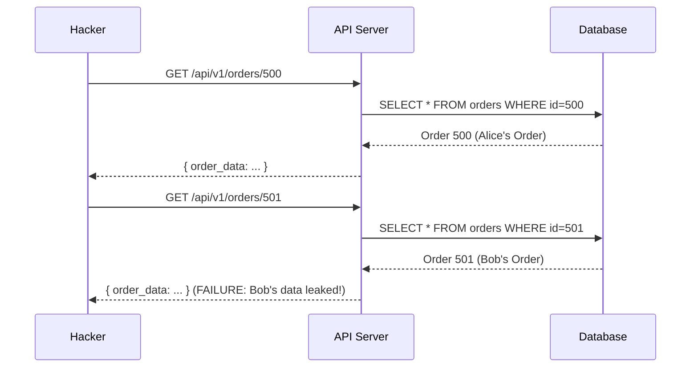

# API Security: Securing the Digital Connectors

## 1. Beginner-friendly Hinglish Explanation 🇮🇳
Bhai, **API (Application Programming Interface)** woh rasta hai jiske zariye tumhara mobile app server se baat karta hai. Aaj kal hackers website ke "Frontend" ko chhod kar direct "API" par attack karte hain kyunki wahan data "Kachha" (Raw) milta hai. 

API security ka matlab hai yeh ensure karna ki sirf valid apps hi server se baat karein, aur koi bina permission ke kisi dusre ka data na nikal sake. Agar tumne API security sahi nahi ki, toh koi hacker ek simple "Script" likh kar tumhara pura database download kar sakta hai bina kisi login ke.

---

## 2. Deep Technical Explanation
API security focuses on protecting the logic and data exposed via endpoints.
- **BOLA (Broken Object Level Authorization)**: The #1 API risk. A user accesses another user's data by changing the `ID` in the URL (e.g., `/api/user/101` -> `/api/user/102`).
- **Mass Assignment**: When an API takes a full JSON object and saves it directly to the DB, allowing a hacker to add a field like `"is_admin": true` to their profile update.
- **Improper Assets Management**: Leaving old, unpatched versions of the API (like `v1`) running when `v2` is out.
- **Authentication/Authorization**: Using robust mechanisms like OAuth2, OIDC, and API Keys with proper scoping.

---

## 3. Attack Flow Diagrams
**BOLA (Broken Object Level Authorization) Attack:**

---

## 4. Real-world Attack Examples
- **Twitter API Leak (2022)**: A vulnerability in the API allowed attackers to find the phone number/email associated with a user's handle, leading to a massive data dump of millions of users.
- **Peloton Data Exposure**: A private API was accessible without authentication, exposing private account data of 3 million users, including the President of the United States.

---

## 5. Defensive Mitigation Strategies
- **Object-Level Checks**: Every time you fetch data from the DB, include the `user_id` in the query: `SELECT * FROM orders WHERE id=? AND owner_id=?`.
- **API Gateways**: Using Kong, Tyk, or AWS API Gateway to handle authentication, rate limiting, and logging centrally.
- **Scoping**: Using OAuth2 scopes so that a 3rd party app can "Read profile" but not "Send money."

---

## 6. Failure Cases
- **Exposing Internal IDs**: Using incremental IDs like `1, 2, 3`. This makes it too easy for hackers to guess the next target. (Use UUIDs instead).
- **Leaking Stack Traces**: Giving a "Database Error" in the API response that reveals your table names and server paths.

---

## 7. Debugging and Investigation Guide
- **Postman / Insomnia**: Manually testing every endpoint with different user tokens to see if you can access unauthorized data.
- **API Documentation (Swagger/OpenAPI)**: Checking if sensitive internal endpoints are accidentally documented for the public.

---

## 8. Tradeoffs
| Metric | API Key Auth | OAuth2 / JWT |
|---|---|---|
| Security | Medium | High |
| Performance | Fast | Slower (Signature check) |
| Management | Simple | Complex (OIDC needed) |

---

## 9. Security Best Practices
- **Never trust the Client**: Just because the frontend hides a button doesn't mean the API is safe. Always re-verify permissions on the server.
- **Versioning**: Explicitly use `/v1/`, `/v2/` in your URLs.
- **Disable unused methods**: If an endpoint only needs `GET`, don't allow `POST` or `DELETE`.

---

## 10. Production Hardening Techniques
- **Rate Limiting**: Preventing an attacker from hitting your "Login" API 1000 times per second.
- **Payload Validation**: Using JSON Schema to ensure the incoming data has the correct types and no extra fields.

---

## 11. Monitoring and Logging Considerations
- **API Usage Analytics**: Monitoring for sudden spikes in "403 Forbidden" errors (could be an attacker scanning your endpoints).
- **Logging the Request ID**: Every API call should have a unique ID that connects the frontend log, the backend log, and the database log.

---

## 12. Common Mistakes
- **No Rate Limiting on Authentication**: Allowing unlimited password guesses on the `/api/login` endpoint.
- **Logging API Keys**: Printing the full request log (including the `Authorization` header) to a plain text file.

---

## 13. Compliance Implications
- **PSD2 (Banking)**: Requires strict API security standards (Strong Customer Authentication - SCA) for any financial transaction.

---

## 14. Interview Questions
1. What is BOLA and why is it the #1 risk for APIs?
2. How would you prevent a "Mass Assignment" vulnerability in a Node.js API?
3. What is the difference between an API Key and an OAuth Access Token?

---

## 15. Latest 2026 Security Patterns and Threats
- **AI-Native API Protection**: Firewalls that use ML to understand the "Intent" of an API call and block those that don't match typical user behavior.
- **GraphQL Introspection Attacks**: Tricking a GraphQL API into revealing its entire schema and all hidden data relationships.
- **Ephemeral API Keys**: API keys that are generated for a single session or a single request and expire automatically.
    
    
    
