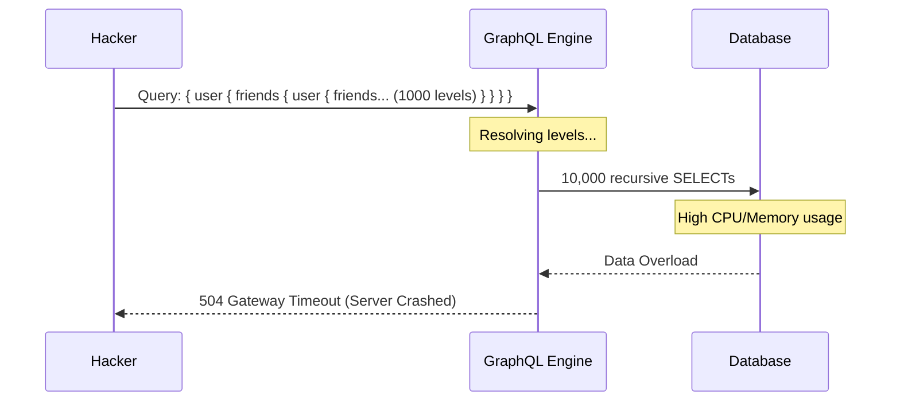

# GraphQL Security: Securing the New Data Layer

## 1. Beginner-friendly Hinglish Explanation 🇮🇳
Bhai, **GraphQL** REST ka ek modern bhai hai jo bohot flexible hai. REST mein tumhe sirf wahi milta hai jo server deta hai, lekin GraphQL mein tum "Chun" (Choose) sakte ho ki tumhe kaunsa data chahiye. 

Yeh flexibility hi iski sabse badi kamzori hai. Socho agar hacker server se pooche: "Mujhe saare users ki detail de do, aur unke saare friends ki, aur unke saare passwords ki." Agar tumne limit nahi lagayi, toh server "Confusion" mein sab kuch de dega. GraphQL security ka matlab hai yeh "Gahri Queries" (Deep Queries) ko rokna aur schema ko safe rakhna.

---

## 2. Deep Technical Explanation
GraphQL introduces unique attack vectors because it exposes a single endpoint (`/graphql`) and a flexible query language.
- **Introspection Attacks**: Using the `__schema` query to download the entire list of types, fields, and relationships. This is a goldmine for hackers.
- **Deep Query Attacks (DoS)**: A query like `user { friends { friends { friends { ... } } } }` can crash the server by exhausting memory and CPU.
- **Batching Attacks**: Sending 1000 queries inside a single HTTP request to bypass standard rate limiters.
- **BOLA (Broken Object Level Authorization)**: Just like REST, but harder to track because one query can fetch data from 10 different tables.

---

## 3. Attack Flow Diagrams
**GraphQL Depth Attack (Denial of Service):**

---

## 4. Real-world Attack Examples
- **Facebook GraphQL Bug (2018)**: A vulnerability in the GraphQL implementation of the "View As" feature allowed hackers to steal access tokens for 50 million users.
- **GitLab GraphQL Vulnerability**: A bug allowed unauthenticated users to use a GraphQL endpoint to find out if a specific email address was registered on the system.

---

## 5. Defensive Mitigation Strategies
- **Disable Introspection in Production**: Ensure that hackers can't see your schema structure.
- **Query Depth Limiting**: Use a library to reject any query that is deeper than, say, 5 levels.
- **Query Cost Analysis**: Assign a "Cost" to each field (e.g., `user` = 1, `friends` = 10). If the total cost of a query exceeds 100, reject it.
- **Persisted Queries**: Only allow the frontend to send the "ID" of a pre-approved query, rather than the raw query string itself.

---

## 6. Failure Cases
- **Bypassing with Aliases**: A hacker can run the same query 100 times in one request using aliases: `q1: user(id:1){...} q2: user(id:2){...}`.
- **Inconsistent Auth**: Protecting the `user` object but forgetting to protect the `profilePicture` field inside it.

---

## 7. Debugging and Investigation Guide
- **Apollo Sandbox / GraphiQL**: Tools to test your queries. If you can see the whole schema without logging in, your introspection is open.
- **Graphql-cop**: A security scanner specifically built for GraphQL endpoints.

---

## 8. Tradeoffs
| Strategy | Security | Developer UX |
|---|---|---|
| Persisted Queries | Maximum | Harder to deploy (Sync needed) |
| Depth Limiting | High | Limits complex data fetching |
| Introspection Off | Medium | Frontend team can't use tools |

---

## 9. Security Best Practices
- **Implement Authorization at the Resolver Level**: Don't just protect the endpoint; protect every single "Resolver" function.
- **Use Input Types**: Instead of raw strings, use strict `Input` types to enforce schema validation.

---

## 10. Production Hardening Techniques
- **Batching Limits**: Limiting the number of queries allowed in a single batch (e.g., max 10).
- **Timeouts**: Setting a strict execution timeout for every GraphQL query to prevent long-running DoS attacks.

---

## 11. Monitoring and Logging Considerations
- **Log the Query String**: But be careful! Don't log sensitive variables like passwords.
- **Performance Tracing**: Monitoring which resolvers are taking the most time—they are likely targets for DoS.

---

## 12. Common Mistakes
- **Relying on "Internal" GraphQL**: Thinking "Our GraphQL is only for our mobile app, so it's safe." (Mobile apps can be easily reverse-engineered).
- **No Rate Limiting**: GraphQL batching makes traditional "Request-per-second" rate limiting useless. You need "Query-per-second" limiting.

---

## 13. Compliance Implications
- **Data Privacy**: Because GraphQL can fetch deeply nested data, it's very easy to accidentally leak "Related data" that violates GDPR (e.g., fetching a user's address when you only asked for their name).

---

## 14. Interview Questions
1. How does GraphQL "Cost Analysis" help prevent DoS attacks?
2. What is the danger of leaving Introspection enabled in production?
3. How would you prevent a "Batching Attack" in GraphQL?

---

## 15. Latest 2026 Security Patterns and Threats
- **Federated GraphQL Security**: When you have multiple sub-graphs (Apollo Federation), ensuring that the "Gateway" correctly enforces security across all of them is a 2026-level challenge.
- **AI-Generated Malicious Queries**: Attackers using AI to find "Hidden paths" in your GraphQL schema that lead to unauthorized data.
- **Directive Exploits**: Using custom GraphQL directives to bypass security filters or trigger server-side errors.
    
    
    
    
    
