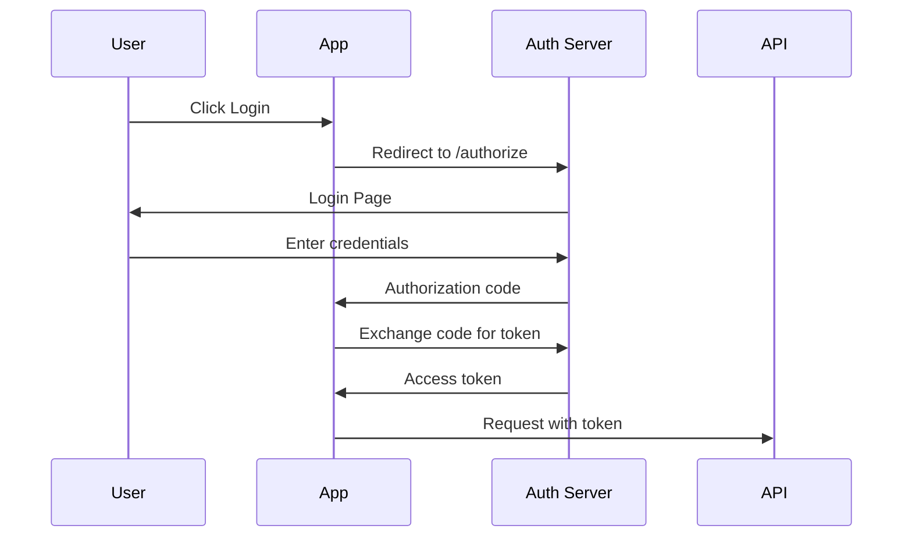

# 🔐 OAuth2 & OpenID Connect
> **Level:** Intermediate | **Language:** Hinglish | **Goal:** Master authentication flows

---

## 🧭 Core Concepts (Concept-First)

- OAuth2 Grant Types: Authorization code, client credentials
- OpenID Connect: Identity layer on OAuth2
- Token Management: Access, refresh tokens
- Implementation

---

## 1. 🔑 OAuth2 Flows

### Authorization Code Flow



### Implementation

```python
# FastAPI OAuth2
from fastapi import FastAPI, Depends
from fastapi.security import OAuth2PasswordBearer
from typing import Optional

app = FastAPI()

oauth2_scheme = OAuth2PasswordBearer(tokenUrl="token")

@app.get("/protected")
async def read_items(token: str = Depends(oauth2_scheme)):
    return {"token": token}

# Token endpoint
@app.post("/token")
async def login(form_data: OAuth2PasswordRequestForm = Depends()):
    # Validate user
    user = verify_user(form_data.username, form_data.password)
    if not user:
        raise HTTPException(status_code=401)
    
    access_token = create_access_token(data={"sub": user.username})
    return {"access_token": access_token, "token_type": "bearer"}
```

---

## 2. 🔓 OpenID Connect (OIDC)

```python
# OIDC Discovery
import requests

# Get OIDC configuration
oidc_config = requests.get(
    "https://accounts.google.com/.well-known/openid-configuration"
).json()

# Use authorization endpoint
auth_url = oidc_config["authorization_endpoint"]
params = {
    "client_id": "your-client-id",
    "redirect_uri": "https://your-app.com/callback",
    "response_type": "code",
    "scope": "openid email profile",
    "state": "random-state"
}
```

---

## ✅ Checklist

- [ ] OAuth2 flows samjho
- [ ] OIDC implement kar sakte ho
- [ ] Token management kar sakte ho