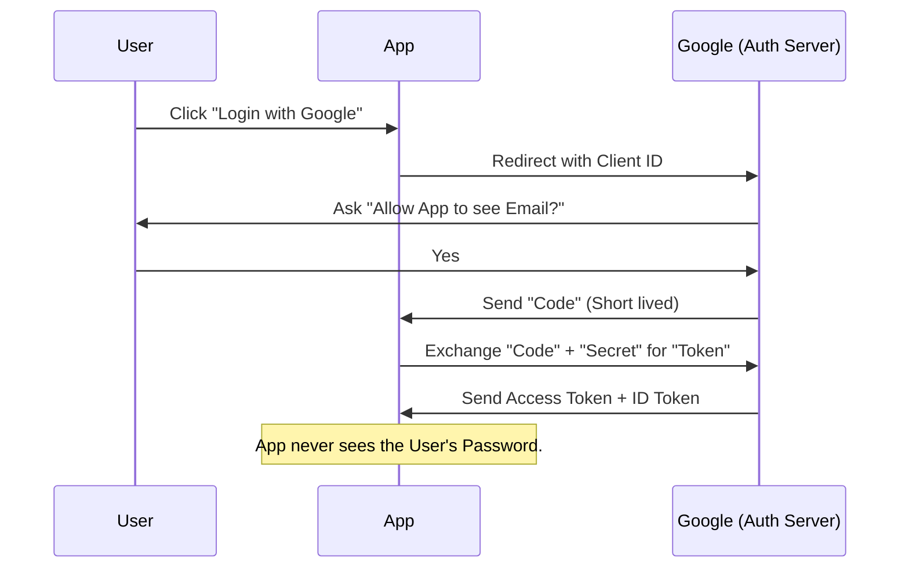

# OAuth2 and OpenID Connect (OIDC) Deep Dive

## 1. Beginner-friendly Hinglish Explanation 🇮🇳
Bhai, **OAuth2 aur OIDC** "Login with Google/Facebook" button ke peeche ki technology hain. 

Socho aap ek hotel (App) mein jate ho. Aap "Reception" (Google) ko apna ID dikhate ho. Google aapko ek "Key Card" (Token) deta hai. Ab aap hotel ke kamre (Data) mein us key card se ghus sakte ho. Hotel ko aapka "Password" nahi pata, sirf yeh pata hai ki "Google ne ise permission di hai."
**OAuth2** ka kaam hai "Authorization" (Kya kar sakte ho?). **OIDC** ka kaam hai "Authentication" (Kaun ho tum?). Inhe secure karna isliye zaruri hai kyunki agar hacker ko aapka "Token" mil gaya, toh woh aapke Google account ka access le sakta hai.

---

## 2. Deep Technical Explanation
- **OAuth 2.0**: A framework for authorization. It allows apps to get limited access to user accounts.
    - **Roles**: Resource Owner (User), Client (App), Resource Server (API), Authorization Server (Google).
    - **Grant Types**: Authorization Code (Safest), Implicit (Obsolete), Client Credentials, Device Code.
- **OpenID Connect (OIDC)**: A layer on top of OAuth2 that provides identity. It adds an **ID Token** (JWT) to the process.
- **Scopes**: What specific data the app is asking for (e.g., `profile`, `email`, `contacts`).

---

## 3. Attack Flow Diagrams
**The 'Authorization Code' Flow (The Right Way):**

---

## 4. Real-world Attack Examples
- **Redirect URI Hijacking**: A hacker tricks Google into sending the login "Code" to the *hacker's* website instead of the real app.
- **Token Leakage via Logs**: Developers accidentally logging the full `access_token` in their server logs, allowing anyone with log access to hijack user accounts.

---

## 5. Defensive Mitigation Strategies
- **PKCE (Proof Key for Code Exchange)**: A mandatory security feature for mobile and single-page apps (SPAs) that prevents "Code Interception" attacks.
- **Strict Redirect URI Whitelisting**: Only allowing the "Code" to be sent to your exact, verified domain.
- **State Parameter**: A random string sent to prevent **CSRF** attacks on the login process.

---

## 6. Failure Cases
- **Using 'Implicit Flow'**: This flow sends the token directly in the URL fragment. It's insecure because tokens can leak via browser history or referer headers.
- **Infinite Token Life**: Giving a token that never expires. If stolen, the hacker has access forever.

---

## 7. Debugging and Investigation Guide
- **OAuth Debugger**: A website to test your OAuth2 configuration.
- **JWT.io**: For decoding and checking the `id_token`.
- **Browser Network Tab**: Checking the URL redirects to see if the `code` is appearing and if `PKCE` is being used.

---

## 8. Tradeoffs
| Metric | Authorization Code + PKCE | Client Credentials |
|---|---|---|
| Use Case | Real Users | Server-to-Server |
| Security | Highest | Medium |
| Complexity | High | Low |

---

## 9. Security Best Practices
- **Rotate Client Secrets**: Change your app's secret key every 6 months.
- **Minimal Scopes**: Only ask for the data you truly need. Don't ask for "Full Access" if you only need "Email."

---

## 10. Production Hardening Techniques
- **Mutual TLS (mTLS)**: Requiring the App to present a digital certificate before the Auth Server gives it a token.
- **DPoP (Demonstrating Proof-of-Possession)**: A newer standard that binds a token to a specific cryptographic key, making stolen tokens useless.

---

## 11. Monitoring and Logging Considerations
- **Unusual Token Usage**: Monitoring if a token generated in India is suddenly being used in Russia.
- **High Volume of 'Code Exchange' Failures**: A sign that someone is trying to guess or intercept authorization codes.

---

## 12. Common Mistakes
- **Hardcoding Client Secret in Frontend**: Putting the `client_secret` in a React or Android app. (Secrets should ONLY be on the backend!).
- **Assuming OIDC = OAuth2**: Thinking they are the same. OAuth2 is for access, OIDC is for identity.

---

## 13. Compliance Implications
- **FAPI (Financial-grade API)**: A high-security profile for OAuth2 used in banking that requires extra layers of encryption and signing.

---

## 14. Interview Questions
1. What is the difference between an 'Access Token' and an 'ID Token'?
2. Why is 'PKCE' necessary for mobile apps?
3. How do you prevent 'Redirect URI' hijacking?

---

## 15. Latest 2026 Security Patterns and Threats
- **Identity Orchestration**: Using platforms like **Auth0** or **Okta** to manage complex login flows across multiple providers.
- **Biometric OIDC**: Integrating **WebAuthn/Passkeys** directly into the OIDC flow for truly passwordless enterprise logins.
- **AI-Native Session Hijacking Protection**: Auth servers that use AI to monitor "User Behavior Fingerprints" to kill a token if the user's "Typing rhythm" changes.
