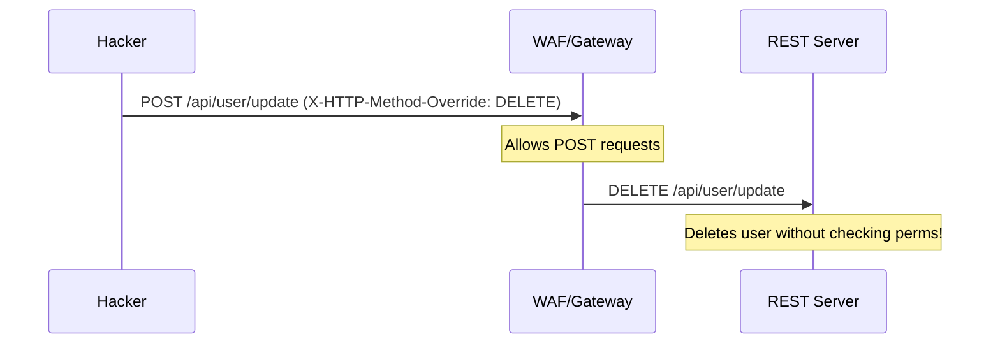

# REST API Security: Hardening the Web's Language

## 1. Beginner-friendly Hinglish Explanation 🇮🇳
Bhai, REST APIs internet ki "Lingua Franca" hain—woh language jismein sab log baat karte hain. REST security ka matlab hai `GET`, `POST`, `PUT`, aur `DELETE` requests ko safe banana. 

Socho tumne ek bank ki REST API banayi. Agar koi hacker bina permission ke `DELETE /api/account/123` bhej de aur tumhara server use execute kar de, toh account khatam! REST security mein hum seekhte hain ki kaise headers ko lock karein, kaise token verify karein, aur kaise yeh ensure karein ki server wahi kar raha hai jo user ko allowed hai.

---

## 2. Deep Technical Explanation
REST API security relies on standard HTTP features and robust backend logic.
- **Statelessness & Tokens**: REST is stateless, so each request must contain proof of identity (usually a Bearer Token/JWT).
- **HTTP Verbs Security**:
    - **GET**: Must be idempotent and never change state. Sensitive data should not be in the URL (avoid `/api/user?ssn=123`).
    - **POST/PUT**: Vulnerable to "Mass Assignment" and "Injection." Must use schema validation.
    - **DELETE**: Highly sensitive; must require strong authorization checks.
- **Resource Naming**: Avoid incremental IDs in paths (`/orders/1`) to prevent "Scraping" attacks.
- **Content-Type Validation**: Only accepting `application/json` to prevent "CSRF" via form-data.

---

## 3. Attack Flow Diagrams
**Insecure REST Verb Usage (Method Overriding):**

---

## 4. Real-world Attack Examples
- **Snapchat Data Breach (2013)**: A vulnerability in the REST API allowed attackers to download millions of phone numbers and usernames because the API didn't have rate limiting or authorization on the "Find Friends" endpoint.
- **Panera Bread Leak**: An unauthenticated REST API leaked millions of customer records in plain text for over 8 months.

---

## 5. Defensive Mitigation Strategies
- **HTTPS Only**: Use HSTS to ensure all REST calls are encrypted.
- **Authorization Headers**: Never pass tokens in the URL or Body; use the `Authorization: Bearer <token>` header.
- **UUIDs for Resources**: Use `orders/550e8400-e29b...` instead of `orders/1`.

---

## 6. Failure Cases
- **Bypassing with `_method` Parameter**: Some frameworks allow changing the method via a URL parameter (`/update?_method=DELETE`). This can bypass simple firewall rules.
- **JWT Alg: None**: If the REST server doesn't check the signing algorithm, a hacker can change it to `None` and forge any token they want.

---

## 7. Debugging and Investigation Guide
- **Checking for CORS**: Ensure your REST API doesn't have `Allow-Origin: *`.
- **Method Checking**: Using `curl -X OPTIONS https://api.com/resource` to see which verbs are exposed.
- **Response Headers**: Ensuring the server doesn't leak its technology stack (`Server: Microsoft-IIS/10.0`).

---

## 8. Tradeoffs
| Metric | API Keys | OAuth2 / JWT |
|---|---|---|
| Speed | Very Fast | Fast |
| Security | Medium (Static) | High (Short-lived) |
| Revocation | Immediate | Hard (Needs Blacklist) |

---

## 9. Security Best Practices
- **Implement Rate Limiting**: On every endpoint, especially auth ones.
- **Strict Payload Validation**: Use libraries like `Joi` or `Zod` to ensure the incoming JSON is exactly what you expect.
- **Use Error Codes Correctly**: Use `401 Unauthorized` for missing auth, and `403 Forbidden` for missing permissions.

---

## 10. Production Hardening Techniques
- **API Gateway Throttling**: Preventing a single user from taking down the server with 1000 requests per second.
- **Secure Serialization**: Ensuring your REST framework doesn't include hidden fields (like `password_hash`) in the JSON response by default.

---

## 11. Monitoring and Logging Considerations
- **Log the Route, Method, and User ID**: Essential for reconstructing an attack.
- **Success/Failure Ratios**: An unusual spike in 4xx or 5xx errors often indicates a security scan or an attack.

---

## 12. Common Mistakes
- **Putting Secrets in GET URLs**: URL paths and parameters are often logged by proxies and browsers.
- **Trusting the Content-Type**: A hacker can send XML to a JSON endpoint. If your parser is weak, it can lead to an XXE attack.

---

## 13. Compliance Implications
- **PCI-DSS**: Requires all RESTful transmission of credit card data to be encrypted and all access to be logged.

---

## 14. Interview Questions
1. Why is it bad practice to put sensitive data in a GET request?
2. How do you prevent "Mass Assignment" in a REST API?
3. What is the difference between `401` and `403` status codes?

---

## 15. Latest 2026 Security Patterns and Threats
- **REST-to-GraphQL Bridges**: Hackers targeting the "Translation layer" between REST and GraphQL to find injection points.
- **API Drift Detection**: Automated tools that compare your "Live API" with your "Swagger Docs" and alert you if new, unauthorized endpoints appear.
- **Signed REST Requests**: Using AWS Signature V4 style signing for all REST calls to ensure that even if a token is stolen, the request cannot be replayed or modified.
    
    
    
    
