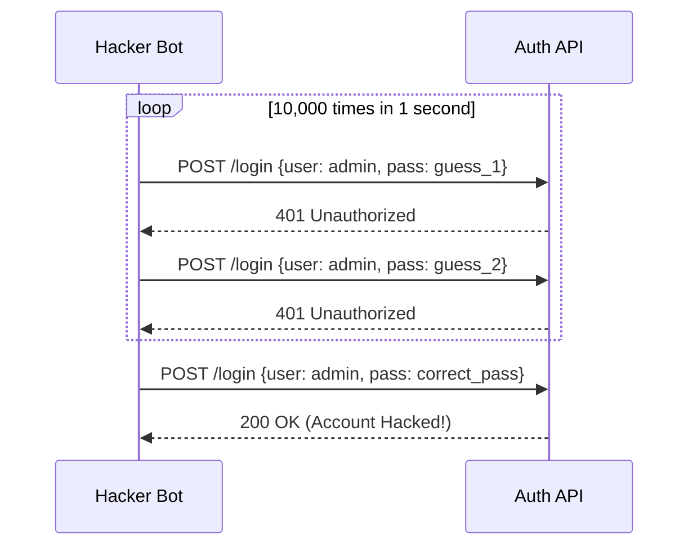

# Rate Limiting & Abuse Prevention: Stopping the Flood

## 1. Beginner-friendly Hinglish Explanation 🇮🇳
Bhai, socho tumne ek "Free Burger" ka offer nikala. Agar ek hi banda 10,000 baar line mein lag jaye, toh baaki logon ko kuch nahi milega aur tumhari dukan (Server) band ho jayegi. 

**Rate Limiting** wahi "Rules" hain jo decide karte hain ki ek user ek minute mein kitni baar system ko call kar sakta hai. Iska kaam sirf speed control karna nahi hai, balki hackers ko "Brute Force" (Bar-bar password guess karna) aur "DDoS" (System ko crash karna) se rokna hai. Bina iske, ek akela hacker tumhare pura infrastructure ka budget 5 minute mein khatam kar sakta hai.

---

## 2. Deep Technical Explanation
Rate limiting is the process of controlling the rate of traffic sent or received by a network interface or service.
- **Algorithms**:
    - **Token Bucket**: Users get tokens; every request uses a token. Tokens refill at a set rate. (Allows bursts).
    - **Leaky Bucket**: Requests enter a bucket and leave at a steady rate. (Prevents bursts).
    - **Fixed Window**: 100 requests per 1 minute. Reset at exactly 12:01, 12:02. (Vulnerable to spikes at the window edge).
    - **Sliding Window Log/Counter**: More precise, checks the *last 60 seconds* from the current millisecond.
- **Tiers**:
    - **IP-based**: Limiting based on the client's IP.
    - **User-based**: Limiting based on the UserID (after login).
    - **API Key-based**: For 3rd party developers.

---

## 3. Attack Flow Diagrams
**Brute Force Attack without Rate Limiting:**

---

## 4. Real-world Attack Examples
- **Instagram "Password Reset" Abuse**: In the past, hackers used a vulnerability in the password reset API to guess 6-digit codes by sending 1000s of requests per second, bypassing simple IP-based rate limits by using a botnet of 10,000 different IPs.
- **API Scraping**: Competitors using bots to hit a "Product Price" API every second to copy all data and under-price you in real-time.

---

## 5. Defensive Mitigation Strategies
- **CAPTCHA Integration**: If a user hits the rate limit, don't just block them; show a CAPTCHA. This stops bots but allows real humans who made a mistake.
- **Exponential Backoff**: Telling the client "Wait 1s, then 2s, then 4s, then 8s..." before trying again.
- **Circuit Breaker Pattern**: If a downstream service (like the DB) is overloaded, the rate limiter "Trips" and stops sending requests until the service recovers.

---

## 6. Failure Cases
- **Shared IP Problem**: If you rate limit by IP, and 100 students are using the same college Wi-Fi, one student's abuse can block the whole college.
- **Memory Overflow in Limiter**: If you use a "Fixed Window Log" and an attacker sends 1 million requests, storing the logs for those requests can crash your Redis or Memory.

---

## 7. Debugging and Investigation Guide
- **HTTP 429 Too Many Requests**: The standard response for a rate-limited user.
- **X-RateLimit Headers**: Sending headers like `X-RateLimit-Remaining: 45` to tell the user how many calls they have left.
- **Redis `MONITOR`**: Seeing the rate limit counters incrementing in real-time.

---

## 8. Tradeoffs
| Algorithm | Burst Support | Precision | Performance |
|---|---|---|---|
| Fixed Window | Low | Low | Very High |
| Token Bucket | High | Medium | High |
| Sliding Window| Medium | High | Low (CPU intensive) |

---

## 9. Security Best Practices
- **Implement at the Edge**: Use Cloudflare, Nginx, or AWS WAF to block traffic *before* it even hits your app code.
- **Tiered Limits**: 5 requests/sec for Login, but 100 requests/sec for getting the "Home Page."

---

## 10. Production Hardening Techniques
- **Distributed Rate Limiting**: Using a central store like **Redis** so that if a user hits Server A, Server B also knows their limit is used up.
- **Global Kill Switch**: A manual way to set a "0 requests/sec" limit for a specific API that is being actively abused.

---

## 11. Monitoring and Logging Considerations
- **High 429 Rate Alerts**: If 10% of your traffic is getting 429s, you are likely under a bot attack or your limits are too strict.
- **Bot Score Analysis**: Using "Bot Management" tools to distinguish between Googlebot (Good) and a Scraper Bot (Bad).

---

## 12. Common Mistakes
- **No Rate Limit on "Forgot Password"**: Allowing someone to send 10,000 emails to a victim, crashing their inbox and your email budget.
- **Forgetting internal APIs**: Hackers can often bypass the "External" rate limiter if they find a way to talk to internal services directly.

---

## 13. Compliance Implications
- **SLA (Service Level Agreements)**: If you rate limit a paying customer too aggressively, you might violate your contract (SLA) and owe them money.

---

## 14. Interview Questions
1. What is the difference between "Token Bucket" and "Leaky Bucket" algorithms?
2. How would you handle a DDoS attack that is coming from 10,000 different IP addresses?
3. What HTTP status code should you return when a user is rate limited?

---

## 15. Latest 2026 Security Patterns and Threats
- **Behavioral Rate Limiting**: Instead of a fixed number, the system calculates a "Trust Score" for each user. If you browse "Like a human," you get a higher limit.
- **AI-Driven Traffic Shaping**: Using AI to predict traffic spikes and automatically adjusting rate limits in real-time.
- **Web3 / Blockchain Spam**: Using rate limiting to protect decentralized APIs from "Gas-exhaustion" or "State-bloat" attacks.
    
    
    
    
    
    
