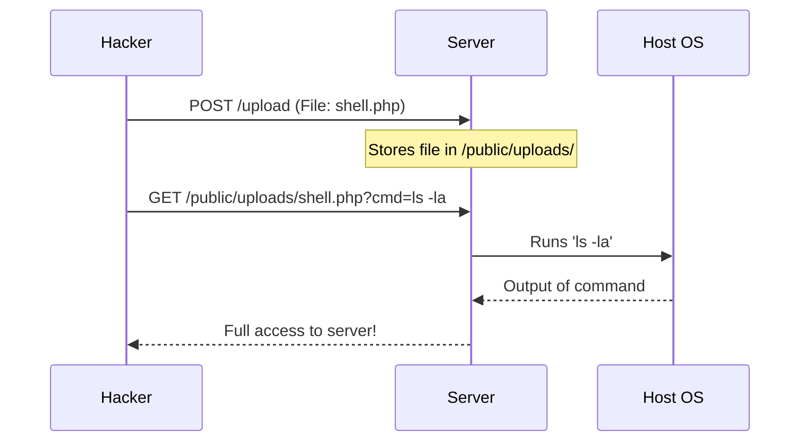

# Secure File Uploads: Handling the Dangerous Cargo

## 1. Beginner-friendly Hinglish Explanation 🇮🇳
Bhai, **File Upload** ek aisi feature hai jismein tum "Anjaan Logon" (Anonymous users) ko ijazat dete ho ki woh tumhare server par kuch "Store" karein. Yeh sabse khatarnak kaam ho sakta hai. 

Socho ek hacker ne `photo.jpg` ki jagah `virus.php` upload kar diya. Agar server ne use "Run" kar diya, toh hacker ka tumhare pura server par kabza ho jayega. Secure file upload ka matlab hai: "Aankh band karke kisi par bharosa mat karo." File ka size check karo, uska type (Extension) verify karo, use rename karo, aur use kisi "Safe Island" (S3 bucket) par rakho, server ke main folder mein nahi.

---

## 2. Deep Technical Explanation
File upload vulnerabilities can lead to Remote Code Execution (RCE), Local File Inclusion (LFI), or Cross-Site Scripting (XSS).
- **Extension Bypassing**: A hacker renames `shell.php` to `shell.php.jpg` or `shell.phtml` to bypass simple filters.
- **MIME Type Spoofing**: The attacker sends a PHP file but sets the `Content-Type` header to `image/jpeg`.
- **Path Traversal**: A filename like `../../etc/passwd` that tricks the server into overwriting critical system files.
- **Malware Injection**: A valid PDF or Image file that contains embedded malicious scripts (Polyglots).
- **Zip Slips**: Uploading a ZIP file that, when unzipped, places files in unauthorized directories via `../` paths.

---

## 3. Attack Flow Diagrams
**RCE (Remote Code Execution) via File Upload:**

---

## 4. Real-world Attack Examples
- **WordPress Plugin Vulnerabilities**: Many plugins have historically allowed users to upload "Avatars" without checking the file type, leading to thousands of site takeovers via PHP shells.
- **CGI Script Exploits**: Older servers that ran any file with an executable bit in a specific directory.

---

## 5. Defensive Mitigation Strategies
- **Rename Files on Upload**: Never keep the user's filename. Change `my_resume.pdf` to `a7f9-2310-88bc.pdf`.
- **Verify File Content (Magic Bytes)**: Don't just check the extension; check the first few bytes of the file to see if it's *actually* a PDF or JPEG.
- **Isolated Storage**: Store uploaded files in an external service like **AWS S3** or **Azure Blob Storage** with no execution permissions.
- **Scan with Antivirus**: Run every uploaded file through an engine like **ClamAV** or **VirusTotal API**.

---

## 6. Failure Cases
- **Null Byte Injection**: A filename like `shell.php%00.jpg`. Some older systems see `.jpg` at the end and allow it, but the OS sees the null byte and stops, saving the file as `shell.php`.
- **Incomplete Whitelist**: Allowing `.svg` (which can contain XSS) or `.html` thinking they are harmless documents.

---

## 7. Debugging and Investigation Guide
- **`file` command (Linux)**: Tells you what a file *actually* is based on its structure, not its name.
- **Checking Mount Options**: Ensure the upload directory is mounted with the `noexec` flag.

---

## 8. Tradeoffs
| Strategy | Security | Cost/Complexity |
|---|---|---|
| In-memory Scan | Very High | High latency/CPU |
| S3 Storage | High | Monthly storage cost |
| Strict Whitelist | High | Might block valid user files |

---

## 9. Security Best Practices
- **Max File Size**: Set a strict limit (e.g., 5MB). This prevents "Zip Bomb" or "Pixel Flood" DoS attacks.
- **No Direct Access**: Don't serve files directly from the upload path. Serve them via a script that checks permissions: `/get_file?id=123`.

---

## 10. Production Hardening Techniques
- **Image Transcoding**: If a user uploads a JPEG, use a library to "Re-process" it and save a new version. This strips any hidden malicious metadata or scripts.
- **Sandbox Processing**: If you need to process files (like converting PDF to Image), do it in an isolated Lambda function or a separate "Dirty" container.

---

## 11. Monitoring and Logging Considerations
- **Log the File Hash (SHA-256)**: If you find a virus later, you can search your logs to see who else uploaded that same file.
- **Audit Upload Patterns**: Alerts for a user who suddenly uploads 1000 files in 1 minute.

---

## 12. Common Mistakes
- **Trusting `$_FILES['type']`**: In PHP (and others), this value comes from the user's browser. It's 100% fakeable.
- **Putting Uploads in the Web Root**: Never let the `/uploads` folder be reachable by a direct URL like `mysite.com/uploads/virus.php`.

---

## 13. Compliance Implications
- **GDPR**: If you allow users to upload files, you might be storing PII (Personally Identifiable Information) without knowing. You need clear policies and "Data At Rest" encryption.

---

## 14. Interview Questions
1. How do you prevent a PHP shell from being executed after it's uploaded?
2. What are "Magic Bytes" and how do they help in file security?
3. What is a "Zip Slip" vulnerability?

---

## 15. Latest 2026 Security Patterns and Threats
- **AI-Steganography**: Hackers using AI to hide command-and-control (C2) instructions inside perfectly normal-looking images that pass all traditional scanners.
- **WASM-based Malware**: Uploading files that contain WebAssembly code designed to perform cryptomining or side-channel attacks in the browser of anyone who views the file.
- **Server-Side Request Forgery (SSRF) via PDF**: Tricking a PDF-to-HTML converter into fetching internal network data.
    
    
    
    
    
    
    
    
