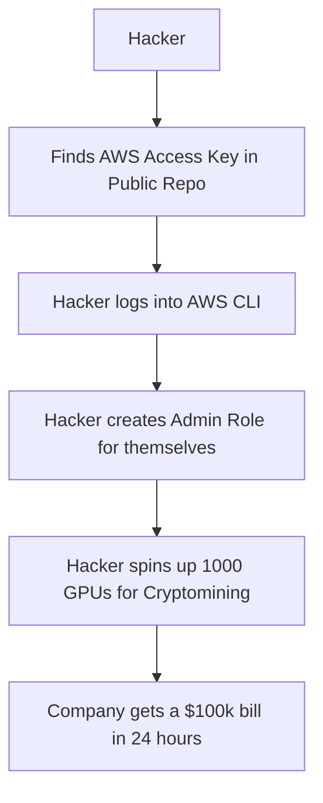

# AWS Security: Securing the World's Cloud

## 1. Beginner-friendly Hinglish Explanation 🇮🇳
Bhai, **AWS (Amazon Web Services)** duniya ka sabse bada cloud provider hai. 

Cloud security ka sabse bada rule hai: **Shared Responsibility Model**. 
Iska matlab hai: "AWS badal (Cloud) ki security sambhalega, aur tum uske andar jo rakha hai (Data/Apps) uski security sambhaloge." Agar tumne apna S3 bucket "Public" chhoda, toh Amazon tumhare liye kuch nahi kar sakta. Is module mein hum seekhenge ki kaise **IAM**, **VPC**, aur **Security Groups** ka use karke hum AWS par ek "Bulletproof" infrastructure bana sakte hain.

---

## 2. Deep Technical Explanation
AWS security is built on a hierarchy of controls:
- **IAM (Identity & Access Management)**: Controlling WHO (Users/Roles) can do WHAT (Actions) on WHICH (Resources).
- **VPC (Virtual Private Cloud)**: Isolating your network. Use Public Subnets only for Load Balancers and Private Subnets for App/DB.
- **Security Groups (Firewalls)**: Stateful firewalls at the instance level. Default should be "Deny All."
- **KMS (Key Management Service)**: Managing encryption keys for S3, RDS, EBS.
- **AWS GuardDuty**: An AI-driven threat detection service that monitors logs (CloudTrail, DNS) for malicious activity.

---

## 3. Attack Flow Diagrams
**The "Leaked AWS Key" Disaster:**

---

## 4. Real-world Attack Examples
- **Capital One Breach (2019)**: A hacker exploited a misconfigured WAF (Web Application Firewall) to steal the "IAM Role" of a server, which gave them access to 700 S3 buckets containing 100 million customer records.
- **Twilio Hack (2022)**: Attackers used phishing to steal an employee's AWS credentials and modified internal code to steal user data.

---

## 5. Defensive Mitigation Strategies
- **MFA for Root**: Never use the "Root" account for daily tasks. Enable physical MFA on it and lock it in a safe.
- **Use Roles, Not Keys**: For EC2 or Lambda, use "IAM Roles" so you don't have to store Access Keys in the code.
- **VPC Flow Logs**: Enable these to see every packet moving in and out of your cloud.

---

## 6. Failure Cases
- **Over-privileged Roles**: Giving a Lambda function `AdministratorAccess` when it only needs to read one S3 file.
- **Open S3 Buckets**: Accidentally setting a bucket to "Public" so anyone with the URL can download your logs or backups.

---

## 7. Debugging and Investigation Guide
- **CloudTrail**: The "CCTV Camera" of AWS. It logs every single API call made in your account. If something changed, CloudTrail knows who did it.
- **AWS Trusted Advisor**: A tool that gives you a "Checklist" of security misconfigurations in your account.

---

## 8. Tradeoffs
| Feature | Benefit | Complexity |
|---|---|---|
| Single AWS Account | Easy to manage | High Blast Radius (One hack kills all) |
| Multi-Account (AWS Org) | Secure Isolation | High Management Cost |
| IAM Users | Simple | Hard to rotate keys |

---

## 9. Security Best Practices
- **Least Privilege**: Only give the permissions absolutely necessary.
- **Infrastructure as Code (IaC)**: Use Terraform or CloudFormation to build your security, so it's repeatable and version-controlled.

---

## 10. Production Hardening Techniques
- **Service Control Policies (SCPs)**: Rules at the "Organization" level that prevent even an Admin from doing dangerous things (like disabling CloudTrail).
- **Amazon Inspector**: Automatically scans your EC2 instances for vulnerabilities and unintended network exposure.

---

## 11. Monitoring and Logging Considerations
- **AWS Config**: Monitoring "Configuration Drift." If someone opens a port on a firewall, Config will alert you instantly.
- **Security Hub**: A central dashboard that aggregates alerts from GuardDuty, Inspector, and Macie.

---

## 12. Common Mistakes
- **Using Access Keys in Local Dev**: Developers leaving `.aws/credentials` files on their laptops which are then stolen or lost.
- **Ignoring CloudWatch Alarms**: Getting 1000 security emails a day and ignoring them all ("Alert Fatigue").

---

## 13. Compliance Implications
- **AWS Artifact**: A portal where you can download AWS's own compliance reports (ISO, SOC2, PCI) to show your auditors.

---

## 14. Interview Questions
1. What is the "Shared Responsibility Model" in AWS?
2. How does an IAM Role differ from an IAM User?
3. What would you do if you realized your AWS Access Key was leaked on GitHub?

---

## 15. Latest 2026 Security Patterns and Threats
- **GenAI Security in AWS (Bedrock)**: Ensuring that your data used to train AI models in AWS doesn't leak into the public model.
- **Nitro System Security**: AWS's hardware-level isolation that ensures even AWS employees cannot see the data inside your EC2 instances.
- **Cloud Native Security (CNAPP)**: Unified platforms that manage everything from code security to cloud configuration in one place.
