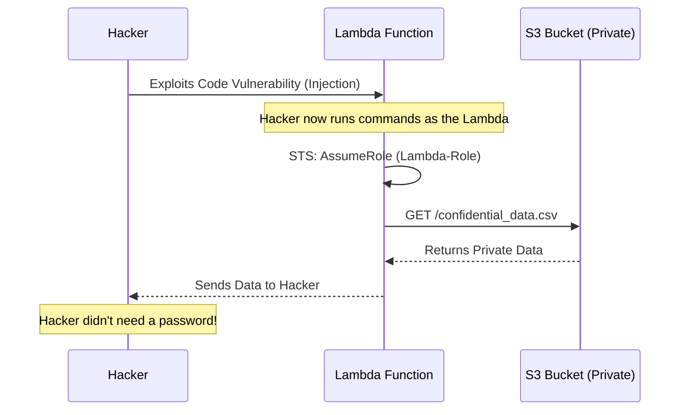

# Cloud Identity & Access Management (IAM): The New Perimeter

## 1. Beginner-friendly Hinglish Explanation 🇮🇳
Bhai, puraane zamane mein security ka matlab tha "Firewall" (ek deewar). Lekin aaj kal servers aur data internet par hain, toh asli deewar hai **Identity (Pechan)**. 

**Cloud IAM** ka matlab hai: "Kaun (Who) kya (What) kar sakta hai aur kab (When)." 
Socho tumne ek naya developer hire kiya. Tum use "Full Admin" access nahi doge. Tum use ek "Role" doge jo sirf use code upload karne ki ijazat de. IAM security ka sabse zaruri hissa hai kyunki 80% cloud breaches "Ghalat Permissions" ki wajah se hote hain. Is module mein hum seekhenge ki kaise "Roles", "Policies", aur "Groups" ka use karke hum apne cloud ko secure karein.

---

## 2. Deep Technical Explanation
Cloud IAM is based on the relationship between **Principals**, **Actions**, and **Resources**.
- **Principals**: Users, Groups, or Applications (Service Accounts/Roles).
- **Policies**: JSON documents that define permissions (e.g., `Allow`, `s3:ListBucket`, `Resource: *`).
- **Implicit Deny**: If a permission isn't explicitly granted, it's denied by default.
- **Explicit Deny**: A "Deny" rule always overrides any "Allow" rule.
- **Trust Relationships**: Defining which external services (like a GitHub Action) can "Assume" a role in your cloud.

---

## 3. Attack Flow Diagrams
**IAM Role Assumption Exploit:**

---

## 4. Real-world Attack Examples
- **Capital One (SSRF to IAM)**: A hacker used a Server-Side Request Forgery attack to hit the AWS "Metadata Service" (169.254.169.254) and steal the temporary credentials of an IAM role.
- **Ubiquiti Breach**: An internal employee used their own high-level IAM credentials to steal data and then tried to "Extort" the company for money.

---

## 5. Defensive Mitigation Strategies
- **Principle of Least Privilege (PoLP)**: Start with 0 permissions. Only add what is needed. Use "IAM Access Analyzer" to find unused permissions.
- **MFA for All Users**: No human should ever log into the cloud console without MFA.
- **Temporary Credentials**: Never use "Permanent Access Keys." Use "Roles" that generate 1-hour tokens.

---

## 6. Failure Cases
- **Wildcard Permissions**: Using `Resource: *` or `Action: *`. If a server with this permission is hacked, the hacker can delete everything in your account.
- **Circular Dependencies**: Role A can assume Role B, and Role B can assume Role A, creating a loop that can be exploited to bypass audits.

---

## 7. Debugging and Investigation Guide
- **IAM Policy Simulator**: Testing a JSON policy before you apply it to see if it allows too much.
- **CloudTrail Lookup**: Searching for "AccessDenied" errors to see if your app is missing a permission or if a hacker is probing your resources.

---

## 8. Tradeoffs
| Feature | IAM Users | IAM Roles |
|---|---|---|
| Security | Low (Permanent Keys) | High (Temporary Tokens) |
| Complexity | Easy | Hard (Needs trust config) |
| Maintenance | High (Key rotation) | Low (Auto-rotation) |

---

## 9. Security Best Practices
- **Never use the Root User**: Lock it away and use an "Admin" user instead.
- **Audit Roles Regularly**: If a project is finished, delete the roles associated with it.

---

## 10. Production Hardening Techniques
- **Permission Boundaries**: A "Max Limit" on what a user can do, even if they are given "Admin" rights by someone else.
- **ABAC (Attribute-Based Access Control)**: "Allow access to S3 only if the tag `Project` on the user matches the tag `Project` on the bucket."

---

## 11. Monitoring and Logging Considerations
- **Credential Rotation Alerts**: Alerts for any Access Key that is older than 90 days.
- **Login Source Monitoring**: Alerts for logins from IPs that are not part of your office or VPN range.

---

## 12. Common Mistakes
- **Hardcoding Keys**: Putting `AWS_ACCESS_KEY_ID` in your `.env` file. (Use IAM Instance Profiles instead).
- **Ignoring "Console" vs "API" access**: Giving a user console access but forgetting to restrict what they can do via the CLI.

---

## 13. Compliance Implications
- **SOC2 / HIPAA**: Requires a documented "Access Control Matrix" showing exactly who has access to production data and why.

---

## 14. Interview Questions
1. What is the difference between an IAM User and an IAM Role?
2. How does the "Implicit Deny" rule work in IAM?
3. What is a "Service-Linked Role"?

---

## 15. Latest 2026 Security Patterns and Threats
- **Identity-First Security**: Moving away from "Network Firewalls" entirely and relying 100% on IAM and MFA for every request.
- **Just-In-Time (JIT) Privileges**: A user has 0 permissions. They request "Admin access" for 30 minutes, it gets approved by a manager, and then expires automatically.
- **AI-Managed IAM**: AI that watches your app's behavior and automatically generates the "Smallest possible IAM policy" for it.
