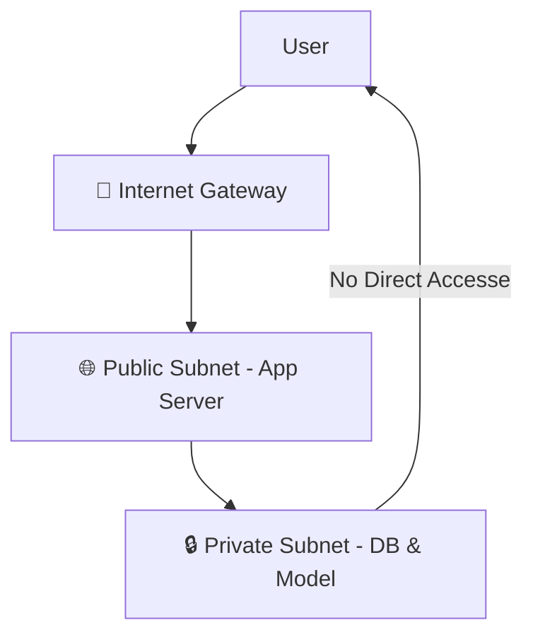

# 🌐 Network Security: Protecting the Cloud (Security Guide)
> **Level:** Beginner → Expert | **Goal:** Master VPCs, Subnets, Firewalls, and SSL/TLS Encryption

---

## 📋 Is Guide Se Kya Seekhoge

| Topic | Importance |
|-------|------------|
| 1. VPC (Virtual Private Cloud) | Network Isolation |
| 2. Public vs Private Subnets | Access Control |
| 3. Security Groups vs NACLs | Firewalls logic |
| 4. SSL/TLS Handshake | Encryption in Transit |
| 5. VPN & Bastion Hosts | Management security |
| 6. Exercises & Challenges | Design a secure network |

---

## 1. 🛡️ VPC: The Digital Border

VPC (Virtual Private Cloud) ek logically isolated part hai cloud ka (AWS/Azure/GCP).
- **Default VPC:** Kuch nahi.
- **Custom VPC:** Khud ka IP range (CIDR), subnets aur security rules.

---

## 🏗️ 2. Public vs Private Subnets

Security ka sabse bada rule: **Database ko kabhi internet se connect mat karo.**

1. **Public Subnet:** Internet se connected. Isme App Servers, Load Balancer, Nginx rakho (Accessible for users).
2. **Private Subnet:** Internet se disconnect. Isme Database, AI Model servers (GPU), Redis rakho (Only internal communication).

---

## 🛡️ 3. Security Groups & NACLs

Firewalls do tarah ki hoti hain cloud mein.

| Feature | Security Group (SG) | Network ACL (NACL) |
|---------|---------------------|-------------------|
| **Level** | Instance Level | Subnet Level |
| **State** | Stateful (Response allowed) | Stateless (Rule required) |
| **Default** | Deny All | Allow All |

---

## 📞 4. SSL/TLS: Encryption in Transit

Encryption "Handshake" process se start hoti hai.
1. **Client Hello:** User browser server se "Cipher Suite" puchi hai.
2. **Server Hello + Cert:** Server apna code aur certificate deta hai.
3. **Session Key:** Dono milkar ek symmetric key banate hain session safe rakhne ke liye.

---

## 🏢 5. Bastion Host (Jump Box)

Private network ka access kaise karein management ke liye? 
Ek chhota **Bastion Host** (Jump Box) setup karein public subnet mein. User SSH karega Bastion par, aur phir Bastion se internal private IP pe SSH karega (Double security).

---

## 🧪 Exercises — Design a Secure Network!

### Challenge 1: The DB Leak ⭐⭐
**Scenario:** Aapka database internet se connected hai, lekin login secure hai (Complex password). 
Question: Isme system design security risk kya hai?

Answer

Password secure hona kaafi nahi hai. Hacker **Port Scanning**, **Dos Attacks**, ya **Zero-day vulnerabilities** se DB machine control kar sakta hai agar wo "Private Subnet" mein isolated nahi hai.

---

## 🔗 Resources
- [AWS VPC Fundamentals (Video)](https://www.youtube.com/watch?v=ap8m8XOf6-A)
- [NIST Guide on Network Security](https://csrc.nist.gov/publications/detail/sp/800-41/rev-1/final)
- [How SSL/TLS works exactly](https://www.cloudflare.com/learning/ssl/what-is-ssl/)
