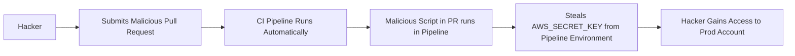

# CI/CD Security: Securing the Software Factory

## 1. Beginner-friendly Hinglish Explanation 🇮🇳
Bhai, **CI/CD Pipeline** tumhari software ki "Factory" hai. Developer yahan se code bhejta hai, aur pipeline use pack karke production mein bhej deti hai. 

Socho agar hacker is factory ke "Watchman" (Jenkins/GitHub Actions) ko hi rishwat de de? Agar pipeline hack ho gayi, toh hacker tumhare code mein "Virus" daal sakta hai jo tumhare har user ke paas pahunch jayega. **CI/CD Security** ka matlab hai is pipeline ko lock karna—kaun code push kar sakta hai, kaun secrets dekh sakta hai, aur kaise yeh ensure karein ki jo code deploy ho raha hai woh wahi hai jo humne approve kiya tha.

---

## 2. Deep Technical Explanation
CI/CD security focuses on protecting the automated software delivery process.
- **Pipeline Identity**: Every pipeline runner should have a short-lived identity (e.g., using OIDC) to access cloud resources.
- **Build Integrity**: Ensuring that the code wasn't modified between the `commit` and the `deploy` stage.
- **Runner Security**: Keeping the build machines (Jenkins agents, GitHub Runners) hardened and isolated.
- **Environment Isolation**: The CI/CD system should be able to talk to "Production," but "Production" should never be able to talk back to the CI/CD system.

---

## 3. Attack Flow Diagrams
**Poisoning the CI/CD Pipeline:**

---

## 4. Real-world Attack Examples
- **Codecov Breach (2021)**: Hackers modified a bash script used in the Codecov CI process. This allowed them to steal environment variables (secrets) from thousands of companies who were using Codecov.
- **SolarWinds (Sunspot Malware)**: Attackers injected malware directly into the "Build Process." The developers' source code was clean, but the final binary was malicious.

---

## 5. Defensive Mitigation Strategies
- **Secret Masking**: Ensuring that secrets are never printed in the pipeline logs.
- **Pinning Dependencies**: Never use `image: latest`. Use a specific hash: `image: node@sha256:abcd...`.
- **Signed Commits**: Requiring developers to sign their commits with GPG keys so the pipeline knows the code actually came from them.

---

## 6. Failure Cases
- **Over-privileged Runners**: A Jenkins runner that has full `AdminAccess` to your AWS account.
- **Unprotected Branches**: Allowing anyone to push code directly to `main` without a Pull Request review.

---

## 7. Debugging and Investigation Guide
- **Log Auditing**: Checking the history of "Who changed the CI/CD configuration file (`.github/workflows/main.yml`)?"
- **Isolated Runners**: Running every build in a fresh, ephemeral container that is destroyed immediately after.

---

## 8. Tradeoffs
| Metric | Self-Hosted Runners | Cloud-Managed Runners |
|---|---|---|
| Security | High (You control network) | Medium (Shared infrastructure) |
| Maintenance | High | Zero |
| Speed | Fast (Local cache) | Slower |

---

## 9. Security Best Practices
- **Two-Person Approval**: At least one other person must approve a PR before it can be merged and deployed.
- **Principle of Least Privilege**: The CI/CD token should only have "Write" access to the specific bucket it deploys to.

---

## 10. Production Hardening Techniques
- **OIDC (OpenID Connect) for CI/CD**: Removing permanent AWS Keys from GitHub/GitLab. The pipeline requests a temporary token from AWS for each run.
- **Immutable Pipelines**: Using a "Pipeline as Code" approach where the build steps cannot be modified by the build itself.

---

## 11. Monitoring and Logging Considerations
- **Anomaly Detection**: Alerts if a pipeline starts a process it has never started before (e.g., `curl hacker.com`).
- **Audit Trails**: Recording every manual "Approval" and "Deployment" action.

---

## 12. Common Mistakes
- **Storing Secrets in Git**: `credentials.json` inside the repo.
- **Bypassing Reviews**: Giving yourself "Admin" rights to push to `main` when you're in a hurry.

---

## 13. Compliance Implications
- **SOC2**: Requires proof of "Segregation of Duties"—the person who writes the code should not be the only person who can deploy it to production.

---

## 14. Interview Questions
1. How do you secure secrets in a GitHub Actions workflow?
2. What is a "Supply Chain Attack" in the context of CI/CD?
3. Why should you avoid using `latest` tags in your Dockerfiles/Pipelines?

---

## 15. Latest 2026 Security Patterns and Threats
- **OIDC-Only Architecture**: Moving away from long-lived "Service Account Keys" entirely in CI/CD.
- **Supply-Chain Levels for Software Artifacts (SLSA)**: A set of standards to prove that your build process is "Tamper-proof."
- **In-Toto Attestations**: Using cryptographic signatures to "Prove" that every step in your pipeline was completed successfully and by the correct tool.
