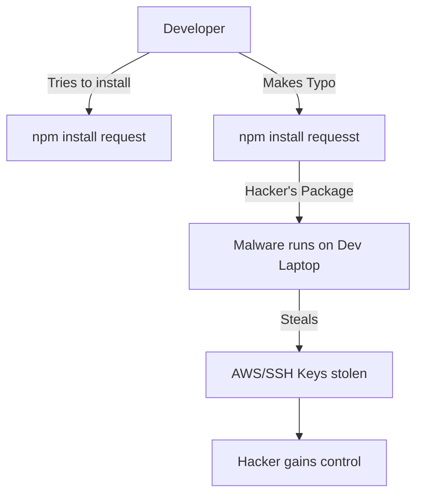

# Dependency & Supply Chain Security: Trusting Your Tools

## 1. Beginner-friendly Hinglish Explanation 🇮🇳
Bhai, modern software development ka matlab hai "Ready-made parts" ko jodna. Jab tum `npm install` ya `pip install` karte ho, toh tum kisi aur ka likha hua code apne computer par chala rahe ho. 

Socho agar woh "Ready-made part" (Library) hi zehreela (Malicious) ho? Isse hum **Supply Chain Attack** kehte hain. Hacker ek popular library ko hack karta hai, usmein malware daalta hai, aur woh malware tumhare through tumhare saare users tak pahunch jata hai. Is module mein hum seekhenge ki kaise in 3rd party libraries par "Aankh band karke" bharosa na karein aur kaise apne software ki "Ingredients" ko check karein.

---

## 2. Deep Technical Explanation
The software supply chain consists of everything that goes into your software: code, libraries, build tools, and cloud infrastructure.
- **SCA (Software Composition Analysis)**: Tools that scan your `package.json` or `requirements.txt` for libraries with known vulnerabilities (CVEs).
- **Typosquatting**: Hackers upload libraries with names very similar to popular ones (e.g., `requesst` instead of `requests`) hoping you'll make a typo.
- **Dependency Confusion**: Tricking a build system into pulling a malicious "Public" package instead of your "Private" internal one.
- **SBOM (Software Bill of Materials)**: A machine-readable list of all components in your software.

---

## 3. Attack Flow Diagrams
**Typosquatting Attack:**

---

## 4. Real-world Attack Examples
- **SolarWinds Breach (2020)**: Attackers injected a backdoor into a build tool used by SolarWinds. This tool then compiled the malware into their official product, infecting 18,000 customers (including the US Treasury).
- **left-pad Incident**: A developer deleted a tiny library (`left-pad`) from npm. Because thousands of other libraries depended on it, half the internet's build systems crashed instantly. This showed how fragile the supply chain is.

---

## 5. Defensive Mitigation Strategies
- **Dependency Pinning**: Always use exact versions (`react: "18.2.0"`) instead of range versions (`react: "^18.2.0"`).
- **Lock Files**: Always commit `package-lock.json` or `yarn.lock` to ensure everyone in the team is using the *exact same* bits.
- **Automated Scanning**: Use **GitHub Dependabot** or **Snyk** to get alerts for vulnerable libraries.

---

## 6. Failure Cases
- **Transitive Dependencies**: You trust Library A. But Library A trusts Library B, which trusts Library C. Library C is hacked. You are now hacked, even though you never heard of Library C.
- **Abandoned Packages**: Using a library that hasn't been updated in 5 years. It likely has many unpatched security holes.

---

## 7. Debugging and Investigation Guide
- **npm audit / yarn audit**: Quick commands to see if your current project has any known vulnerable packages.
- **SBOM Generation**: Using tools like `syft` to create a full list of all your software's "Ingredients."

---

## 8. Tradeoffs
| Strategy | Security | Developer Speed |
|---|---|---|
| Manual Review | Maximum | Ultra-Slow |
| Automated Scan | High | Fast |
| Ignore | Zero | Ultra-Fast |

---

## 9. Security Best Practices
- **Minimize Dependencies**: Don't install a 100KB library just to capitalize a string. Write the code yourself.
- **Use a Private Registry**: Use Verdaccio or Artifactory to "Mirror" only approved public packages for your team.

---

## 10. Production Hardening Techniques
- **SLSA (Supply-chain Levels for Software Artifacts)**: A framework by Google to ensure your build process is secure and traceable.
- **Provenance Attestation**: Cryptographically proving that "This binary was built from this specific Git commit on this specific Jenkins server."

---

## 11. Monitoring and Logging Considerations
- **Dependency Updates**: Monitoring how quickly your team patches critical library vulnerabilities.
- **Audit Logs for Registry**: Tracking who added a new dependency to the `package.json`.

---

## 12. Common Mistakes
- **Ignoring "Low" Severity Alerts**: Sometimes 3 "Low" bugs can be combined into one "Critical" exploit.
- **Trusting a high "Star" count**: Just because a library has 50k stars on GitHub doesn't mean it's secure.

---

## 13. Compliance Implications
- **Executive Order 14028**: Requires vendors selling to the US government to provide an SBOM for all their software.

---

## 14. Interview Questions
1. What is a "Transitive Dependency"?
2. How does a "Dependency Confusion" attack work?
3. Why is an SBOM important for a modern enterprise?

---

## 15. Latest 2026 Security Patterns and Threats
- **AI-Generated Malicious Libraries**: Attackers using AI to write libraries that look legitimate and solve real problems, but contain hidden backdoors.
- **Namespace Shadowing**: A new type of attack targeting mono-repos and private packages.
- **Real-time Dependency Blocking**: Firewalls that block `npm install` in real-time if a library is flagged as malicious by the community.
