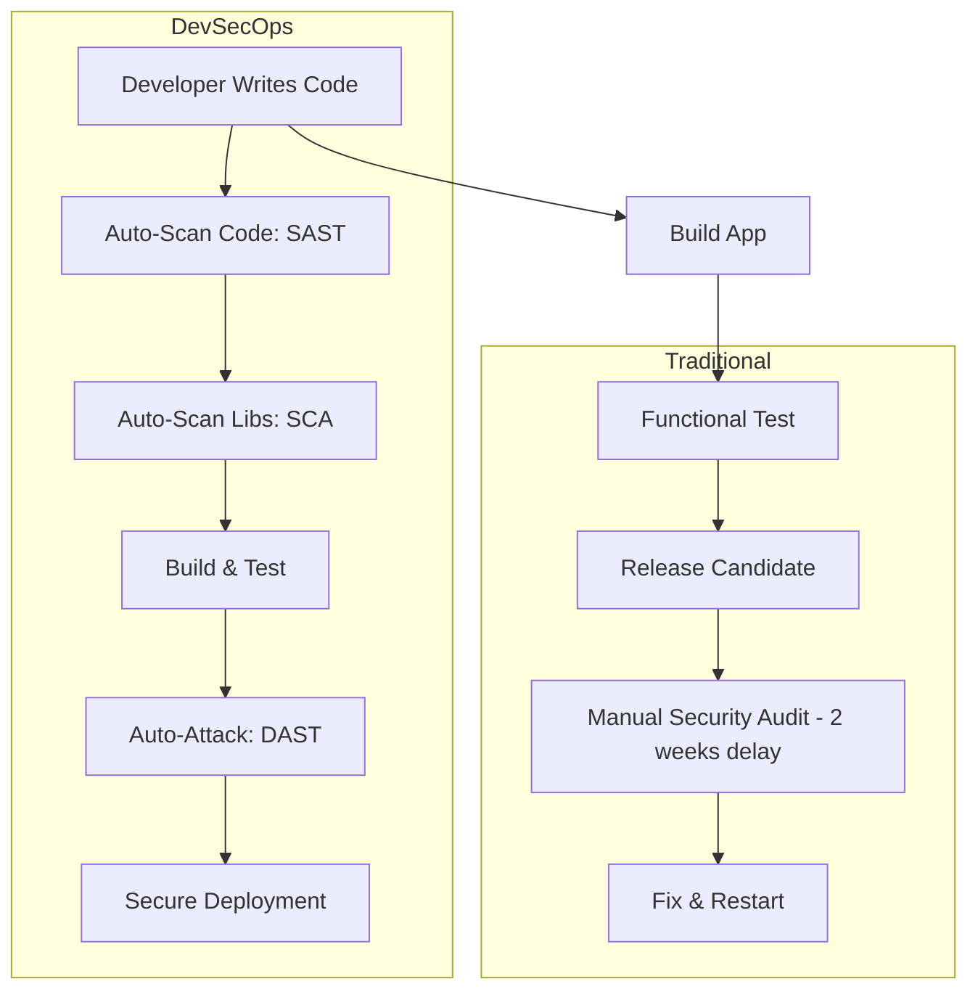

# DevSecOps Fundamentals: Integrating Security into the Heart of DevOps

## 1. Beginner-friendly Hinglish Explanation 🇮🇳
Bhai, **DevSecOps** ka matlab hai DevOps (Development + Operations) ki speed mein "Security" ka tadka lagana. 

Purane zamane mein, developer code likhte the aur end mein security team use check karti thi—bilkul us plumber ki tarah jo ghar banne ke baad pipes check karta hai. DevSecOps kehta hai ki security ko pipeline ka "Automated" part banna chahiye. Har bar jab koi developer code "Push" kare, tab automatically security tests run honi chahiye. Iska goal hai speed aur security dono ko sath lekar chalna, bina ek dusre ko slow kiye.

---

## 2. Deep Technical Explanation
DevSecOps is the practice of integrating security activities into every stage of the DevOps lifecycle through automation and cultural change.
- **Continuous Security**: Not a one-time check, but a recurring automated process in the CI/CD pipeline.
- **Shift Left**: Moving security testing earlier in the development process (at the IDE and PR level).
- **Shift Right**: Continuous security monitoring and feedback in the production environment.
- **Security as Code**: Defining security policies (Firewalls, IAM, Compliance) in code (Terraform/Ansible) so they are version-controlled and repeatable.

---

## 3. Attack Flow Diagrams
**Traditional Security vs. DevSecOps Pipeline:**

---

## 4. Real-world Attack Examples
- **Log4Shell (2021)**: Companies with DevSecOps could identify every single server running the vulnerable library in minutes using automated SCA tools. Companies without it spent weeks manually checking spreadsheets.
- **SolarWinds Breach**: Attackers modified the "Build System" to inject malware. DevSecOps focuses on securing the "Pipeline" itself to prevent such supply-chain attacks.

---

## 5. Defensive Mitigation Strategies
- **Automated Scanning**: Integrate **SAST** (Checkmarx, Snyk), **SCA** (Github Dependabot), and **DAST** (OWASP ZAP) into the pipeline.
- **Policy as Code (OPA)**: Automatically reject any infrastructure change that doesn't meet security rules (e.g., "No public S3 buckets").
- **Security Champions**: Developers who act as the primary security contact for their teams.

---

## 6. Failure Cases
- **Alert Fatigue**: Flooding developers with thousands of "Low" severity alerts, causing them to ignore real "Critical" ones.
- **Broken Pipeline**: A security tool that is too slow, causing developers to "Bypass" it to meet deadlines.

---

## 7. Debugging and Investigation Guide
- **Pipeline Logs**: Checking which specific security test failed the build.
- **Vulnerability Triage**: Using a central dashboard (like DefectDojo) to track and manage bugs from multiple tools.

---

## 8. Tradeoffs
| Feature | Manual Security | DevSecOps |
|---|---|---|
| Speed | Slow | Fast (Automated) |
| Depth | High (Human logic) | Medium (Pattern matching) |
| Consistency | Low | High |

---

## 9. Security Best Practices
- **Fail Fast**: Stop the build as soon as a critical vulnerability is found. Don't wait for the end.
- **Treat Security like a Feature**: It should be in the "Definition of Done" for every task.

---

## 10. Production Hardening Techniques
- **Infrastructure as Code (IaC) Scanning**: Checking Terraform files for misconfigurations before they are applied.
- **Immutable Infrastructure**: Replacing servers instead of patching them to ensure no configuration drift.

---

## 11. Monitoring and Logging Considerations
- **Drift Detection**: Alerts when someone changes a production setting manually (outside of the code).
- **Security Metric Tracking**: Measuring "Mean Time to Repair" (MTTR) for security vulnerabilities.

---

## 12. Common Mistakes
- **Automating "Broken" processes**: If your manual security process is bad, automating it will just make it "Bad and Fast."
- **Forgetting the Human**: Thinking tools alone can replace a security mindset.

---

## 13. Compliance Implications
- **SOC2 / PCI-DSS**: Requires proof that security checks are consistently applied to every code change.

---

## 14. Interview Questions
1. What does "Shift Left" mean in DevSecOps?
2. How do you balance "Speed of Release" with "Depth of Security"?
3. What is the difference between SAST and SCA?

---

## 15. Latest 2026 Security Patterns and Threats
- **AI-Native DevSecOps**: Using LLMs to automatically write "Fixes" for vulnerabilities found in the pipeline.
- **Supply Chain Security (SLSA)**: A framework for ensuring that every part of your build process is verified and untampered.
- **Platform Engineering for Security**: Building "Golden Paths" where security is built-in by default, so developers don't have to think about it.
