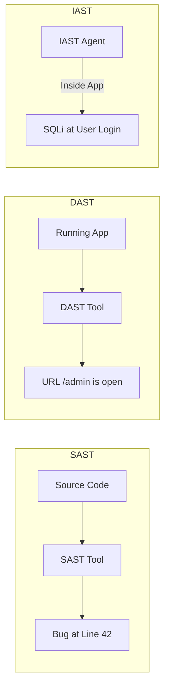

# SAST, DAST, and IAST Scanning: The Automated Detectives

## 1. Beginner-friendly Hinglish Explanation 🇮🇳
Bhai, **SAST, DAST aur IAST** aapke code ke teen alag tarah ke "Bodyguards" hain. 

- **SAST (Static Analysis)**: Yeh code ko bina chalaye check karta hai (jaise koi teacher spelling mistake check karta hai). 
- **DAST (Dynamic Analysis)**: Yeh app ko "Hacker bankar" attack karta hai jab woh chal rahi hoti hai. 
- **IAST (Interactive Analysis)**: Yeh sabse smart hai—yeh app ke *andar* baith kar dekhta hai ki jab attack ho raha hai toh code kaise behave kar raha hai.
Security engineer ko pata hona chahiye ki kaunsa bodyguard kab use karna hai taaki koi bhi vulnerability bach na paye.

---

## 2. Deep Technical Explanation
- **SAST (White Box)**: Scans source code, binaries, or byte code.
    - **Pros**: Finds issues early (Shift Left), points to the exact line of code.
    - **Cons**: High False Positives, can't find configuration or runtime issues.
- **DAST (Black Box)**: Scans the running application via the front-end/API.
    - **Pros**: Finds runtime issues (Auth, TLS, Server config), no access to code needed.
    - **Cons**: Finds issues late (Shift Right), doesn't know *why* the bug exists.
- **IAST (Grey Box)**: An agent inside the application runtime.
    - **Pros**: Low False Positives, combines code-level visibility with runtime context.
    - **Cons**: Language-specific (Needs an agent for Java, .NET, etc.), can slow down testing.

---

## 3. Attack Flow Diagrams
**Comparing the Three Bodyguards:**

---

## 4. Real-world Attack Examples
- **Hardcoded Secret**: A **SAST** tool finds a database password in `config.js` before the code is even finished.
- **Insecure Cookies**: A **DAST** tool finds that your "Session Cookie" is missing the `Secure` flag while scanning the login page.
- **Data Leakage**: An **IAST** tool sees that a user's SSN is being logged to a text file in plain text during a transaction.

---

## 5. Defensive Mitigation Strategies
- **Pipeline Integration**: Run SAST on every "Pull Request" and DAST on every "Staging" deploy.
- **Vulnerability Triage**: Have a clear process to mark "False Positives" so the developers don't get frustrated.
- **Hybrid Approach**: Use all three (SAST + DAST + IAST) for the most critical applications.

---

## 6. Failure Cases
- **Obfuscated Code**: SAST might fail if the code is too complex or written in an unsupported language.
- **Complex Auth**: DAST might fail to scan deep inside an app if it can't figure out how to "Login" or handle "MFA."

---

## 7. Debugging and Investigation Guide
- **SonarQube / Checkmarx**: Industry standard SAST tools.
- **OWASP ZAP / Burp Suite Enterprise**: Popular DAST tools.
- **Contrast Security / Veracode**: Leading IAST providers.

---

## 8. Tradeoffs
| Feature | SAST | DAST | IAST |
|---|---|---|---|
| Phase | Coding | Testing/Staging | Testing/Staging |
| False Positives | High | Low | Very Low |
| Line of Code | Yes | No | Yes |

---

## 9. Security Best Practices
- **Custom Rules**: Write your own rules for SAST/DAST to find bugs specific to your company's business logic.
- **Incremental Scanning**: Only scan the "Changed Code" to keep the CI/CD pipeline fast.

---

## 10. Production Hardening Techniques
- **DAST on Production (Safe Mode)**: Running non-destructive DAST scans on your live site once a week to find new configuration issues.
- **OSS (Open Source Software) Scanning**: Always include a scan for your 3rd-party libraries (SCA) alongside SAST.

---

## 11. Monitoring and Logging Considerations
- **Scan Pass/Fail Ratio**: Tracking if security is getting better or worse over time.
- **Critical Vuln Alerting**: If a "Critical" bug is found, send an instant alert to the security team's PagerDuty.

---

## 12. Common Mistakes
- **Relying on ONLY one tool**: Using SAST doesn't mean you are safe from DAST-found configuration issues.
- **Not fixing the bugs**: Running the scans every day but never actually giving developers time to fix the findings.

---

## 13. Compliance Implications
- **PCI-DSS Requirement 6.6**: Specifically requires either a "Web Application Firewall" or "Automated Vulnerability Assessment" (DAST/SAST) for all public-facing apps.

---

## 14. Interview Questions
1. Explain the difference between SAST and DAST.
2. Why is IAST considered 'Smart'?
3. At which stage of the SDLC should you run a SAST scan?

---

## 15. Latest 2026 Security Patterns and Threats
- **AI-Native SAST**: Scanners that don't just find a bug, but "Auto-write" the secure fix and open a Pull Request for the developer.
- **API-Specific DAST**: Specialized tools that understand GraphQL and Protobuf to find deep logic bugs.
- **Self-Healing Pipelines**: If a scanner finds a critical bug in a library, the pipeline automatically "Upgrades" the library to the secure version and tests it.
