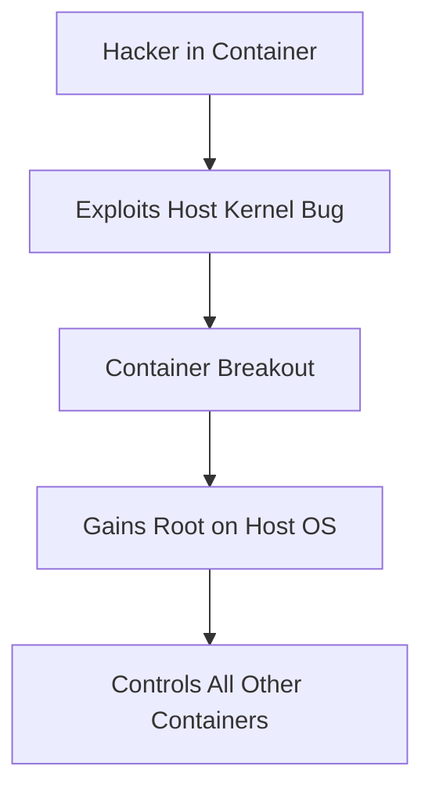

# Container Security: Securing Docker & Kubernetes

## 1. Beginner-friendly Hinglish Explanation 🇮🇳
Bhai, containers (jaise Docker) ne software deployment ko bohot asaan bana diya hai, lekin security ke liye nayi "Challenges" bhi laya hai. 

Socho ek container ek "Kiraye ka kamra" (Rental Room) hai. Tum sab ko ek hi "Makaan" (Kernel/OS) mein rakh rahe ho. Agar ek kirayedar gunda nikal jaye aur woh diwar tod kar dusre ke kamre mein ghus jaye (**Container Escape**), toh sab khatre mein hain. 

**Container Security** ka matlab hai:
1. Sahi "Image" use karna (No malware inside).
2. "Kamre" ko lock karna (Restricting privileges).
3. "Makaan" (Host) ko safe rakhna.
Is module mein hum seekhenge ki kaise containers ko "Bulletproof" banaya jata hai.

---

## 2. Deep Technical Explanation
Container security relies on Linux Kernel primitives:
- **Namespaces**: Provide a private view of the system (Network, PID, Mount). Container A cannot see Container B's processes.
- **Cgroups (Control Groups)**: Limit resources (CPU, RAM). Prevents one container from crashing the host (DoS).
- **Capability Dropping**: Removing root-like powers (e.g., `NET_RAW`, `SYS_ADMIN`) from the container.
- **Seccomp & AppArmor**: Restricting which system calls a container can make.
- **Image Scanning**: Checking the layers of a Docker image for known vulnerabilities (CVEs) before running it.

---

## 3. Attack Flow Diagrams
**Container Escape Attack:**

---

## 4. Real-world Attack Examples
- **Tesla's Kubernetes Breach**: Hackers found an exposed Kubernetes dashboard with no password. They used it to spin up containers for "Cryptomining," costing Tesla thousands of dollars.
- **Docker Hub Poisoning**: Hackers uploaded a "Modified" version of a popular image (like `alpine`) with a back-door inside. Thousands of developers downloaded it thinking it was safe.

---

## 5. Defensive Mitigation Strategies
- **Distroless Images**: Using images that only contain your app and its dependencies (No shell, no `curl`, no `apt`). If a hacker gets in, they have no tools to use.
- **Read-only Filesystem**: Running the container with `--read-only`. This prevents malware from being written to the disk.
- **Rootless Docker**: Running the Docker daemon as a regular user, not `root`.

---

## 6. Failure Cases
- **Privileged Containers**: Running with `--privileged` gives the container almost full access to the host. This is a "Security Nightmare."
- **Sharing the Docker Socket**: Mounting `/var/run/docker.sock` inside a container. If that container is hacked, the hacker can control the entire Docker engine on the host.

---

## 7. Debugging and Investigation Guide
- **docker inspect**: Seeing exactly how a container is configured (Environment variables, ports, mounts).
- **trivy / grype**: Scanning an image for vulnerabilities: `trivy image nginx:latest`.
- **kubectl get pods**: Checking the status and security context of pods in Kubernetes.

---

## 8. Tradeoffs
| Strategy | Security | Developer UX |
|---|---|---|
| Distroless Images | Very High | Harder to debug |
| Rootless Mode | High | Some networking limits |
| Security Sidecars | High | Resource heavy |

---

## 9. Security Best Practices
- **Never store secrets in images**: Don't put API keys in your Dockerfile. Use environment variables or a Secret manager (K8s Secrets, Vault).
- **Use Specific Tags**: Don't use `image:latest`. Use a specific version (e.g., `node:18.1.0-alpine`) to avoid sudden changes.

---

## 10. Production Hardening Techniques
- **Network Policies**: In Kubernetes, tell Pod A it can ONLY talk to Pod B on Port 5432, and block everything else.
- **Admission Controllers**: Using tools like **OPA Gatekeeper** or **Kyverno** to automatically reject any pod that doesn't follow security rules (e.g., "No pods allowed to run as root").

---

## 11. Monitoring and Logging Considerations
- **Runtime Security**: Using **Falco** to detect "Strange behavior" inside a container (e.g., "Why is Nginx running a bash shell?").
- **Audit Logs**: Keeping track of every `docker run` or `kubectl apply` command.

---

## 12. Common Mistakes
- **Assuming Containers are VMs**: They are NOT. They share the same kernel as the host. A kernel bug can break ALL containers.
- **Exposing the Docker API**: Leaving Port 2375 open without authentication.

---

## 13. Compliance Implications
- **SOC2 / HIPAA**: Requires proof that all container images are scanned for vulnerabilities and that "Least Privilege" is enforced at the pod level.

---

## 14. Interview Questions
1. What is the difference between a Namespace and a Cgroup?
2. How would you prevent a "Container Escape" attack?
3. Why should you never run a container as the `root` user?

---

## 15. Latest 2026 Security Patterns and Threats
- **Software Bill of Materials (SBOM)**: Generating a list of every single library inside your container image to track supply chain risks.
- **eBPF-based Observability**: Using Cilium/Tetragon to see exactly which files a container is touching at the kernel level.
- **Confidential Containers**: Using TEE (Trusted Execution Environments) to encrypt the container's memory even from the host admin.
