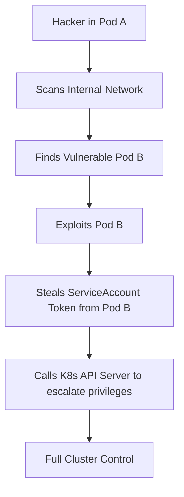

# Kubernetes Security: Hardening the Container Orchestrator

## 1. Beginner-friendly Hinglish Explanation 🇮🇳
Bhai, **Kubernetes (K8s)** ek bohot bada "Jahaz" (Ship) hai jo 1000s containers ko handle karta hai. Lekin agar jahaz mein koi chhed (Vulnerability) ho, toh saare containers doob sakte hain. 

Kubernetes security ka matlab hai:
1. **API Server ko bachana**: K8s ka "Dimaag" (Brain).
2. **Nodes ko safe rakhna**: Woh machine jahan containers chal rahe hain.
3. **Pods ke beech mein "Deewar" banana**: Taaki ek pod hack ho jaye toh dusra bacha rahe (**Network Policies**).
K8s bohot complex hai, isliye iski default settings hamesha "Open" hoti hain. Humein unhe "Lock" karna hota hai.

---

## 2. Deep Technical Explanation
Kubernetes security is often described as the **4C Model**: Cloud, Cluster, Container, and Code.
- **RBAC (Role-Based Access Control)**: Restricting who can run `kubectl` commands. (Who can `create`, `delete`, `list` pods?).
- **Network Policies**: Firewall rules for Pods. By default, all pods can talk to all other pods. You must change this to "Deny All" and whitelist only needed connections.
- **Admission Controllers**: Gatekeepers that check every request to the K8s API (e.g., **OPA Gatekeeper**).
- **Secrets Management**: Using K8s Secrets (which are only Base64 encoded by default!) or better, integrating with HashiCorp Vault or AWS KMS.
- **Pod Security Admission**: Enforcing "Restricted" profiles (No root, no host network).

---

## 3. Attack Flow Diagrams
**Lateral Movement in Kubernetes:**

---

## 4. Real-world Attack Examples
- **Shopify Bug Bounty**: A researcher found that they could use an SSRF vulnerability to talk to the "Metadata Service" of the K8s node and steal the kubelet credentials, gaining full cluster access.
- **Microsoft Azure "Siloscape"**: A malware that specifically targeted Windows-based K8s clusters to escape the container and infect the host node.

---

## 5. Defensive Mitigation Strategies
- **Namespace Isolation**: Put different teams/apps in different Namespaces.
- **Disable AutomountServiceAccountToken**: If a pod doesn't need to talk to the K8s API, don't give it the token.
- **Read-Only Root Filesystem**: Making the container's disk read-only prevents malware from being installed.

---

## 6. Failure Cases
- **Over-privileged Service Accounts**: Giving a regular app `cluster-admin` rights because "It was easier to set up."
- **Exposed Kube-Dashboard**: Leaving the management UI open to the public internet without a password.

---

## 7. Debugging and Investigation Guide
- **kube-bench**: An automated tool that checks your cluster against the **CIS Kubernetes Benchmark**.
- **kubectl auth can-i**: A command to test if your permissions are correct: `kubectl auth can-i create pods`.
- **Falco**: A runtime security tool that alerts you if a container starts a shell or changes a sensitive file.

---

## 8. Tradeoffs
| Feature | Security | Complexity |
|---|---|---|
| No Root Pods | High | Apps might break |
| Network Policies | Very High | Hard to maintain |
| Dedicated Nodes | High | Expensive |

---

## 9. Security Best Practices
- **Rotate Certificates**: K8s uses certificates for everything. Ensure they are auto-rotated every 90 days.
- **Scan Images**: Use Trivy or Grype to scan container images before they enter the cluster.

---

## 10. Production Hardening Techniques
- **Seccomp / AppArmor**: Restricting the system calls a container can make.
- **Egress Filtering**: Only allowing pods to talk to specific internet URLs (e.g., only `api.stripe.com`).

---

## 11. Monitoring and Logging Considerations
- **K8s Audit Logs**: Tracking every single `kubectl` or API request. Who did what and when?
- **Resource Quotas**: Preventing a "Hacked Pod" from using 100% of the cluster's CPU for cryptomining.

---

## 12. Common Mistakes
- **Storing Secrets in Git**: Putting your `secret.yaml` with Base64 strings in your repo.
- **Ignoring the Control Plane**: Securing the pods but leaving the ETCD database (where all K8s data lives) unencrypted.

---

## 13. Compliance Implications
- **PCI-DSS**: Requires strict network segmentation, which means you MUST use Network Policies and separate clusters for payment data.

---

## 14. Interview Questions
1. What is a "Network Policy" in Kubernetes?
2. How do you protect the K8s API Server?
3. What is the difference between a "ClusterRole" and a "Role"?

---

## 15. Latest 2026 Security Patterns and Threats
- **Service Mesh Security (Istio/Linkerd)**: Using a service mesh to handle mTLS (encryption) between all pods automatically.
- **Serverless Kubernetes (Fargate/Autopilot)**: Moving away from "Nodes" entirely. You only manage the pods; the cloud provider manages (and secures) the machines.
- **AI-Managed K8s Security**: Tools that use AI to automatically generate the perfect Network Policy based on how your pods are talking to each other.
