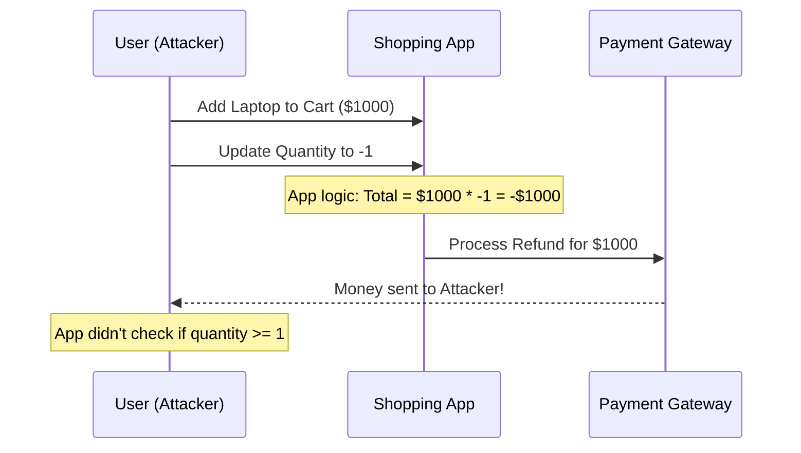

# Application Security Fundamentals: The Core of Software Defense

## 1. Beginner-friendly Hinglish Explanation 🇮🇳
Bhai, **Application Security (AppSec)** ka matlab hai "Apni app ko aise banana ki woh khud apni hifazat kar sake." 

Socho tumne ek bohot bada mahal (Network) banaya aur uske charo taraf deewar (Firewall) laga di. Lekin mahal ke andar jo "Khazana" (App) hai, uski windows aur darwaze (Code) khule hain. Hacker deewar todne ki jagah window se andar ghus jayega. AppSec wahi "Window aur Darwaze" lock karne ka naam hai. Is module mein hum seekhenge ki kaise coding ke waqt hi security ke baare mein sochein, taaki hacker app ke "Logic" ka galat fayda na utha sake.

---

## 2. Deep Technical Explanation
AppSec is a broad discipline focused on making software resilient to attacks.
- **Trust Boundaries**: Identifying where data moves from an untrusted source (like a user) to a trusted system (like your DB).
- **Defense in Depth**: Not relying on a single security measure. If the firewall fails, the auth should stop the hacker. If auth fails, encryption should protect the data.
- **Fail Securely**: If the app crashes or throws an error, it should not reveal sensitive data or grant access.
- **Input/Output Handling**: The fundamental cause of most AppSec bugs (Injection, XSS).

---

## 3. Attack Flow Diagrams
**The "Logic Flaw" Attack:**

---

## 4. Real-world Attack Examples
- **Knight Capital Group (2012)**: A bug in an internal trading application caused the company to lose $440 million in 45 minutes, leading to its bankruptcy. This was a "Logic Error" that a robust AppSec program could have caught.
- **Facebook "View As" Vulnerability**: A complex bug involving three different features allowed hackers to steal access tokens. It was a failure of "Feature Interaction" security.

---

## 5. Defensive Mitigation Strategies
- **Least Privilege**: The app should only have the minimum permissions it needs on the OS and Database.
- **Principle of Economy of Mechanism**: Keep the security design as simple and small as possible. Complex security usually has bugs.
- **Zero Trust inside the App**: Don't assume that because a function is "Internal," its inputs are safe.

---

## 6. Failure Cases
- **Security by Obscurity**: Thinking "Nobody will find this hidden URL." (Hackers have scanners that find everything in seconds).
- **Hardcoding Logic**: "If user is 'admin', allow everything." (What if the 'admin' account is hacked?).

---

## 7. Debugging and Investigation Guide
- **Code Reviews**: Having another pair of eyes look at your security-critical code (Auth, Payments, Data handling).
- **Fuzz Testing**: Sending millions of random inputs to your app to see if it crashes or behaves unexpectedly.

---

## 8. Tradeoffs
| Metric | Security Focus | Performance Focus |
|---|---|---|
| Latency | Higher (Checks/Logging) | Lower |
| Development Time | Longer | Shorter |
| Reliability | Ultra-High | Variable |

---

## 9. Security Best Practices
- **Adopt the OWASP Top 10**: Use it as your primary checklist for common vulnerabilities.
- **Security Education**: Every developer should know how to spot a basic SQLi or XSS bug.

---

## 10. Production Hardening Techniques
- **Content Security Policy (CSP)**: A browser-level defense that tells the browser which scripts are allowed to run, stopping 90% of XSS attacks.
- **SRI (Subresource Integrity)**: Ensuring that if a CDN is hacked and your `jquery.js` is modified, your app will refuse to load it.

---

## 11. Monitoring and Logging Considerations
- **Log the "Attempt," not just the "Success"**: You need to know when someone *tries* to bypass your login.
- **Application Performance Monitoring (APM)**: Sudden spikes in CPU can indicate a "Regex DoS" attack or an injection attempt.

---

## 12. Common Mistakes
- **Fixing the "Symptom," not the "Root Cause"**: Fixing one XSS bug instead of implementing a global "Auto-escaping" template engine.
- **Ignoring "Internal" APIs**: Assuming that APIs not exposed to the public internet are safe.

---

## 13. Compliance Implications
- **PCI-DSS / HIPAA**: Requires regular application-layer security scans and documented secure coding training for all staff.

---

## 14. Interview Questions
1. What is "Defense in Depth" in the context of a web app?
2. How do you prevent "Logic Flaws" in your software?
3. What is the difference between Application Security and Network Security?

---

## 15. Latest 2026 Security Patterns and Threats
- **AI-Native AppSec**: Using small, dedicated AI models to "Watch" application logic in real-time and block suspicious patterns that humans didn't anticipate.
- **API First Security**: Protecting the "Data layer" directly, as most modern apps are just frontends for many micro-APIs.
- **Self-Healing Apps**: Applications that can automatically "Roll back" a change or "Kill" a session if they detect they are under a high-intensity attack.
