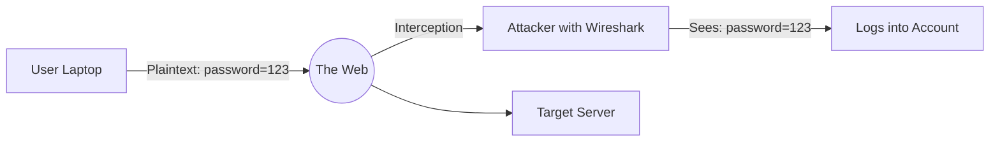

# Encryption at Rest & In Transit: Data in a Safe

## 1. Beginner-friendly Hinglish Explanation 🇮🇳
Bhai, encryption ka matlab hai data ko ek "Secret Code" mein badal dena. 

1. **Encryption in Transit**: Jab data internet par "Safarnama" (Travel) kar raha hai. Socho tumne browser se password bheja server ko. Beech mein koi hacker "Sniffing" karke use dekh na le, isliye hum **HTTPS (TLS)** use karte hain.
2. **Encryption at Rest**: Jab data database ya hard disk par "Soya" (Stored) hai. Agar koi chor physical hard disk chura le, tab bhi woh data na padh sake, isliye hum use encrypt karte hain. 
Is module mein hum seekhenge ki kaise in dono layers ko pakka kiya jata hai taaki data hamesha secure rahe.

---

## 2. Deep Technical Explanation
- **In Transit (TLS/SSL)**:
    - Uses Public Key Infrastructure (PKI).
    - **Handshake**: Client and Server agree on encryption keys.
    - **PFS (Perfect Forward Secrecy)**: Ensures that even if the server's private key is stolen tomorrow, today's traffic remains encrypted.
- **At Rest (AES-256)**:
    - **Transparent Data Encryption (TDE)**: The DB automatically encrypts files on disk.
    - **Volume Encryption**: Encrypting the entire hard drive (BitLocker, AWS EBS Encryption).
    - **Field-Level Encryption**: Encrypting specific columns (like `credit_card_number`) inside the database before saving them.

---

## 3. Attack Flow Diagrams
**MITM (Man-In-The-Middle) without Encryption:**

---

## 4. Real-world Attack Examples
- **DigiNotar Breach**: A Certificate Authority was hacked, allowing hackers to issue fake SSL certificates and perform MITM attacks on millions of users.
- **The "Cloud Sniffer" Attack**: If internal microservices talk to each other over plain HTTP, a hacker who gets into one server can "Listen" to all traffic across the entire data center.

---

## 5. Defensive Mitigation Strategies
- **Force HTTPS**: Using HSTS (HTTP Strict Transport Security) to tell browsers NEVER to use HTTP.
- **Enable Disk Encryption**: In AWS/Azure, it's just a checkbox. Never leave it off.
- **mTLS (Mutual TLS)**: For internal services, require BOTH the client and the server to present a certificate.

---

## 6. Failure Cases
- **Expired Certificates**: If your SSL certificate expires, users get a scary "Not Secure" warning, and data might be sent unencrypted.
- **Weak Cipher Suites**: Allowing old, broken encryption like SSLv3 or TLS 1.0.

---

## 7. Debugging and Investigation Guide
- **SSLLabs (Qualys)**: A free tool to test your website's HTTPS strength. Aim for an "A+" score.
- **openssl s_client**: A command-line tool to inspect a server's SSL certificate and supported protocols.

---

## 8. Tradeoffs
| Feature | Benefit | Cost |
|---|---|---|
| AES-256 (At Rest) | Maximum Security | Minor CPU overhead |
| mTLS (In Transit) | Prevents Impersonation | High operational complexity |
| Field-Level Enc | Secure even if DB is hacked | Hard to search/query |

---

## 9. Security Best Practices
- **Rotate Keys Regularly**: Change your encryption keys every 1-2 years.
- **Use TLS 1.3**: It's faster and more secure than 1.2.

---

## 10. Production Hardening Techniques
- **KMS (Key Management Service)**: Use a service like AWS KMS or HashiCorp Vault to manage your keys. Never store keys in the code.
- **Hardware Security Modules (HSM)**: Physical chips that handle encryption so the keys never even touch the OS memory.

---

## 11. Monitoring and Logging Considerations
- **Certificate Expiry Alerts**: Set alerts for 30, 15, and 7 days before expiry.
- **KMS Usage Audit**: Monitoring "Who used the master key to decrypt data?"

---

## 12. Common Mistakes
- **Encryption but no Access Control**: If I can log into your server and run `SELECT *`, the "Encryption at Rest" doesn't stop me from seeing the data. It only stops a physical thief.
- **Self-Signed Certificates**: Browsers don't trust them, leading users to "Ignore warnings," which is a huge security risk.

---

## 13. Compliance Implications
- **HIPAA / GDPR**: Mandatory requirement to encrypt all PII (Personally Identifiable Information) both at rest and in transit.

---

## 14. Interview Questions
1. What is the difference between Symmetric and Asymmetric encryption?
2. How does "Perfect Forward Secrecy" (PFS) protect my past data?
3. What happens if I encrypt a DB column but forget to secure the key?

---

## 15. Latest 2026 Security Patterns and Threats
- **Post-Quantum Cryptography (PQC)**: Moving to algorithms that can resist future quantum computers.
- **Fully Homomorphic Encryption (FHE)**: The "Holy Grail" - performing calculations on encrypted data without ever decrypting it.
- **Confidential Computing**: Using Secure Enclaves (like Intel SGX) to ensure data is encrypted even while it is being *processed* in the CPU.
