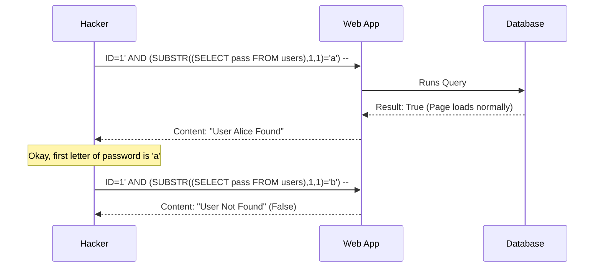

# SQL Injection (SQLi): Destroying the Database

## 1. Beginner-friendly Hinglish Explanation 🇮🇳
Bhai, **SQL Injection** ka matlab hai database ko "Ghalat Commands" dena. 

Socho tumne ek search bar banaya: `SELECT * FROM products WHERE name = '$user_input'`. 
Agar user ne likha `Laptop`, toh sab sahi hai. Lekin agar user ne likha `' OR 1=1 --`, toh query ban jayegi: `SELECT * FROM products WHERE name = '' OR 1=1 --'`. 
Database ko lagega "1=1" hamesha sach hai, toh woh tumhare saare products (ya users, ya passwords) hacker ko de dega. Yeh aisa hi hai jaise kisi ko "Bank ke manager ka sign" chura kar check par likh dena. SQLi se hacker tumhara pura database delete bhi kar sakta hai.

---

## 2. Deep Technical Explanation
SQL Injection occurs when untrusted data is concatenated into a database query, allowing an attacker to manipulate the query's logic.
- **In-band SQLi (Classic)**: The attacker uses the same communication channel to launch the attack and gather results (e.g., seeing data on the screen).
- **Inferential SQLi (Blind)**: No data is transferred via the web app. The attacker observes the server's response (Time-based or Boolean-based) to reconstruct the DB structure.
- **Out-of-band SQLi**: The attacker tricks the DB into making an external request (e.g., DNS or HTTP) to their own server to exfiltrate data.
- **Vulnerable Functions**: `mysql_query()`, `exec()`, or any raw string concatenation in ORMs.

---

## 3. Attack Flow Diagrams
**Blind SQL Injection (Boolean-based):**

---

## 4. Real-world Attack Examples
- **Sony Pictures Hack (2011)**: A massive SQL injection attack allowed hackers to steal personal info of over 1 million users.
- **TalkTalk Breach (2015)**: A 15-year-old hacker used SQLi to steal the data of 157,000 customers, costing the company millions in fines.

---

## 5. Defensive Mitigation Strategies
- **Prepared Statements (Parameterized Queries)**: The absolute best defense. The DB treats the input as "Data," never as "Code."
- **Stored Procedures**: Can be safe if they don't use dynamic SQL strings inside.
- **Input Validation**: Ensuring an `age` field only contains numbers.
- **Least Privilege**: The web app's DB user should NOT be `root` or `sa`. It should only have `SELECT/INSERT/UPDATE` on specific tables.

---

## 6. Failure Cases
- **Second-Order SQLi**: You sanitize the data on input, but later you read it from the DB and use it in *another* query without sanitization.
- **Incomplete WAF Rules**: A WAF that blocks `OR 1=1` but forgets about `OR 2=2` or hexadecimal encoding.

---

## 7. Debugging and Investigation Guide
- **Error-based Testing**: Sending a single quote `'` to see if the server returns a "SQL Syntax Error." If it does, it's a huge red flag.
- **sqlmap**: The industry-standard tool for detecting and exploiting SQL injection. Use it for automated testing of your own APIs.

---

## 8. Tradeoffs
| Strategy | Security | Development Effort |
|---|---|---|
| Raw Concatenation | Zero | Low |
| ORM (e.g., Prisma) | High | Medium |
| Parameterized Queries | Maximum | Medium |

---

## 9. Security Best Practices
- **Use a modern ORM**: Most modern ORMs (Sequelize, TypeORM, SQLAlchemy) handle parameterization automatically.
- **Escape All Input**: If you *must* use dynamic SQL, use a proven escaping library.

---

## 10. Production Hardening Techniques
- **Database Firewall**: Systems like ProxySQL that monitor and block suspicious SQL patterns in real-time.
- **Data Masking**: Ensuring that sensitive fields (like SSN) are masked in the DB unless a specific high-privilege query is run.

---

## 11. Monitoring and Logging Considerations
- **Log Long-running Queries**: Attackers using Blind SQLi often trigger `SLEEP()` commands.
- **Audit Logs**: Log every administrative change (DROP TABLE, ALTER USER).

---

## 12. Common Mistakes
- **Sanitizing on Input only**: You must parameterize every query, every time.
- **Trusting the "Admin" Panel**: Thinking that internal tools don't need SQLi protection.

---

## 13. Compliance Implications
- **PCI-DSS Requirement 6.5.1**: Explicitly requires protecting against injection flaws like SQLi.

---

## 14. Interview Questions
1. How does a Prepared Statement prevent SQL Injection?
2. What is "Blind SQL Injection" and how do you detect it?
3. Why is it dangerous to use a DB user with `dba` privileges for a web app?

---

## 15. Latest 2026 Security Patterns and Threats
- **NoSQL Injection**: Attacks targeting MongoDB or DynamoDB using JSON-based injection (e.g., `{"$gt": ""}`).
- **LLM-Enhanced SQLi Detection**: Using small, local LLMs to analyze incoming SQL queries for "Semantic anomalies" that traditional regex WAFs miss.
- **GraphQL-to-SQL Injection**: Exploiting the mapping layer between a GraphQL query and the underlying SQL database.
