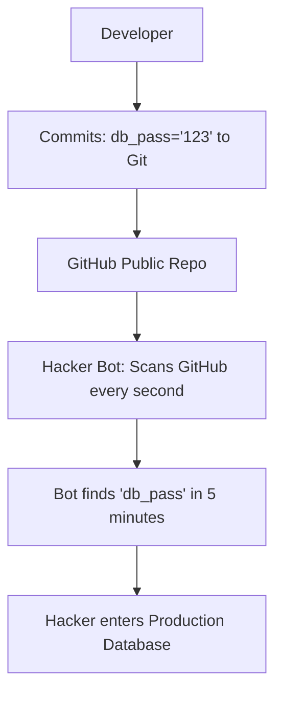

# Secrets Management: Protecting the Keys to the Kingdom

## 1. Beginner-friendly Hinglish Explanation 🇮🇳
Bhai, **Secrets** ka matlab hai tumhari app ki "Tijori ki chabiyan"—jaise Database passwords, API keys (Stripe, Twilio), aur Encryption keys. 

Galti se bhi in secrets ko code mein hardcode mat karna (jaise `const DB_PASS = 'mysecret'`). Agar tumne code GitHub par push kiya, toh pura internet tumhara database access kar sakta hai. **Secrets Management** ka matlab hai in chabiyon ko ek "Digital Locker" (Vault) mein rakhna aur app ko sirf wahi chabi dena jo use chahiye, woh bhi sirf tab jab use zarurat ho.

---

## 2. Deep Technical Explanation
Secrets management involves the secure storage, distribution, and rotation of digital credentials.
- **Dynamic Secrets**: Generating a unique password for every instance of a service that expires automatically.
- **Encryption at Rest**: The vault itself encrypts the secrets using a Master Key (often protected by an HSM).
- **Access Control**: Using IAM or RBAC to define which service can read which secret.
- **Rotation**: Automatically changing passwords every 30-90 days to minimize the impact of a leak.

---

## 3. Attack Flow Diagrams
**The "Hardcoded Secret" Leak:**

---

## 4. Real-world Attack Examples
- **Uber Breach (2022)**: A hacker found hardcoded admin credentials on an internal GitHub server, allowing them to access Uber's entire AWS infrastructure.
- **CircleCI Breach (2023)**: A malware on a developer's laptop stole session tokens, which allowed hackers to access the "Secrets" stored in the CI/CD environment, affecting thousands of companies.

---

## 5. Defensive Mitigation Strategies
- **Never Hardcode**: Use environment variables (`process.env.DB_PASS`) or better, a dedicated vault.
- **Use a Secret Manager**: AWS Secrets Manager, HashiCorp Vault, or Azure Key Vault.
- **Secret Scanning**: Use tools like `git-secrets` or GitHub's native scanner to block commits that contain secrets.

---

## 6. Failure Cases
- **Secret Sprawl**: Storing secrets in 10 different places (Jenkins, AWS, local .env, Slack), making it impossible to rotate them all if one is leaked.
- **Verbose Logs**: An app crashing and printing the entire Environment Config (including secrets) to a public log file.

---

## 7. Debugging and Investigation Guide
- **Audit Logs**: Checking "Who accessed the 'Stripe_API_Key' in the last 24 hours?"
- **truffleHog**: A tool that scans your entire Git history to find secrets that were deleted but are still in the "History."

---

## 8. Tradeoffs
| Method | Security | Complexity | Cost |
|---|---|---|---|
| .env files | Low | Low | Free |
| CI/CD Secrets | Medium | Medium | Free |
| HashiCorp Vault | Ultra-High | High | Expensive |

---

## 9. Security Best Practices
- **Least Privilege**: The "Frontend" should never have access to the "Database" secret.
- **Environment Isolation**: The "Dev" database password should be different from the "Prod" one.

---

## 10. Production Hardening Techniques
- **Runtime Injection**: Injecting secrets into the container's memory at startup so they are never written to the disk.
- **Automatic Rotation**: Configuring AWS Secrets Manager to automatically change the RDS password every 30 days without downtime.

---

## 11. Monitoring and Logging Considerations
- **KMS/Vault Alerts**: Alerts for "Access Denied" on a secret—this often means an attacker is trying to guess secret paths.
- **Secret Lifetime**: Monitoring for secrets that haven't been changed in over 1 year.

---

## 12. Common Mistakes
- **Putting Secrets in Dockerfiles**: `ENV DB_PASS=123` in a Dockerfile makes the secret part of the image, which can be pulled by anyone.
- **Trusting Private Repos**: Thinking "It's a private repo, so hardcoding is fine." (Internal employees are a major threat).

---

## 13. Compliance Implications
- **PCI-DSS / SOC2**: Requires strict evidence of "Secrets Management" and "Credential Rotation" for all systems handling sensitive data.

---

## 14. Interview Questions
1. How do you handle secrets in a Kubernetes cluster?
2. What is "Dynamic Secret Generation"?
3. Why is it dangerous to store secrets in Git history even if you delete them later?

---

## 15. Latest 2026 Security Patterns and Threats
- **Workload Identity (Secretless Auth)**: Moving away from "Secrets" entirely. Instead of a password, Service A uses its "Identity" (IAM/SPIFFE) to talk to Service B.
- **Machine Learning for Secret Detection**: AI models that can find secrets even if they are "Obfuscated" or hidden in binary data.
- **Ephemeral Infrastructure**: Secrets that only exist for the 10 seconds a Lambda function is running and then vanish.
