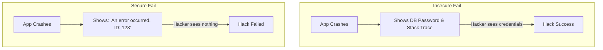

# Secure Coding Practices: Building from the Ground Up

## 1. Beginner-friendly Hinglish Explanation 🇮🇳
Bhai, **Secure Coding** ka matlab hai code likhte waqt "Deewar" banana. 

Jyadatar hackers app ko tab hack karte hain jab code mein koi galti (Bug) hoti hai. Socho aapne ek login form banaya lekin password check karna bhool gaye—yeh ek security bug hai. Secure coding humein sikhata hai ki kaise shuru se hi aisa code likhein jismein holes na hon. Ismein sabse bada rule hai: **"Trust No One."** Chahe data user se aaye ya database se, hamesha use check karo.

---

## 2. Deep Technical Explanation
- **Principles of Secure Coding**:
    - **Defense in Depth**: Multiple layers of security.
    - **Least Privilege**: Only give the code the permissions it needs.
    - **Fail Securely**: If an app crashes, it shouldn't leave a backdoor open.
    - **Keep it Simple**: Complex code is harder to secure.
- **Common Standards**: **OWASP ASVS** (Application Security Verification Standard), **CERT C/C++ Coding Standards**.

---

## 3. Attack Flow Diagrams
**Failing Securely vs. Failing Insecurely:**

---

## 4. Real-world Attack Examples
- **Log4j (2021)**: A failure in secure coding where a library trusted user input and executed it as a command, leading to the world's biggest hack in a decade.
- **Buffer Overflow**: In languages like C, if you don't check the size of a user's name, they can send 1,000 characters and overwrite the system's memory to run their own code.

---

## 5. Defensive Mitigation Strategies
- **Input Validation**: Check for type, length, and format.
- **Output Encoding**: Prevent XSS by encoding characters like `<` and `>`.
- **Use Secure Frameworks**: Use modern tools (like React or Django) that handle security for you.

---

## 6. Failure Cases
- **Hardcoded Secrets**: Putting the database password in a variable `db_pass = "123"`.
- **Insecure Defaults**: Creating a new user with a default password that never expires.

---

## 7. Debugging and Investigation Guide
- **Code Linters**: Using **ESLint** (JS) or **Pylint** (Python) with security plugins.
- **IDE Extensions**: Using **Snyk** or **SonarLint** directly in VS Code to find bugs as you type.

---

| Feature | Regular Coding | Secure Coding |
|---|---|---|
| Focus | "Make it Work" | "Make it Safe" |
| Input | Trusted | Untrusted |
| Errors | Verbose (for debugging) | Generic (for users) |

---

## 9. Security Best Practices
- **Never Use `eval()`**: Running strings as code is the easiest way to get hacked.
- **Parameterize Queries**: Use prepared statements for all database talk.

---

## 10. Production Hardening Techniques
- **Dependency Scanning**: Using `npm audit` or `snyk` to find bugs in the libraries you use.
- **Code Signing**: Signing your software so users know it hasn't been modified by a hacker.

---

## 11. Monitoring and Logging Considerations
- **Log Security Events**: Log every login, password change, and "Access Denied" error.
- **Don't Log PII**: Never log credit cards, passwords, or personal data.

---

## 12. Common Mistakes
- **Assuming 'Internal = Safe'**: Not securing an app just because it's only used by employees. (Remember: Employees can be hackers too!).
- **Copy-pasting from Stack Overflow**: Using code that works but is 10 years old and full of security holes.

---

## 13. Compliance Implications
- **PCI-DSS Requirement 6.3**: Requires that software development be based on "Industry best practices and security throughout the life cycle."

---

## 14. Interview Questions
1. What is the 'Principle of Least Privilege' in coding?
2. Why is 'Input Validation' important?
3. How do you handle errors securely?

---

## 15. Latest 2026 Security Patterns and Threats
- **AI-Native Secure Coding**: AI that automatically fixes your code to be secure while you type.
- **Memory-Safe Languages**: The shift from C/C++ to **Rust** to eliminate 70% of all security bugs (memory leaks/overflows).
- **Prompt Injection Defense**: Writing code that treats AI "Prompts" as untrusted input.
