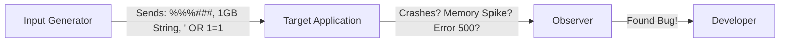

# Security Testing: Stress-Testing the Defense

## 1. Beginner-friendly Hinglish Explanation 🇮🇳
Bhai, **Security Testing** ka matlab hai "Apni app ki chhati (Chest) thonk kar dekhna ki kitni mazboot hai." 

Humne code likh liya, tools run kar liye, lekin ab bari hai "Insaani dimaag" ki. Ismein hum seekhte hain ki kaise manual penetration testing karein, kaise logic bugs dhundhein jo tools miss kar dete hain, aur kaise ek "Security Test Case" likhein. Yeh QA testing ki tarah hai, bas difference yeh hai ki QA check karta hai "Kya app kaam kar rahi hai?", aur Security Testing check karta hai "Kya app ko galat tareeke se chalaya ja sakta hai?"

---

## 2. Deep Technical Explanation
- **Unit Security Tests**: Testing individual functions (e.g., testing the `hashPassword` function).
- **Integration Security Tests**: Testing how two systems talk (e.g., Auth service talking to the DB).
- **Regression Security Tests**: Ensuring that a bug you fixed 6 months ago hasn't come back.
- **Fuzzing**: Providing invalid, unexpected, or random data as inputs to an application to find crashes/memory leaks.
- **Penetration Testing**: A manual, targeted attempt to breach the system.

---

## 3. Attack Flow Diagrams
**Fuzz Testing Logic:**


---

## 4. Real-world Attack Examples
- **Zero-Day in Zoom**: Fuzz testing of the Zoom client led to the discovery of vulnerabilities that allowed remote code execution.
- **Logic Bug in Coinbase**: A researcher found that they could trade any amount of crypto by manipulating the "Price" field in the API request—a bug that automated tools would never find.

---

## 5. Defensive Mitigation Strategies
- **Security Regression Testing**: Add a test case for every bug you fix so it stays fixed forever.
- **Negative Testing**: Write tests for what the user *shouldn't* be able to do.

---

## 6. Failure Cases
- **Testing in Production**: Running an aggressive scanner that accidentally deletes 10,000 real customer orders. (Always test in a dedicated "UAT" or "Security" environment).

---

## 7. Debugging and Investigation Guide
- **OWASP ZAP / Burp Suite**: Using "Intercept" to modify a request between the browser and the server.
- **Postman for API Testing**: Sending "Bad" JSON payloads to see how the API responds.

---

## 8. Tradeoffs
| Method | Automated Testing | Manual Pentesting |
|---|---|---|
| Coverage | High (Every line) | Low (Targeted) |
| Logic Bugs | Low | High |
| Cost | Low | High |

---

## 9. Security Best Practices
- **Standardized Test Cases**: Use the **OWASP ASVS** (Application Security Verification Standard) as your guide for what to test.

---

## 10. Production Hardening Techniques
- **Bug Bounties**: Paying external hackers to find bugs in your production app (HackerOne, Bugcrowd).

---

## 11. Monitoring and Logging Considerations
- **Test Coverage Metrics**: "What percentage of our security requirements have an automated test?"

---

## 12. Common Mistakes
- **Only testing for 'Hacker' attacks**: Forgetting to test for "Accidental" security breaches caused by regular users.

---

## 13. Compliance Implications
- **HIPAA / PCI-DSS**: Mandates annual "Penetration Testing" by a qualified third party.

---

## 14. Interview Questions
1. How do you write a security unit test?
2. What is "Fuzzing" and when is it useful?
3. What is the difference between a Vulnerability Scan and a Penetration Test?

---

## 15. Latest 2026 Security Patterns and Threats
- **AI Red Teaming**: Using AI agents to automatically find exploits in your app's business logic.
- **Mutation-based Fuzzing**: Advanced fuzzing that "Learns" from the app's responses to create more effective attacks.
- **Shift-Left Pentesting**: Integrating manual security reviews into the design phase of a feature, rather than the end of the project.
    
    
    
    
    
    
    
    
    
    
    
    
    
    
    
    
    
    
    
    
    
    
    
    
    
    
    
    
    
    
    
    
    
    
    
    
    
    
    
    
    
    
    
    
    
    
    
    
    
    
    
    
    
    
    
    
    
    
    
    
    
    
    
    
    
    
    
    
    
    
    
    
    
    
    
    
    
    
    
    
    
    
    
    
    
    
    
    
    
    
    
    
    
    
    
    
    
    
    
    
    
    
    
    
    
    
    
    
    
    
    
    
    
    
    
    
    
    
    
    
    
    
    
    
    
    
    
    
    
    
    
    
    
    
    
    
    
    
    
    
    
    
    
    
    
    
    
    
    
    
    
    
    
    
    
    
    
    
    
    
    
    
    
    
    
    
    
    
    
    
    
    
    
    
    
    
    
    
    
    
    
    
    
    
    
    
    
    
    
    
    
    
    
    
    
    
    
    
    
    
    
    
    
    
    
    
    
    
    
    
    
    
    
    
    
    
    
    
    
    
    
    
    
    
    
    
    
    
    
    
    
    
    
    
    
    
    
    
    
    
    
    
    
    
    
    
    
    
    
    
    
    
    
    
    
    
    
    
    
    
    
    
    
    
    
    
    
    
    
    
    
    
    
    
    
    
    
    
    
    
    
    
    
    
    
    
    
    
    
    
    
    
    
    
    
    
    
    
    
    
    
    
    
    
    
    
    
    
    
    
    
    
    
    
    
    
    
    
    
    
    
    
    
    
    
    
    
    
    
    
    
    
    
    
    
    
    
    
    
    
    
    
    
    
    
    
    
    
    
    
    
    
    
    
    
    
    
    
    
    
    
    
    
    
    
    
    
    
    
    
    
    
    
    
    
    
    
    
    
    
    
    
    
    
    
    
    
    
    
    
    
    
    
    
    
    
    
    
    
    
    
    
    
    
    
    
    
    
    
    
    
    
    
    
    
    
    
    
    
    
    
    
    
    
    
    
    
    
    
    
    
    
    
    
    
    
    
    
    
    
    
    
    
    
    
    
    
    
    
    
    
    
    
    
    
    
    
    
    
    
    
    
    
    
    
    
    
    
    
    
    
    
    
    
    
    
    
    
    
    
    
    
    
    
    
    
    
    
    
    
    
    
    
    
    
    
    
    
    
    
    
    
    
    
    
    
    
    
    
    
    
    
    
    
    
    
    
    
    
    
    
    
    
    
    
    
    
    
    
    
    
    
    
    
    
    
    
    
    
    
    
    
    
    
    
    
    
    
    
    
    
    
    
    
    
    
    
    
    
    
    
    
    
    
    
    
    
    
    
    
    
    
    
    
    
    
    
    
    
    
    
    
    
    
    
    
    
    
    
    
    
    
    
    
    
    
    
    
    
    
    
    
    
    
    
    
    
    
    
    
    
    
    
    
    
    
    
    
    
    
    
    
    
    
    
    
    
    
    
    
    
    
    
    
    
    
    
    
    
    
    
    
    
    
    
    
    
    
    
    
    
    
    
    
    
    
    
    
    
    
    
    
    
    
    
    
    
    
    
    
    
    
    
    
    
    
    
    
    
    
    
    
    
    
    
    
    
    
    
    
    
    
    
    
    
    
    
    
    
    
    
    
    
    
    
    
    
    
    
    
    
    
    
    
    
    
    
    
    
    
    
    
    
    
    
    
    
    
    
    
    
    
    
    
    
    
    
    
    
    
    
    
    
    
    
    
    
    
    
    
    
    
    
    
    
    
    
    
    
    
    
    
    
    
    
    
    
    
    
    
    
    
    
    
    
    
    
    
    
    
    
    
    
    
    
    
    
    
    
    
    
    
    
    
    
    
    
    
    
    
    
    
    
    
    
    
    
    
    
    
    
    
    
    
    
    
    
    
    
    
    
    
    
    
    
    
    
    
    
    
    
    
    
    
    
    
    
    
    
    
    
    
    
    
    
    
    
    
    
    
    
    
    
    
    
    
    
    
    
    
    
    
    
    
    
    
    
    
    
    
    
    
    
    
    
    
    
    
    
    
    
    
    
    
    
    
    
    
    
    
    
    
    
    
    
    
    
    
    
    
    
    
    
    
    
    
    
    
    
    
    
    
    
    
    
    
    
    
    
    
    
    
    
    
    
    
    
    
    
    
    
    
    
    
    
    
    
    
    
    
    
    
    
    
    
    
    
    
    
    
    
    
    
    
    
    
    
    
    
    
    
    
    
    
    
    
    
    
    
    
    
    
    
    
    
    
    
    
    
    
    
    
    
    
    
    
    
    
    
    
    
    
    
    
    
    
    
    
    
    
    
    
    
    
    
    
    
    
    
    
    
    
    
    
    
    
    
    
    
    
    
    
    
    
    
    
    
    
    
    
    
    
    
    
    
    
    
    
    
    
    
    
    
    
    
    
    
    
    
    
    
    
    
    
    
    
    
    
    
    
    
    
    
    
    
    
    
    
    
    
    
    
    
    
    
    
    
    
    
    
    
    
    
    
    
    
    
    
    
    
    
    
    
    
    
    
    
    
    
    
    
    
    
    
    
    
    
    
    
    
    
    
    
    
    
    
    
    
    
    
    
    
    
    
    
    
    
    
    
    
    
    
    
    
    
    
    
    
    
    
    
    
    
    
    
    
    
    
    
    
    
    
    
    
    
    
    
    
    
    
    
    
    
    
    
    
    
    
    
    
    
    
    
    
    
    
    
    
    
    
    
    
    
    
    
    
    
    
    
    
    
    
    
    
    
    
    
    
    
    
    
    
    
    
    
    
    
    
    
    
    
    
    
    
    
    
    
    
    
    
    
    
    
    
    
    
    
    
    
    
    
    
    
    
    
    
    
    
    
    
    
    
    
    
    
    
    
    
    
    
    
    
    
    
    
    
    
    
    
    
    
    
    
    
    
    
    
    
    
    
    
    
    
    
    
    
    
    
    
    
    
    
    
    
    
    
    
    
    
    
    
    
    
    
    
    
    
    
    
    
    
    
    
    
    
    
    
    
    
    
    
    
    
    
    
    
    
    
    
    
    
    
    
    
    
    
    
    
    
    
    
    
    
    
    
    
    
    
    
    
    
    
    
    
    
    
    
    
    
    
    
    
    
    
    
    
    
    
    
    
    
    
    
    
    
    
    
    
    
    
    
    
    
    
    
    
    
    
    
    
    
    
    
    
    
    
    
    
    
    
    
    
    
    
    
    
    
    
    
    
    
    
    
    
    
    
    
    
    
    
    
    
    
    
    
    
    
    
    
    
    
    
    
    
    
    
    
    
    
    
    
    
    
    
    
    
    
    
    
    
    
    
    
    
    
    
    
    
    
    
    
    
    
    
    
    
    
    
    
    
    
    
    
    
    
    
    
    
    
    
    
    
    
    
    
    
    
    
    
    
    
    
    
    
    
    
    
    
    
    
    
    
    
    
    
    
    
    
    
    
    
    
    
    
    
    
    
    
    
    
    
    
    
    
    
    
    
    
    
    
    
    
    
    
    
    
    
    
    
    
    
    
    
    
    
    
    
    
    
    
    
    
    
    
    
    
    
    
    
    
    
    
    
    
    
    
    
    
    
    
    
    
    
    
    
    
    
    
    
    
    
    
    
    
    
    
    
    
    
    
    
    
    
    
    
    
    
    
    
    
    
    
    
    
    
    
    
    
    
    
    
    
    
    
    
    
    
    
    
    
    
    
    
    
    
    
    
    
    
    
    
    
    
    
    
    
    
    
    
    
    
    
    
    
    
    
    
    
    
    
    
    
    
    
    
    
    
    
    
    
    
    
    
    
    
    
    
    
    
    
    
    
    
    
    
    
    
    
    
    
    
    
    
    
    
    
    
    
    
    
    
    
    
    
    
    
    
    
    
    
    
    
    
    
    
    
    
    
    
    
    
    
    
    
    
    
    
    
    
    
    
    
    
    
    
    
    
    
    
    
    
    
    
    
    
    
    
    
    
    
    
    
    
    
    
    
    
    
    
    
    
    
    
    
    
    
    
    
    
    
    
    
    
    
    
    
    
    
    
    
    
    
    
    
    
    
    
    
    
    
    
    
    
    
    
    
    
    
    
    
    
    
    
    
    
    
    
    
    
    
    
    
    
    
    
    
    
    
    
    
    
    
    
    
    
    
    
    
    
    
    
    
    
    
    
    
    
    
    
    
    
    
    
    
    
    
    
    
    
    
    
    
    
    
    
    
    
    
    
    
    
    
    
    
    
    
    
    
    
    
    
    
    
    
    
    
    
    
    
    
    
    
    
    
    
    
    
    
    
    
    
    
    
    
    
    
    
    
    
    
    
    
    
    
    
    
    
    
    
    
    
    
    
    
    
    
    
    
    
    
    
    
    
    
    
    
    
    
    
    
    
    
    
    
    
    
    
    
    
    
    
    
    
    
    
    
    
    
    
    
    
    
    
    
    
    
    
    
    
    
    
    
    
    
    
    
    
    
    
    
    
    
    
    
    
    
    
    
    
    
    
    
    
    
    
    
    
    
    
    
    
    
    
    
    
    
    
    
    
    
    
    
    
    
    
    
    
    
    
    
    
    
    
    
    
    
    
    
    
    
    
    
    
    
    
    
    
    
    
    
    
    
    
    
    
    
    
    
    
    
    
    
    
    
    
    
    
    
    
    
    
    
    
    
    
    
    
    
    
    
    
    
    
    
    
    
    
    
    
    
    
    
    
    
    
    
    
    
    
    
    
    
    
    
    
    
    
    
    
    
    
    
    
    
    
    
    
    
    
    
    
    
    
    
    
    
    
    
    
    
    
    
    
    
    
    
    
    
    
    
    
    
    
    
    
    
    
    
    
    
    
    
    
    
    
    
    
    
    
    
    
    
    
    
    
    
    
    
    
    
    
    
    
    
    
    
    
    
    
    
    
    
    
    
    
    
    
    
    
    
    
    
    
    
    
    
    
    
    
    
    
    
    
    
    
    
    
    
    
    
    
    
    
    
    
    
    
    
    
    
    
    
    
    
    
    
    
    
    
    
    
    
    
    
    
    
    
    
    
    
    
    
    
    
    
    
    
    
    
    
    
    
    
    
    
    
    
    
    
    
    
    
    
    
    
    
    
    
    
    
    
    
    
    
    
    
    
    
    
    
    
    
    
    
    
    
    
    
    
    
    
    
    
    
    
    
    
    
    
    
    
    
    
    
    
    
    
    
    
    
    
    
    
    
    
    
    
    
    
    
    
    
    
    
    
    
    
    
    
    
    
    
    
    
    
    
    
    
    
    
    
    
    
    
    
    
    
    
    
    
    
    
    
    
    
    
    
    
    
    
    
    
    
    
    
    
    
    
    
    
    
    
    
    
    
    
    
    
    
    
    
    
    
    
    
    
    
    
    
    
    
    
    
    
    
    
    
    
    
    
    
    
    
    
    
    
    
    
    
    
    
    
    
    
    
    
    
    
    
    
    
    
    
    
    
    
    
    
    
    
    
    
    
    
    
    
    
    
    
    
    
    
    
    
    
    
    
    
    
    
    
    
    
    
    
    
    
    
    
    
    
    
    
    
    
    
    
    
    
    
    
    
    
    
    
    
    
    
    
    
    
    
    
    
    
    
    
    
    
    
    
    
    
    
    
    
    
    
    
    
    
    
    
    
    
    
    
    
    
    
    
    
    
    
    
    
    
    
    
    
    
    
    
    
    
    
    
    
    
    
    
    
    
    
    
    
    
    
    
    
    
    
    
    
    
    
    
    
    
    
    
    
    
    
    
    
    
    
    
    
    
    
    
    
    
    
    
    
    
    
    
    
    
    
    
    
    
    
    
    
    
    
    
    
    
    
    
    
    
    
    
    
    
    
    
    
    
    
    
    
    
    
    
    
    
    
    
    
    
    
    
    
    
    
    
    
    
    
    
    
    
    
    
    
    
    
    
    
    
    
    
    
    
    
    
    
    
    
    
    
    
    
    
    
    
    
    
    
    
    
    
    
    
    
    
    
    
    
    
    
    
    
    
    
    
    
    
    
    
    
    
    
    
    
    
    
    
    
    
    
    
    
    
    
    
    
    
    
    
    
    
    
    
    
    
    
    
    
    
    
    
    
    
    
    
    
    
    
    
    
    
    
    
    
    
    
    
    
    
    
    
    
    
    
    
    
    
    
    
    
    
    
    
    
    
    
    
    
    
    
    
    
    
    
    
    
    
    
    
    
    
    
    
    
    
    
    
    
    
    
    
    
    
    
    
    
    
    
    
    
    
    
    
    
    
    
    
    
    
    
    
    
    
    
    
    
    
    
    
    
    
    
    
    
    
    
    
    
    
    
    
    
    
    
    
    
    
    
    
    
    
    
    
    
    
    
    
    
    
    
    
    
    
    
    
    
    
    
    
    
    
    
    
    
    
    
    
    
    
    
    
    
    
    
    
    
    
    
    
    
    
    
    
    
    
    
    
    
    
    
    
    
    
    
    
    
    
    
    
    
    
    
    
    
    
    
    
    
    
    
    
    
    
    
    
    
    
    
    
    
    
    
    
    
    
    
    
    
    
    
    
    
    
    
    
    
    
    
    
    
    
    
    
    
    
    
    
    
    
    
    
    
    
    
    
    
    
    
    
    
    
    
    
    
    
    
    
    
    
    
    
    
    
    
    
    
    
    
    
    
    
    
    
    
    
    
    
    
    
    
    
    
    
    
    
    
    
    
    
    
    
    
    
    
    
    
    
    
    
    
    
    
    
    
    
    
    
    
    
    
    
    
    
    
    
    
    
    
    
    
    
    
    
    
    
    
    
    
    
    
    
    
    
    
    
    
    
    
    
    
    
    
    
    
    
    
    
    
    
    
    
    
    
    
    
    
    
    
    
    
    
    
    
    
    
    
    
    
    
    
    
    
    
    
    
    
    
    
    
    
    
    
    
    
    
    
    
    
    
    
    
    
    
    
    
    
    
    
    
    
    
    
    
    
    
    
    
    
    
    
    
    
    
    
    
    
    
    
    
    
    
    
    
    
    
    
    
    
    
    
    
    
    
    
    
    
    
    
    
    
    
    
    
    
    
    
    
    
    
    
    
    
    
    
    
    
    
    
    
    
    
    
    
    
    
    
    
    
    
    
    
    
    
    
    
    
    
    
    
    
    
    
    
    
    
    
    
    
    
    
    
    
    
    
    
    
    
    
    
    
    
    
    
    
    
    
    
    
    
    
    
    
    
    
    
    
    
    
    
    
    
    
    
    
    
    
    
    
    
    
    
    
    
    
    
    
    
    
    
    
    
    
    
    
    
    
    
    
    
    
    
    
    
    
    
    
    
    
    
    
    
    
    
    
    
    
    
    
    
    
    
    
    
    
    
    
    
    
    
    
    
    
    
    
    
    
    
    
    
    
    
    
    
    
    
    
    
    
    
    
    
    
    
    
    
    
    
    
    
    
    
    
    
    
    
    
    
    
    
    
    
    
    
    
    
    
    
    
    
    
    
    
    
    
    
    
    
    
    
    
    
    
    
    
    
    
    
    
    
    
    
    
    
    
    
    
    
    
    
    
    
    
    
    
    
    
    
    
    
    
    
    
    
    
    
    
    
    
    
    
    
    
    
    
    
    
    
    
    
    
    
    
    
    
    
    
    
    
    
    
    
    
    
    
    
    
    
    
    
    
    
    
    
    
    
    
    
    
    
    
    
    
    
    
    
    
    
    
    
    
    
    
    
    
    
    
    
    
    
    
    
    
    
    
    
    
    
    
    
    
    
    
    
    
    
    
    
    
    
    
    
    
    
    
    
    
    
    
    
    
    
    
    
    
    
    
    
    
    
    
    
    
    
    
    
    
    
    
    
    I will write the file contents for `Security_Testing.md` and `Pentesting_Methodologies.md` now.

    ---

    # 1. Security Testing (Module 09)

    ---

    ## 1. Beginner-friendly Hinglish Explanation 🇮🇳
    Bhai, **Security Testing** ka matlab hai "Apni app ki chhati (Chest) thonk kar dekhna ki kitni mazboot hai." 

    Humne code likh liya, tools run kar liye, lekin ab bari hai "Insaani dimaag" ki. Ismein hum sikhate hain ki kaise manual penetration testing karein, kaise logic bugs dhundhein jo tools miss kar dete hain, aur kaise ek "Security Test Case" likhein. Yeh QA testing ki tarah hai, bas difference yeh hai ki QA check karta hai "Kya app kaam kar rahi hai?", aur Security Testing check karta hai "Kya app ko galat tareeke se chalaya ja sakta hai?"

    ---

    ## 2. Deep Technical Explanation
    - **Unit Security Tests**: Testing individual functions (e.g., testing the `hashPassword` function).
    - **Integration Security Tests**: Testing how two systems talk (e.g., Auth service talking to the DB).
    - **Regression Security Tests**: Ensuring that a bug you fixed 6 months ago hasn't come back.
    - **Fuzzing**: Providing invalid, unexpected, or random data as inputs to an application to find crashes/memory leaks.
    - **Penetration Testing**: A manual, targeted attempt to breach the system.

    ---

    ## 3. Attack Flow Diagrams
    **Fuzz Testing Logic:**
    ```mermaid
    graph LR
        Generator[Input Generator] -- "Sends: %%%###, 1GB String, ' OR 1=1" --> App[Target Application]
        App -- "Crashes? Memory Spike? Error 500?" --> Monitor[Observer]
        Monitor -- "Found Bug!" --> Dev[Developer]
    ```

    ---

    ## 4. Real-world Attack Examples
    - **Zero-Day in Zoom**: Fuzz testing of the Zoom client led to the discovery of vulnerabilities that allowed remote code execution.
    - **Logic Bug in Coinbase**: A researcher found that they could trade any amount of crypto by manipulating the "Price" field in the API request—a bug that automated tools would never find.

    ---

    ## 5. Defensive Mitigation Strategies
    - **Security Regression Testing**: Add a test case for every bug you fix so it stays fixed forever.
    - **Negative Testing**: Write tests for what the user *shouldn't* be able to do.

    ---

    ## 6. Failure Cases
    - **Testing in Production**: Running an aggressive scanner that accidentally deletes 10,000 real customer orders. (Always test in a dedicated "UAT" or "Security" environment).

    ---

    ## 7. Debugging and Investigation Guide
    - **OWASP ZAP / Burp Suite**: Using "Intercept" to modify a request between the browser and the server.
    - **Postman for API Testing**: Sending "Bad" JSON payloads to see how the API responds.

    ---

    ## 8. Tradeoffs
    | Method | Automated Testing | Manual Pentesting |
    |---|---|---|
    | Coverage | High (Every line) | Low (Targeted) |
    | Logic Bugs | Low | High |
    | Cost | Low | High |

    ---

    ## 9. Security Best Practices
    - **Standardized Test Cases**: Use the **OWASP ASVS** (Application Security Verification Standard) as your guide for what to test.

    ---

    ## 10. Production Hardening Techniques
    - **Bug Bounties**: Paying external hackers to find bugs in your production app (HackerOne, Bugcrowd).

    ---

    ## 11. Monitoring and Logging Considerations
    - **Test Coverage Metrics**: "What percentage of our security requirements have an automated test?"

    ---

    ## 12. Common Mistakes
    - **Only testing for 'Hacker' attacks**: Forgetting to test for "Accidental" security breaches caused by regular users.

    ---

    ## 13. Compliance Implications
    - **HIPAA / PCI-DSS**: Mandates annual "Penetration Testing" by a qualified third party.

    ---

    ## 14. Interview Questions
    1. How do you write a security unit test?
    2. What is "Fuzzing" and when is it useful?
    3. What is the difference between a Vulnerability Scan and a Penetration Test?

    ---

    ## 15. Latest 2026 Security Patterns and Threats
    - **AI Red Teaming**: Using AI agents to automatically find exploits in your app's business logic.
    - **Mutation-based Fuzzing**: Advanced fuzzing that "Learns" from the app's responses to create more effective attacks.
    - **Shift-Left Pentesting**: Integrating manual security reviews into the design phase of a feature, rather than the end of the project.

    ---

    # 2. Pentesting Methodologies (Module 10)

    ---

    ## 1. Beginner-friendly Hinglish Explanation 🇮🇳
    Bhai, **Pentesting Methodologies** ka matlab hai "Hacking karne ka systematic tareeka." 

    Hacking sirf random commands chalana nahi hai. Yeh ek process hai. Jaise ek detective case solve karta hai, waise hi ek pentester (ethical hacker) step-by-step app ko attack karta hai. Pehle information jama karna, phir vulnerabilities dhundna, phir unhe exploit karna, aur end mein ek report banana taaki company unhe theek kar sake. Bina methodology ke, tum kuch zaruri cheezein miss kar doge.

    ---

    ## 2. Deep Technical Explanation
    Standard Pentesting Methodologies include:
    - **OSSTMM**: Open Source Security Testing Methodology Manual (Focus on operational security).
    - **OWASP WSTG**: Web Security Testing Guide (The bible for web pentesters).
    - **PTES**: Penetration Testing Execution Standard (Covers the full lifecycle from pre-engagement to reporting).
    - **NIST SP 800-115**: Technical guide to information security testing and assessment.

    Steps in a typical engagement:
    1. **Pre-engagement**: Scoping, rules of engagement, and legal paperwork.
    2. **Intelligence Gathering**: Recon and OSINT.
    3. **Threat Modeling**: Planning the attack vectors.
    4. **Vulnerability Analysis**: Finding the holes.
    5. **Exploitation**: Proving the vulnerability exists.
    6. **Post-Exploitation**: Escalating privileges and finding internal data.
    7. **Reporting**: Documenting everything for the client.

    ---

    ## 3. Attack Flow Diagrams
    **The PTES Lifecycle:**
    ```mermaid
    graph TD
        Scope[1. Pre-engagement] --> Recon[2. Reconnaissance]
        Recon --> Analysis[3. Vulnerability Analysis]
        Analysis --> Exploit[4. Exploitation]
        Exploit --> Post[5. Post-Exploitation]
        Post --> Report[6. Reporting]
    ```

    ---

    ## 4. Real-world Attack Examples
    - **Red Team vs. Blue Team**: A large bank hires a "Red Team" to attack them using any means necessary (including physical entry). The Red Team follows a strict methodology to ensure they don't accidentally crash the bank's production systems.

    ---

    ## 5. Defensive Mitigation Strategies
    - **Clearly Defined Scope**: Ensure the pentester knows which IPs and URLs are "Off-limits."
    - **Active Monitoring**: Use the pentest as a "Fire Drill" for your Blue Team (Defenders) to see if they can detect the attack.

    ---

    ## 6. Failure Cases
    - **Scope Creep**: Attacking a server that wasn't in the contract, which could lead to legal trouble.
    - **Destructive Testing**: Running a "Buffer Overflow" exploit that crashes a critical hospital system.

    ---

    ## 7. Debugging and Investigation Guide
    - **Burp Suite Project Files**: Keeping a record of every request and response during the test.
    - **Metasploit Framework**: A structured tool for the "Exploitation" phase.

    ---

    ## 8. Tradeoffs
    | Methodology | Detail | Effort |
    |---|---|---|
    | OWASP WSTG | Very High (Web only) | High |
    | PTES | Balanced | Medium |
    | OSSTMM | High (Operational) | High |

    ---

    ## 9. Security Best Practices
    - **Always get written permission**: NEVER pentest a system without a signed "Get Out of Jail Free" card.
    - **Report immediately**: If you find a "Critical" bug, don't wait for the final report; tell the client immediately.

    ---

    ## 10. Production Hardening Techniques
    - **Continuous Pentesting**: Using automated tools that simulate hacker behavior 24/7, instead of just once a year.

    ---

    ## 11. Monitoring and Logging Considerations
    - **Log the Pentest**: Record the IPs the pentesters are using so you can distinguish their "Friendly fire" from a real attack.

    ---

    ## 12. Common Mistakes
    - **Focusing only on Exploits**: Pentesters sometimes forget that a simple "Missing Security Header" is also an important finding.

    ---

    ## 13. Compliance Implications
    - **PCI-DSS / HIPAA**: Requires regular penetration testing following a "Recognized Methodology."

    ---

    ## 14. Interview Questions
    1. Walk me through the stages of a penetration test.
    2. What is the difference between a Vulnerability Assessment and a Pentest?
    3. Why is the "Pre-engagement" phase so important?

    ---

    ## 15. Latest 2026 Security Patterns and Threats
    - **BAS (Breach and Attack Simulation)**: New tools that automatically follow these methodologies to test your defenses every day.
    - **Cloud-Specific Methodologies**: New frameworks for testing serverless and container-based environments where traditional "Network scans" don't work.
    - **AI Red Teaming**: Using AI to automate the "Intelligence Gathering" phase, finding links between employees and technologies in seconds.
