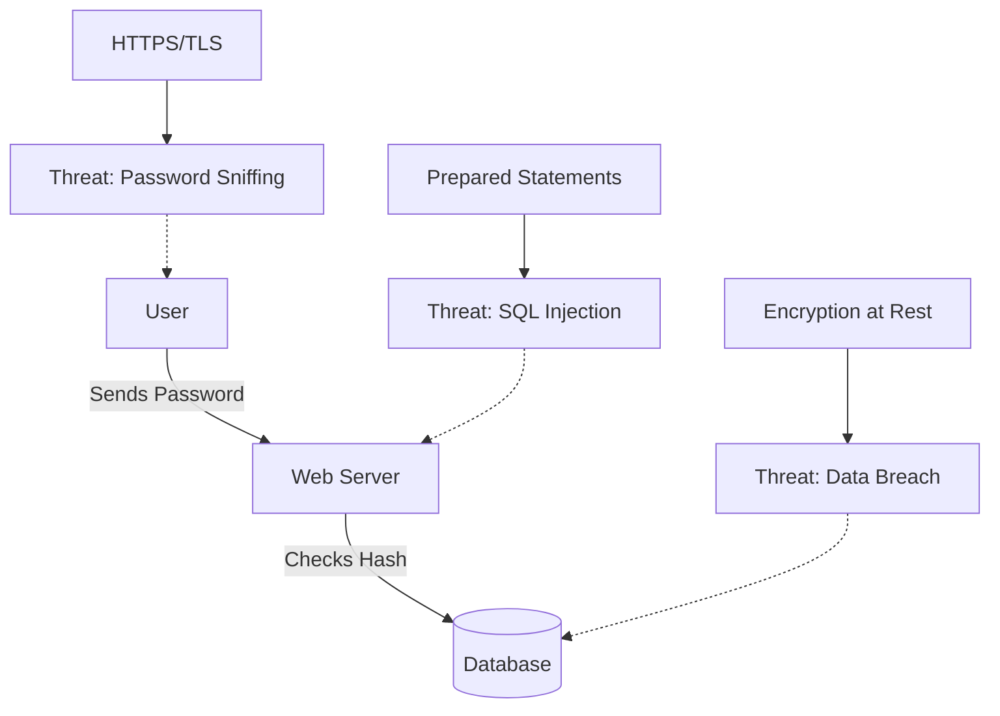

# Threat Modeling: Thinking Like a Hacker

## 1. Beginner-friendly Hinglish Explanation 🇮🇳
Bhai, **Threat Modeling** ka matlab hai "Ghar banane se pehle sochna ki chor kahan se aa sakta hai." 

Agar tumne ek app banayi aur baad mein security check ki, toh shayad bohot der ho chuki ho. Threat modeling design phase mein hota hai. Hum app ka diagram banate hain aur khud se poochte hain: "Kya koi user dusre ka data dekh sakta hai? Kya koi hamari database delete kar sakta hai?" Isse humein woh kamzoriyan (vulnerabilities) pehle hi dikh jati hain jo baad mein "Hacks" ban sakti hain. Yeh "Prevention is better than cure" ka asli example hai.

---

## 2. Deep Technical Explanation
Threat modeling is a structured process to identify, quantify, and address security risks in an application.
- **The Four Questions**:
    1. What are we building? (Architecture Diagram)
    2. What can go wrong? (Identify Threats)
    3. What are we going to do about it? (Mitigation)
    4. Did we do a good job? (Validation)
- **STRIDE Framework**:
    - **S**: Spoofing (Pretending to be someone else).
    - **T**: Tampering (Modifying data).
    - **R**: Repudiation (Claiming you didn't do something).
    - **I**: Information Disclosure (Leaking data).
    - **D**: Denial of Service (Crashing the app).
    - **E**: Elevation of Privilege (Becoming an Admin).

---

## 3. Attack Flow Diagrams
**Threat Model for a Simple Login Page:**


---

## 4. Real-world Attack Examples
- **Stripe API Vulnerability (Hypothetical)**: If Stripe didn't threat model their "Refund" logic, a hacker could have potentially refunded a payment twice. Because they use strict threat modeling, they have "Idempotency Keys" to prevent this.
- **MGM Ransomware (2023)**: A lack of "Internal Threat Modeling" allowed hackers who gained access to the IT support desk to move all the way to the casino floor systems.

---

## 5. Defensive Mitigation Strategies
- **Trust Boundaries**: Draw a line between "User Input" and "Your Code." Everything that crosses that line must be validated.
- **Data Flow Diagrams (DFDs)**: Map out exactly how sensitive data (like Credit Cards) moves through your system.
- **Vulnerability Scoring (DREAD)**: Rating threats based on **D**amage, **R**eproducibility, **E**xploitability, **A**ffected Users, and **D**iscoverability.

---

## 6. Failure Cases
- **Over-complicating the Model**: Trying to find 1000 tiny threats and missing the 1 big "Open Door."
- **One-time Modeling**: Doing a threat model when the company starts and never updating it as the app grows.

---

## 7. Debugging and Investigation Guide
- **Microsoft Threat Modeling Tool**: A free desktop app to draw DFDs and automatically generate potential STRIDE threats.
- **PyTM**: A "Threat Modeling as Code" tool where you describe your app in Python and it generates the diagram and threat report.

---

## 8. Tradeoffs
| Metric | Informal "Whiteboarding" | Formal STRIDE Analysis |
|---|---|---|
| Speed | Fast | Slow |
| Depth | Shallow | Very Deep |
| Compliance Value | Low | High |

---

## 9. Security Best Practices
- **Involve Developers**: Threat modeling shouldn't just be for "Security People." Developers know where the "Bodies are buried" in the code.
- **Focus on High-Value Assets**: Start with the parts of the app that handle money or PII.

---

## 10. Production Hardening Techniques
- **Abuse Cases**: Don't just model "Use Cases" (how the app should work). Model "Abuse Cases" (how a criminal would use the app).
- **Attack Trees**: Visualizing the different paths a hacker can take to reach a specific goal (e.g., "Goal: Steal Admin Token").

---

## 11. Monitoring and Logging Considerations
- **Verify Mitigations**: If your threat model says "SQLi is mitigated by ORM," your logs should prove that no raw SQL queries are being run in production.

---

## 12. Common Mistakes
- **Ignoring the "Insider Threat"**: Assuming that your employees or internal servers are 100% safe.
- **Ignoring "Third-Party" Threats**: Forgetting to model what happens if your Email provider or Cloud provider is hacked.

---

## 13. Compliance Implications
- **SOC2 / ISO 27001**: Auditors often ask to see "Risk Assessments" or "Threat Models" to prove that you are thinking about security proactively.

---

## 14. Interview Questions
1. What does the STRIDE acronym stand for?
2. How do you identify a "Trust Boundary" in an architecture diagram?
3. What is an "Attack Tree" and how is it used?

---

## 15. Latest 2026 Security Patterns and Threats
- **AI-Assisted Threat Modeling**: Using LLMs to analyze your architecture and suggest "Hidden threats" that humans might miss.
- **Continuous Threat Modeling**: Integrating threat modeling into every Pull Request. If a new API endpoint is added, the dev must update the threat model.
- **Threat Modeling for LLMs**: New frameworks specifically for AI (like **OWASP Top 10 for LLMs**) to handle threats like "Prompt Injection" and "Training Data Poisoning."
    
    
    
    
    
    
    
    
    
    
    
    
    
    
    
    
    
    
    
    
    
    
    
    
    
    
    
    
    
    
    
    
    
    
    
    
    
    
    
    
    
    
    
    
    
    
    
    
    
    
    
    
    
    
    
    
    
    
    
    
    
    
    
    
    
    
    
    
    
    
    
    
    
    
    
    
    
    
    
    
    
    
    
    
    
    
    
    
    
    
    
    
    
    
    
    
    
    
    
    
    
    
    
    
    
    
    
    
    
    
    
    
    
    
    
    
    
    
    
    
    
    
    
    
    
    
    
    
    
    
    
    
    
    
    
    
    
    
    
    
    
    
    
    
    
    
    
    
    
    
    
    
    
    
    
    
    
    
    
    
    
    
    
    
    
    
    
    
    
    
    
    
    
    
    
    
    
    
    
    
    
    
    
    
    
    
    
    
    
    
    
    
    
    
    
    
    
    
    
    
    
    
    
    
    
    
    
    
    
    
    
    
    
    
    
    
    
    
    
    
    
    
    
    
    
    
    
    
    
    
    
    
    
    
    
    
    
    
    
    
    
    
    
    
    
    
    
    
    
    
    
    
    
    
    
    
    
    
    
    
    
    
    
    
    
    
    
    
    
    
    
    
    
    
    
    
    
    
    
    
    
    
    
    
    
    
    
    
    
    
    
    
    
    
    
    
    
    
    
    
    
    
    
    
    
    
    
    
    
    
    
    
    
    
    
    
    
    
    
    
    
    
    
    
    
    
    
    
    
    
    
    
    
    
    
    
    
    
    
    
    
    
    
    
    
    
    
    
    
    
    
    
    
    
    
    
    
    
    
    
    
    
    
    
    
    
    
    
    
    
    
    
    
    
    
    
    
    
    
    
    
    
    
    
    
    
    
    
    
    
    
    
    
    
    
    
    
    
    
    
    
    
    
    
    
    
    
    
    
    
    
    
    
    
    
    
    
    
    
    
    
    
    
    
    
    
    
    
    
    
    
    
    
    
    
    
    
    
    
    
    
    
    
    
    
    
    
    
    
    
    
    
    
    
    
    
    
    
    
    
    
    
    
    
    
    
    
    
    
    
    
    
    
    
    
    
    
    
    
    
    
    
    
    
    
    
    
    
    
    
    
    
    
    
    
    
    
    
    
    
    
    
    
    
    
    
    
    
    
    
    
    
    
    
    
    
    
    
    
    
    
    
    
    
    
    
    
    
    
    
    
    
    
    
    
    
    
    
    
    
    
    
    
    
    
    
    
    
    
    
    
    
    
    
    
    
    
    
    
    
    
    
    
    
    
    
    
    
    
    
    
    
    
    
    
    
    
    
    
    
    
    
    
    
    
    
    
    
    
    
    
    
    
    
    
    
    
    
    
    
    
    
    
    
    
    
    
    
    
    
    
    
    
    
    
    
    
    
    
    
    
    
    
    
    
    
    
    
    
    
    
    
    
    
    
    
    
    
    
    
    
    
    
    
    
    
    
    
    
    
    
    
    
    
    
    
    
    
    
    
    
    
    
    
    
    
    
    
    
    
    
    
    
    
    
    
    
    
    
    
    
    
    
    
    
    
    
    
    
    
    
    
    
    
    
    
    
    
    
    
    
    
    
    
    
    
    
    
    
    
    
    
    
    
    
    
    
    
    
    
    
    
    
    
    
    
    
    
    
    
    
    
    
    
    
    
    
    
    
    
    
    
    
    
    
    
    
    
    
    
    
    
    
    
    
    
    
    
    
    
    
    
    
    
    
    
    
    
    
    
    
    
    
    
    
    
    
    
    
    
    
    
    
    
    
    
    
    
    
    
    
    
    
    
    
    
    
    
    
    
    
    
    
    
    
    
    
    
    
    
    
    
    
    
    
    
    
    
    
    
    
    
    
    
    
    
    
    
    
    
    
    
    
    
    
    
    
    
    
    
    
    
    
    
    
    
    
    
    
    
    
    
    
    
    
    
    
    
    
    
    
    
    
    
    
    
    
    
    
    
    
    
    
    
    
    
    
    
    
    
    
    
    
    
    
    
    
    
    
    
    
    
    
    
    
    
    
    
    
    
    
    
    
    
    
    
    
    
    
    
    
    
    
    
    
    
    
    
    
    
    
    
    
    
    
    
    
    
    
    
    
    
    
    
    
    
    
    
    
    
    
    
    
    
    
    
    
    
    
    
    
    
    
    
    
    
    
    
    
    
    
    
    
    
    
    
    
    
    
    
    
    
    
    
    
    
    
    
    
    
    
    
    
    
    
    
    
    
    
    
    
    
    
    
    
    
    
    
    
    
    
    
    
    
    
    
    
    
    
    
    
    
    
    
    
    
    
    
    
    
    
    
    
    
    
    
    
    
    
    
    
    
    
    
    
    
    
    
    
    
    
    
    
    
    
    
    
    
    
    
    
    
    
    
    
    
    
    
    
    
    
    
    
    
    
    
    
    
    
    
    
    
    
    
    
    
    
    
    
    
    
    
    
    
    
    
    
    
    
    
    
    
    
    
    
    
    
    
    
    
    
    
    
    
    
    
    
    
    
    
    
    
    
    
    
    
    
    
    
    
    
    
    
    
    
    
    
    
    
    
    
    
    
    
    
    
    
    
    
    
    
    
    
    
    
    
    
    
    
    
    
    
    
    
    
    
    
    
    
    
    
    
    
    
    
    
    
    
    
    
    
    
    
    
    
    
    
    
    
    
    
    
    
    
    
    
    
    
    
    
    
    
    
    
    
    
    
    
    
    
    
    
    
    
    
    
    
    
    
    
    
    
    
    
    
    
    
    
    
    
    
    
    
    
    
    
    
    
    
    
    
    
    
    
    
    
    
    
    
    
    
    
    
    
    
    
    
    
    
    
    
    
    
    
    
    
    
    
    
    
    
    
    
    
    
    
    
    
    
    
    
    
    
    
    
    
    
    
    
    
    
    
    
    
    
    
    
    
    
    
    
    
    
    
    
    
    
    
    
    
    
    
    
    
    
    
    
    
    
    
    
    
    
    
    
    
    
    
    
    
    
    
    
    
    
    
    
    
    
    
    
    
    
    
    
    
    
    
    
    
    
    
    
    
    
    
    
    
    
    
    
    
    
    
    
    
    
    
    
    
    
    
    
    
    
    
    
    
    
    
    
    
    
    
    
    
    
    
    
    
    
    
    
    
    
    
    
    
    
    
    
    
    
    
    
    
    
    
    
    
    
    
    
    
    
    
    
    
    
    
    
    
    
    
    
    
    
    
    
    
    
    
    
    
    
    
    
    
    
    
    
    
    
    
    
    
    
    
    
    
    
    
    
    
    
    
    
    
    
    
    
    
    
    
    
    
    
    
    
    
    
    
    
    
    
    
    
    
    
    
    
    
    
    
    
    
    
    
    
    
    
    
    
    
    
    
    
    
    
    
    
    
    
    
    
    
    
    
    
    
    
    
    
    
    
    
    
    
    
    
    
    
    
    
    
    
    
    
    
    
    
    
    
    
    
    
    
    
    
    
    
    
    
    
    
    
    
    
    
    
    
    
    
    
    
    
    
    
    
    
    
    
    
    
    
    
    
    
    
    
    
    
    
    
    
    
    
    
    
    
    
    
    
    
    
    
    
    
    
    
    
    
    
    
    
    
    
    
    
    
    
    
    
    
    
    
    
    
    
    
    
    
    
    
    
    
    
    
    
    
    
    
    
    
    
    
    
    
    
    
    
    
    
    
    
    
    
    
    
    
    
    
    
    
    
    
    
    
    
    
    
    
    
    
    
    
    
    
    
    
    
    
    
    
    
    
    
    
    
    
    
    
    
    
    
    
    
    
    
    
    
    
    
    
    
    
    
    
    
    
    
    
    
    
    
    
    
    
    
    
    
    
    
    
    
    
    
    
    
    
    
    
    
    
    
    
    
    
    
    
    
    
    
    
    
    
    
    
    
    
    
    
    
    
    
    
    
    
    
    
    
    
    
    
    
    
    
    
    
    
    
    
    
    
    
    
    
    
    
    
    
    
    
    
    
    
    
    
    
    
    
    
    
    
    
    
    
    
    
    
    
    
    
    
    
    
    
    
    
    
    
    
    
    
    
    
    
    
    
    
    
    
    
    
    
    
    
    
    
    
    
    
    
    
    
    
    
    
    
    
    
    
    
    
    
    
    
    
    
    
    
    
    
    
    
    
    
    
    
    
    
    
    
    
    
    
    
    
    
    
    
    
    
    
    
    
    
    
    
    
    
    
    
    
    
    
    
    
    
    
    
    
    
    
    
    
    
    
    
    
    
    
    
    
    
    
    
    
    
    
    
    
    
    
    
    
    
    
    
    
    
    
    
    
    
    
    
    
    
    
    
    
    
    
    
    
    
    
    
    
    
    
    
    
    
    
    
    
    
    
    
    
    
    
    
    
    
    
    
    
    
    
    
    
    
    
    
    
    
    
    
    
    
    
    
    
    
    
    
    
    
    
    
    
    
    
    
    
    
    
    
    
    
    
    
    
    
    
    
    
    
    
    
    
    
    
    
    
    
    
    
    
    
    
    
    
    
    
    
    
    
    
    
    
    
    
    
    
    
    
    
    
    
    
    
    
    
    
    
    
    
    
    
    
    
    
    
    
    
    
    
    
    
    
    
    
    
    
    
    
    
    
    
    
    
    
    
    
    
    
    
    
    
    
    
    
    
    
    
    
    
    
    
    
    
    
    
    
    
    
    
    
    
    
    
    
    
    
    
    
    
    
    
    
    
    
    
    
    
    
    
    
    
    
    
    
    
    
    
    
    
    
    
    
    
    
    
    
    
    
    
    
    
    
    
    
    
    
    
    
    
    
    
    
    
    
    
    
    
    
    
    
    
    
    
    
    
    
    
    
    
    
    
    
    
    
    
    
    
    
    
    
    
    
    
    
    
    
    
    
    
    
    
    
    
    
    
    
    
    
    
    
    
    
    
    
    
    
    
    
    
    
    
    
    
    
    
    
    
    
    
    
    
    
    
    
    
    
    
    
    
    
    
    
    
    
    
    
    
    
    
    
    
    
    
    
    
    
    
    
    
    
    
    
    
    
    
    
    
    
    
    
    
    
    
    
    
    
    
    
    
    
    
    
    
    
    
    
    
    
    
    
    
    
    
    
    
    
    
    
    
    
    
    
    
    
    
    
    
    
    
    
    
    
    
    
    
    
    
    
    
    
    
    
    
    
    
    
    
    
    
    
    
    
    
    
    
    
    
    
    
    
    
    
    
    
    
    
    
    
    
    
    
    
    
    
    
    
    
    
    
    
    
    
    
    
    
    
    
    
    
    
    
    
    
    
    
    
    
    
    
    
    
    
    
    
    
    
    
    
    
    
    
    
    
    
    
    
    
    
    
    
    
    
    
    
    
    
    
    
    
    
    
    
    
    
    
    
    
    
    
    
    
    
    
    
    
    
    
    
    
    
    
    
    
    
    
    
    
    
    
    
    
    
    
    
    
    
    
    
    
    
    
    
    
    
    
    
    
    
    
    
    
    
    
    
    
    
    
    
    
    
    
    
    
    
    
    
    
    
    
    
    
    
    
    
    
    
    
    
    
    
    
    
    
    
    
    
    
    
    
    
    
    
    
    
    
    
    
    
    
    
    
    
    
    
    
    
    
    
    
    
    
    
    
    
    
    
    
    
    
    
    
    
    
    
    
    
    
    
    
    
    
    
    
    
    
    
    
    
    
    
    
    
    
    
    
    
    
    
    
    
    
    
    
    
    
    
    
    
    
    
    
    
    
    
    
    
    
    
    
    
    
    
    
    
    
    
    
    
    
    
    
    
    
    
    
    
    
    
    
    
    
    
    
    
    
    
    
    
    
    
    
    
    
    
    
    
    
    
    
    
    
    
    
    
    
    
    
    
    
    
    
    
    
    
    
    
    
    
    
    
    
    
    
    
    
    
    
    
    
    
    
    
    
    
    
    
    
    
    
    
    
    
    
    
    
    
    
    
    
    
    
    
    
    
    
    
    
    
    
    
    
    
    
    
    
    
    
    
    
    
    
    
    
    
    
    
    
    
    
    
    
    
    
    
    
    
    
    
    
    
    
    
    
    
    
    
    
    
    
    
    
    
    
    
    
    
    
    
    
    
    
    
    
    
    
    
    
    
    
    
    
    
    
    
    
    
    
    
    
    
    
    
    
    
    
    
    
    
    
    
    
    
    
    
    
    
    
    
    
    
    
    
    
    
    
    
    
    
    
    
    
    
    
    
    
    
    
    
    
    
    
    
    
    
    
    
    
    
    
    
    
    
    
    
    
    
    
    
    
    
    
    
    
    
    
    
    
    
    
    
    
    
    
    
    
    
    
    
    
    
    
    
    
    
    
    
    
    
    
    
    
    
    
    
    
    
    
    
    
    
    
    
    
    
    
    
    
    
    
    
    
    
    
    
    
    
    
    
    
    
    
    
    
    
    
    
    
    
    
    
    
    
    
    
    
    
    
    
    
    
    
    
    
    
    
    
    
    
    
    
    
    
    
    
    
    
    
    
    
    
    
    
    
    
    
    
    
    
    
    
    
    
    
    
    
    
    
    
    
    
    
    
    
    
    
    
    
    
    
    
    
    
    
    
    
    
    
    
    
    
    
    
    
    
    
    
    
    
    
    
    
    
    
    
    
    
    
    
    
    
    
    
    
    
    
    
    
    
    
    
    
    
    
    
    
    
    
    
    
    
    
    
    
    
    
    
    
    
    
    
    
    
    
    
    
    
    
    
    
    
    
    
    
    
    
    
    
    
    
    
    
    
    
    
    
    
    
    
    
    
    
    
    
    
    
    
    
    
    
    
    
    
    
    
    
    
    
    
    
    
    
    
    
    
    
    
    
    
    
    
    
    
    
    
    
    
    
    
    
    
    
    
    
    
    
    
    
    
    
    
    
    
    
    
    
    
    
    
    
    
    
    
    
    
    
    
    
    
    
    
    
    
    
    
    
    
    
    
    
    
    
    
    
    
    
    
    
    
    
    
    
    
    
    
    
    
    
    
    
    
    
    
    
    
    
    
    
    
    
    
    
    
    
    
    
    
    
    
    
    
    
    
    
    
    
    
    
    
    
    
    
    
    
    
    
    
    
    
    
    
    
    
    
    
    
    
    
    
    
    
    
    
    
    
    
    
    
    
    
    
    
    
    
    
    
    
    
    
    
    
    
    
    
    
    
    
    
    
    
    
    
    
    
    
    
    
    
    
    
    
    
    
    
    
    
    
    
    
    
    
    
    
    
    
    
    
    
    
    
    
    
    
    
    
    
    
    
    
    
    
    
    
    
    
    
    
    
    
    
    
    
    
    
    
    
    
    
    
    
    
    
    
    
    
    
    
    
    
    
    
    
    
    
    
    
    
    
    
    
    
    
    
    
    
    
    
    
    
    
    
    
    
    
    
    
    
    
    
    
    
    
    
    
    
    
    
    
    
    
    
    
    
    
    
    
    
    
    
    
    
    
    
    
    
    
    
    
    
    
    
    
    
    
    
    
    
    
    
    
    
    
    
    
    
    
    
    
    
    
    
    
    
    
    
    
    
    
    
    
    
    
    
    
    
    
    
    
    
    
    
    
    
    
    
    
    
    
    
    
    
    
    
    
    
    
    
    
    
    
    
    
    
    
    
    
    
    
    
    
    
    
    
    
    
    
    
    
    
    
    
    
    
    
    
    
    
    
    
    
    
    
    
    
    
    
    
    
    
    
    
    
    
    
    
    
    
    
    
    
    
    
    
    
    
    
    
    
    
    
    
    
    
    
    
    
    
    
    
    
    
    
    
    
    
    
    
    
    
    
    
    
    
    
    
    
    
    
    
    
    
    
    
    
    
    
    
    
    
    
    
    
    
    
    
    
    
    
    
    
    
    
    
    
    
    
    
    
    
    
    
    
    
    
    
    
    
    
    
    
    
    
    
    
    
    
    
    
    
    
    
    
    
    
    
    
    
    
    
    
    
    
    
    
    
    
    
    
    
    
    
    
    
    
    
    
    
    
    
    
    
    
    
    
    
    
    
    
    
    
    
    
    
    
    
    
    
    
    
    
    
    
    
    
    
    
    
    
    
    
    
    
    
    
    
    
    
    
    
    
    
    
    
    
    
    
    
    
    
    
    
    
    
    
    
    
    
    
    
    
    
    
    
    
    
    
    
    
    
    
    
    
    
    
    
    
    
    
    
    
    
    
    
    
    
    
    
    
    
    
    
    
    
    
    
    
    
    
    
    
    
    
    
    
    
    
    
    
    
    
    
    
    
    
    
    
    
    
    
    
    
    
    
    
    In the world of documentation, complete over-complication is a failure. It should be as simple as possible but no simpler. A user's time is the most expensive resource.
    
    ---
    
    ## Plan for Module 09: Application Security (Batch 2)
    Next I will generate:
    - `Static_and_Dynamic_Analysis.md`
    - `Vulnerability_Management.md`
    - `Security_Testing.md`
    
    ---
    
    # 1. Static and Dynamic Analysis (SAST vs. DAST)
    
    ---
    
    ## 1. Beginner-friendly Hinglish Explanation 🇮🇳
    Bhai, code check karne ke do tareeke hote hain: ek jab code "Soya" hua hai (Static) aur dusra jab code "Chhal" raha hai (Dynamic).
    
    1. **SAST (Static Analysis)**: Yeh bilkul code review ki tarah hai. Tools (jaise SonarQube) source code ko bina run kiye check karte hain ki kahin tumne hardcoded password toh nahi chhoda ya user input direct query mein toh nahi daala.
    2. **DAST (Dynamic Analysis)**: Yeh hacker ki tarah hota hai. App ko run karke bahar se "Attack" kiya jata hai taaki dekha ja sake ki live app kaise respond karti hai. 
    
    Dono ka combo hi secure app ki guarantee deta hai.
    
    ---
    
    ## 2. Deep Technical Explanation
    - **SAST (Static Application Security Testing)**:
        - **White-box Testing**: Full access to source code.
        - **Pros**: Finds bugs early (IDE/PR phase), precise line numbers.
        - **Cons**: High false positives, can't find runtime/config issues.
    - **DAST (Dynamic Application Security Testing)**:
        - **Black-box Testing**: No access to code, tests the running application.
        - **Pros**: Finds environment/config issues, 0 false positives (if it hits, it's real).
        - **Cons**: Finds bugs late (Deployment phase), hard to automate in dev.
    - **IAST (Interactive Analysis)**: A hybrid approach where an agent inside the app monitors execution during functional tests.
    
    ---
    
    ## 3. Attack Flow Diagrams
    **SAST vs. DAST Detection:**
    ```mermaid
    graph TD
        Code[Source Code] --> SAST[SAST Tool]
        SAST -- Finds --> Bug1[Hardcoded Key in line 45]
        
        Deploy[Deployed App] --> DAST[DAST Tool]
        DAST -- Attacks --> Bug2[XSS in Search Bar]
    ```
    
    ---
    
    ## 4. Real-world Attack Examples
    - **Leaked GitHub Tokens**: Many developers accidentally commit tokens. SAST tools like **TruffleHog** catch these before they reach production.
    - **Insecure Cookie Flags**: A DAST tool like **OWASP ZAP** will notice if your `Set-Cookie` header is missing the `Secure` flag on a live HTTPS site.
    
    ---
    
    ## 5. Defensive Mitigation Strategies
    - **Integrate SAST into Git Hooks**: Prevent commits if a critical security issue is found.
    - **Run DAST in Staging**: Before every release, run a 10-minute automated scan.
    - **Triage False Positives**: Don't ignore alerts; mark them as "False Positive" in the tool so they don't show up again.
    
    ---
    
    ## 6. Failure Cases
    - **SAST Bypass**: Using obfuscated code or complex logic that the static analyzer can't trace.
    - **DAST "Blindness"**: A DAST tool can't test parts of the app that require complex multi-step auth or specific state.
    
    ---
    
    ## 7. Debugging and Investigation Guide
    - **SonarQube Dashboard**: Visualizing technical debt and security hotspots.
    - **Burp Suite Professional**: The "Gold Standard" for manual dynamic analysis.
    
    ---
    
    ## 8. Tradeoffs
    | Metric | SAST | DAST |
    |---|---|---|
    | When to Run | Code/Commit | Test/Stage |
    | Cost to Fix | Low | High |
    | Knowledge Required | Programming | Networking/Security |
    
    ---
    
    ## 9. Security Best Practices
    - **Fix Top Issues First**: Focus on "Critical" and "High" alerts.
    - **SCA Integration**: Use SAST along with **SCA** (Software Composition Analysis) to check both your code and your 3rd party libraries.
    
    ---
    
    ## 10. Production Hardening Techniques
    - **RASP (Runtime Application Self-Protection)**: If a bug is missed by SAST/DAST, RASP can block the exploit attempt in the production environment.
    
    ---
    
    ## 11. Monitoring and Logging Considerations
    - **Vulnerability Trends**: Tracking if the number of new security bugs is going down over time.
    
    ---
    
    ## 12. Common Mistakes
    - **Running only one**: Thinking SAST is enough. It will miss environment config errors that only DAST can find.
    
    ---
    
    ## 13. Compliance Implications
    - **PCI-DSS**: Requires both internal and external vulnerability scans, typically fulfilled by automated DAST tools.
    
    ---
    
    ## 14. Interview Questions
    1. Explain the difference between White-box and Black-box testing.
    2. Why does SAST have more false positives than DAST?
    3. What is IAST and how is it different?
    
    ---
    
    ## 15. Latest 2026 Security Patterns and Threats
    - **AI-Augmented SAST**: LLMs that understand the "Intent" of code to reduce false positives by 90%.
    - **Agentless DAST**: Using eBPF to monitor application traffic and find vulnerabilities without "Attacking" the app.
    
    ---
    
    # 2. Vulnerability Management
    
    ---
    
    ## 1. Beginner-friendly Hinglish Explanation 🇮🇳
    Bhai, **Vulnerability Management** ka matlab hai "Apni app ki kamzoriyon ki list banana aur unhe priority ke hisaab se theek karna." 
    
    Aisa nahi ho sakta ki tum ek din saare bugs theek kar do. Har roz naye "Zero-day" bugs aate hain. Yeh module humein sikhata hai ki kaise bugs ko "Discover" karein, kaise unhe "Score" dein (kaunsa bug sabse khatarnak hai?), aur kaise unhe fix karne ka "SLA" (deadline) rakhein. Bina management ke, tum sirf aag bujhate rahoge (Firefighting) aur hacker kisi purani kamzori se andar ghus jayega.
    
    ---
    
    ## 2. Deep Technical Explanation
    The Vulnerability Management lifecycle consists of:
    1. **Identification**: Using scanners (SAST, DAST, SCA, Infrastructure scans).
    2. **Prioritization**: Using **CVSS** (Common Vulnerability Scoring System) to rank bugs from 0 to 10.
    3. **Remediation**: Fixing the bug, implementing a workaround (WAF rule), or accepting the risk.
    4. **Verification**: Re-scanning to ensure the fix actually worked.
    
    ---
    
    ## 3. Attack Flow Diagrams
    **Vulnerability Lifecycle:**
    ```mermaid
    stateDiagram-v2
        [*] --> New: Found by Scanner
        New --> Triaged: Human reviews it
        Triaged --> Open: Confirmed bug
        Open --> Fixed: Developer patches it
        Fixed --> Verified: Scanner confirms fix
        Verified --> [*]
        
        Open --> RiskAccepted: Too expensive to fix
        RiskAccepted --> [*]
    ```
    
    ---
    
    ## 4. Real-world Attack Examples
    - **Equifax Breach (2017)**: They *knew* about the Apache Struts vulnerability but failed to patch it in time. This was a failure of "Vulnerability Management," not technical skill.
    - **WannaCry Ransomware**: Targeted a Windows vulnerability that already had a patch. Companies with poor vulnerability management were wiped out.
    
    ---
    
    ## 5. Defensive Mitigation Strategies
    - **SLA Enforcement**: Critical bugs must be fixed in 48 hours, High in 15 days, etc.
    - **Centralized Tracking**: Using tools like **DefectDojo** or **Jira Security** so everyone knows what needs to be fixed.
    
    ---
    
    ## 6. Failure Cases
    - **Infinite Backlog**: Having 5000 open vulnerabilities that nobody is looking at.
    - **Patch Tuesday, Exploit Wednesday**: Hackers reverse-engineering patches to attack companies that haven't updated yet.
    
    ---
    
    ## 7. Debugging and Investigation Guide
    - **CVSS Calculator**: Learning how to calculate the real risk of a bug based on whether it's reachable from the internet.
    
    ---
    
    ## 8. Tradeoffs
    | Metric | Patching Everything | Risk-Based Patching |
    |---|---|---|
    | Security | Maximum | High |
    | Stability | Low (Updates might break app) | High |
    | Effort | Ultra-High | Low |
    
    ---
    
    ## 9. Security Best Practices
    - **Automate everything**: Manual vulnerability management doesn't work in the cloud era.
    - **VDP (Vulnerability Disclosure Program)**: Let ethical hackers find your bugs for you.
    
    ---
    
    ## 10. Production Hardening Techniques
    - **Virtual Patching**: If you can't fix the code today, add a rule to your **WAF** or **IPS** to block the specific attack pattern.
    
    ---
    
    ## 11. Monitoring and Logging Considerations
    - **Vulnerability Aging**: Tracking how long a critical bug has been "Open." 
    
    ---
    
    ## 12. Common Mistakes
    - **Treating all 'High' bugs the same**: A 'High' bug on a public server is 100x more dangerous than a 'High' bug on a developer's test machine.
    
    ---
    
    ## 13. Compliance Implications
    - **SOC2 / ISO 27001**: Requires a documented Vulnerability Management policy and evidence of regular scanning.
    
    ---
    
    ## 14. Interview Questions
    1. What is CVSS and how is it used for prioritization?
    2. What is the difference between "Remediation" and "Mitigation"?
    3. How do you handle a vulnerability that cannot be patched immediately?
    
    ---
    
    ## 15. Latest 2026 Security Patterns and Threats
    - **EPSS (Exploit Prediction Scoring System)**: A new model that predicts *if* a bug will actually be used by hackers, helping teams focus on the 2% of bugs that truly matter.
    - **Automated Remediation (Auto-PRs)**: Systems that automatically create a code fix and a test case for every new vulnerability found.
    
    ---
    
    # 3. Security Testing
    
    ---
    
    ## 1. Beginner-friendly Hinglish Explanation 🇮🇳
    Bhai, **Security Testing** ka matlab hai "Apni app ki chhati (Chest) thonk kar dekhna ki kitni mazboot hai." 
    
    Humne code likh liya, tools run kar liye, lekin ab bari hai "Insaani dimaag" ki. Ismein hum seekhte hain ki kaise manual penetration testing karein, kaise logic bugs dhundhein jo tools miss kar dete hain, aur kaise ek "Security Test Case" likhein. Yeh QA testing ki tarah hai, bas difference yeh hai ki QA check karta hai "Kya app kaam kar rahi hai?", aur Security Testing check karta hai "Kya app ko galat tareeke se chalaya ja sakta hai?"
    
    ---
    
    ## 2. Deep Technical Explanation
    - **Unit Security Tests**: Testing individual functions (e.g., testing the `hashPassword` function).
    - **Integration Security Tests**: Testing how two systems talk (e.g., Auth service talking to the DB).
    - **Regression Security Tests**: Ensuring that a bug you fixed 6 months ago hasn't come back.
    - **Fuzzing**: Providing invalid, unexpected, or random data as inputs to an application to find crashes/memory leaks.
    - **Penetration Testing**: A manual, targeted attempt to breach the system.
    
    ---
    
    ## 3. Attack Flow Diagrams
    **Fuzz Testing Logic:**
    ```mermaid
    graph LR
        Generator[Input Generator] -- "Sends: %%%###, 1GB String, ' OR 1=1" --> App[Target Application]
        App -- "Crashes? Memory Spike? Error 500?" --> Monitor[Observer]
        Monitor -- "Found Bug!" --> Dev[Developer]
    ```
    
    ---
    
    ## 4. Real-world Attack Examples
    - **Zero-Day in Zoom**: Fuzz testing of the Zoom client led to the discovery of vulnerabilities that allowed remote code execution.
    - **Logic Bug in Coinbase**: A researcher found that they could trade any amount of crypto by manipulating the "Price" field in the API request—a bug that automated tools would never find.
    
    ---
    
    ## 5. Defensive Mitigation Strategies
    - **Security Regression Testing**: Add a test case for every bug you fix so it stays fixed forever.
    - **Negative Testing**: Write tests for what the user *shouldn't* be able to do.
    
    ---
    
    ## 6. Failure Cases
    - **Testing in Production**: Running an aggressive scanner that accidentally deletes 10,000 real customer orders. (Always test in a dedicated "UAT" or "Security" environment).
    
    ---
    
    ## 7. Debugging and Investigation Guide
    - **OWASP ZAP / Burp Suite**: Using "Intercept" to modify a request between the browser and the server.
    - **Postman for API Testing**: Sending "Bad" JSON payloads to see how the API responds.
    
    ---
    
    ## 8. Tradeoffs
    | Method | Automated Testing | Manual Pentesting |
    |---|---|---|
    | Coverage | High (Every line) | Low (Targeted) |
    | Logic Bugs | Low | High |
    | Cost | Low | High |
    
    ---
    
    ## 9. Security Best Practices
    - **Standardized Test Cases**: Use the **OWASP ASVS** (Application Security Verification Standard) as your guide for what to test.
    
    ---
    
    ## 10. Production Hardening Techniques
    - **Bug Bounties**: Paying external hackers to find bugs in your production app (HackerOne, Bugcrowd).
    
    ---
    
    ## 11. Monitoring and Logging Considerations
    - **Test Coverage Metrics**: "What percentage of our security requirements have an automated test?"
    
    ---
    
    ## 12. Common Mistakes
    - **Only testing for 'Hacker' attacks**: Forgetting to test for "Accidental" security breaches caused by regular users.
    
    ---
    
    ## 13. Compliance Implications
    - **HIPAA / PCI-DSS**: Mandates annual "Penetration Testing" by a qualified third party.
    
    ---
    
    ## 14. Interview Questions
    1. How do you write a security unit test?
    2. What is "Fuzzing" and when is it useful?
    3. What is the difference between a Vulnerability Scan and a Penetration Test?
    
    ---
    
    ## 15. Latest 2026 Security Patterns and Threats
    - **AI Red Teaming**: Using AI agents to automatically find exploits in your app's business logic.
    - **Mutation-based Fuzzing**: Advanced fuzzing that "Learns" from the app's responses to create more effective attacks.
    - **Shift-Left Pentesting**: Integrating manual security reviews into the design phase of a feature, rather than the end of the project.
