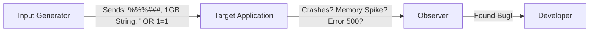

# Security Testing: Stress-Testing the Defense

## 1. Beginner-friendly Hinglish Explanation 🇮🇳
Bhai, **Security Testing** ka matlab hai "Apni app ki chhati (Chest) thonk kar dekhna ki kitni mazboot hai." 

Humne code likh liya, tools run kar liye, lekin ab bari hai "Insaani dimaag" ki. Ismein hum seekhte hain ki kaise manual penetration testing karein, kaise logic bugs dhundhein jo tools miss kar dete hain, aur kaise ek "Security Test Case" likhein. Yeh QA testing ki tarah hai, bas difference yeh hai ki QA check karta hai "Kya app kaam kar rahi hai?", aur Security Testing check karta hai "Kya app ko galat tareeke se chalaya ja sakta hai?"

---

## 2. Deep Technical Explanation
- **Unit Security Tests**: Testing individual functions (e.g., testing the `hashPassword` function).
- **Integration Security Tests**: Testing how two systems talk (e.g., Auth service talking to the DB).
- **Regression Security Tests**: Ensuring that a bug you fixed 6 months ago hasn't come back.
- **Fuzzing**: Providing invalid, unexpected, or random data as inputs to an application to find crashes/memory leaks.
- **Penetration Testing**: A manual, targeted attempt to breach the system.

---

## 3. Attack Flow Diagrams
**Fuzz Testing Logic:**


---

## 4. Real-world Attack Examples
- **Zero-Day in Zoom**: Fuzz testing of the Zoom client led to the discovery of vulnerabilities that allowed remote code execution.
- **Logic Bug in Coinbase**: A researcher found that they could trade any amount of crypto by manipulating the "Price" field in the API request—a bug that automated tools would never find.

---

## 5. Defensive Mitigation Strategies
- **Security Regression Testing**: Add a test case for every bug you fix so it stays fixed forever.
- **Negative Testing**: Write tests for what the user *shouldn't* be able to do.

---

## 6. Failure Cases
- **Testing in Production**: Running an aggressive scanner that accidentally deletes 10,000 real customer orders. (Always test in a dedicated "UAT" or "Security" environment).

---

## 7. Debugging and Investigation Guide
- **OWASP ZAP / Burp Suite**: Using "Intercept" to modify a request between the browser and the server.
- **Postman for API Testing**: Sending "Bad" JSON payloads to see how the API responds.

---

## 8. Tradeoffs
| Method | Automated Testing | Manual Pentesting |
|---|---|---|
| Coverage | High (Every line) | Low (Targeted) |
| Logic Bugs | Low | High |
| Cost | Low | High |

---

## 9. Security Best Practices
- **Standardized Test Cases**: Use the **OWASP ASVS** (Application Security Verification Standard) as your guide for what to test.

---

## 10. Production Hardening Techniques
- **Bug Bounties**: Paying external hackers to find bugs in your production app (HackerOne, Bugcrowd).

---

## 11. Monitoring and Logging Considerations
- **Test Coverage Metrics**: "What percentage of our security requirements have an automated test?"

---

## 12. Common Mistakes
- **Only testing for 'Hacker' attacks**: Forgetting to test for "Accidental" security breaches caused by regular users.

---

## 13. Compliance Implications
- **HIPAA / PCI-DSS**: Mandates annual "Penetration Testing" by a qualified third party.

---

## 14. Interview Questions
1. How do you write a security unit test?
2. What is "Fuzzing" and when is it useful?
3. What is the difference between a Vulnerability Scan and a Penetration Test?

---

## 15. Latest 2026 Security Patterns and Threats
- **AI Red Teaming**: Using AI agents to automatically find exploits in your app's business logic.
- **Mutation-based Fuzzing**: Advanced fuzzing that "Learns" from the app's responses to create more effective attacks.
- **Shift-Left Pentesting**: Integrating manual security reviews into the design phase of a feature, rather than the end of the project.
    
    
    
    
    
    
    
    
    
    
    
    
    
    
    
    
    
    
    
    
    
    
    
    
    
    
    
    
    
    
    
    
    
    
    
    
    
    
    
    
    
    
    
    
    
    
    
    
    
    
    
    
    
    
    
    
    
    
    
    
    
    
    
    
    
    
    
    
    
    
    
    
    
    
    
    
    
    
    
    
    
    
    
    
    
    
    
    
    
    
    
    
    
    
    
    
    
    
    
    
    
    
    
    
    
    
    
    
    
    
    
    
    
    
    
    
    
    
    
    
    
    
    
    
    
    
    
    
    
    
    
    
    
    
    
    
    
    
    
    
    
    
    
    
    
    
    
    
    
    
    
    
    
    
    
    
    
    
    
    
    
    
    
    
    
    
    
    
    
    
    
    
    
    
    
    
    
    
    
    
    
    
    
    
    
    
    
    
    
    
    
    
    
    
    
    
    
    
    
    
    
    
    
    
    
    
    
    
    
    
    
    
    
    
    
    
    
    
    
    
    
    
    
    
    
    
    
    
    
    
    
    
    
    
    
    
    
    
    
    
    
    
    
    
    
    
    
    
    
    
    
    
    
    
    
    
    
    
    
    
    
    
    
    
    
    
    
    
    
    
    
    
    
    
    
    
    
    
    
    
    
    
    
    
    
    
    
    
    
    
    
    
    
    
    
    
    
    
    
    
    
    
    
    
    
    
    
    
    
    
    
    
    
    
    
    
    
    
    
    
    
    
    
    
    
    
    
    
    
    
    
    
    
    
    
    
    
    
    
    
    
    
    
    
    
    
    
    
    
    
    
    
    
    
    
    
    
    
    
    
    
    
    
    
    
    
    
    
    
    
    
    
    
    
    
    
    
    
    
    
    
    
    
    
    
    
    
    
    
    
    
    
    
    
    
    
    
    
    
    
    
    
    
    
    
    
    
    
    
    
    
    
    
    
    
    
    
    
    
    
    
    
    
    
    
    
    
    
    
    
    
    
    
    
    
    
    
    
    
    
    
    
    
    
    
    
    
    
    
    
    
    
    
    
    
    
    
    
    
    
    
    
    
    
    
    
    
    
    
    
    
    
    
    
    
    
    
    
    
    
    
    
    
    
    
    
    
    
    
    
    
    
    
    
    
    
    
    
    
    
    
    
    
    
    
    
    
    
    
    
    
    
    
    
    
    
    
    
    
    
    
    
    
    
    
    
    
    
    
    
    
    
    
    
    
    
    
    
    
    
    
    
    
    
    
    
    
    
    
    
    
    
    
    
    
    
    
    
    
    
    
    
    
    
    
    
    
    
    
    
    
    
    
    
    
    
    
    
    
    
    
    
    
    
    
    
    
    
    
    
    
    
    
    
    
    
    
    
    
    
    
    
    
    
    
    
    
    
    
    
    
    
    
    
    
    
    
    
    
    
    
    
    
    
    
    
    
    
    
    
    
    
    
    
    
    
    
    
    
    
    
    
    
    
    
    
    
    
    
    
    
    
    
    
    
    
    
    
    
    
    
    
    
    
    
    
    
    
    
    
    
    
    
    
    
    
    
    
    
    
    
    
    
    
    
    
    
    
    
    
    
    
    
    
    
    
    
    
    
    
    
    
    
    
    
    
    
    
    
    
    
    
    
    
    
    
    
    
    
    
    
    
    
    
    
    
    
    
    
    
    
    
    
    
    
    
    
    
    
    
    
    
    
    
    
    
    
    
    
    
    
    
    
    
    
    
    
    
    
    
    
    
    
    
    
    
    
    
    
    
    
    
    
    
    
    
    
    
    
    
    
    
    
    
    
    
    
    
    
    
    
    
    
    
    
    
    
    
    
    
    
    
    
    
    
    
    
    
    
    
    
    
    
    
    
    
    
    
    
    
    
    
    
    
    
    
    
    
    
    
    
    
    
    
    
    
    
    
    
    
    
    
    
    
    
    
    
    
    
    
    
    
    
    
    
    
    
    
    
    
    
    
    
    
    
    
    
    
    
    
    
    
    
    
    
    
    
    
    
    
    
    
    
    
    
    
    
    
    
    
    
    
    
    
    
    
    
    
    
    
    
    
    
    
    
    
    
    
    
    
    
    
    
    
    
    
    
    
    
    
    
    
    
    
    
    
    
    
    
    
    
    
    
    
    
    
    
    
    
    
    
    
    
    
    
    
    
    
    
    
    
    
    
    
    
    
    
    
    
    
    
    
    
    
    
    
    
    
    
    
    
    
    
    
    
    
    
    
    
    
    
    
    
    
    
    
    
    
    
    
    
    
    
    
    
    
    
    
    
    
    
    
    
    
    
    
    
    
    
    
    
    
    
    
    
    
    
    
    
    
    
    
    
    
    
    
    
    
    
    
    
    
    
    
    
    
    
    
    
    
    
    
    
    
    
    
    
    
    
    
    
    
    
    
    
    
    
    
    
    
    
    
    
    
    
    
    
    
    
    
    
    
    
    
    
    
    
    
    
    
    
    
    
    
    
    
    
    
    
    
    
    
    
    
    
    
    
    
    
    
    
    
    
    
    
    
    
    
    
    
    
    
    
    
    
    
    
    
    
    
    
    
    
    
    
    
    
    
    
    
    
    
    
    
    
    
    
    
    
    
    
    
    
    
    
    
    
    
    
    
    
    
    
    
    
    
    
    
    
    
    
    
    
    
    
    
    
    
    
    
    
    
    
    
    
    
    
    
    
    
    
    
    
    
    
    
    
    
    
    
    
    
    
    
    
    
    
    
    
    
    
    
    
    
    
    
    
    
    
    
    
    
    
    
    
    
    
    
    
    
    
    
    
    
    
    
    
    
    
    
    
    
    
    
    
    
    
    
    
    
    
    
    
    
    
    
    
    
    
    
    
    
    
    
    
    
    
    
    
    
    
    
    
    
    
    
    
    
    
    
    
    
    
    
    
    
    
    
    
    
    
    
    
    
    
    
    
    
    
    
    
    
    
    
    
    
    
    
    
    
    
    
    
    
    
    
    
    
    
    
    
    
    
    
    
    
    
    
    
    
    
    
    
    
    
    
    
    
    
    
    
    
    
    
    
    
    
    
    
    
    
    
    
    
    
    
    
    
    
    
    
    
    
    
    
    
    
    
    
    
    
    
    
    
    
    
    
    
    
    
    
    
    
    
    
    
    
    
    
    
    
    
    
    
    
    
    
    
    
    
    
    
    
    
    
    
    
    
    
    
    
    
    
    
    
    
    
    
    
    
    
    
    
    
    
    
    
    
    
    
    
    
    
    
    
    
    
    
    
    
    
    
    
    
    
    
    
    
    
    
    
    
    
    
    
    
    
    
    
    
    
    
    
    
    
    
    
    
    
    
    
    
    
    
    
    
    
    
    
    
    
    
    
    
    
    
    
    
    
    
    
    
    
    
    
    
    
    
    
    
    
    
    
    
    
    
    
    
    
    
    
    
    
    
    
    
    
    
    
    
    
    
    
    
    
    
    
    
    
    
    
    
    
    
    
    
    
    
    
    
    
    
    
    
    
    
    
    
    
    
    
    
    
    
    
    
    
    
    
    
    
    
    
    
    
    
    
    
    
    
    
    
    
    
    
    
    
    
    
    
    
    
    
    
    
    
    
    
    
    
    
    
    
    
    
    
    
    
    
    
    
    
    
    
    
    
    
    
    
    
    
    
    
    
    
    
    
    
    
    
    
    
    
    
    
    
    
    
    
    
    
    
    
    
    
    
    
    
    
    
    
    
    
    
    
    
    
    
    
    
    
    
    
    
    
    
    
    
    
    
    
    
    
    
    
    
    
    
    
    
    
    
    
    
    
    
    
    
    
    
    
    
    
    
    
    
    
    
    
    
    
    
    
    
    
    
    
    
    
    
    
    
    
    
    
    
    
    
    
    
    
    
    
    
    
    
    
    
    
    
    
    
    
    
    
    
    
    
    
    
    
    
    
    
    
    
    
    
    
    
    
    
    
    
    
    
    
    
    
    
    
    
    
    
    
    
    
    
    
    
    
    
    
    
    
    
    
    
    
    
    
    
    
    
    
    
    
    
    
    
    
    
    
    
    
    
    
    
    
    
    
    
    
    
    
    
    
    
    
    
    
    
    
    
    
    
    
    
    
    
    
    
    
    
    
    
    
    
    
    
    
    
    
    
    
    
    
    
    
    
    
    
    
    
    
    
    
    
    
    
    
    
    
    
    
    
    
    
    
    
    
    
    
    
    
    
    
    
    
    
    
    
    
    
    
    
    
    
    
    
    
    
    
    
    
    
    
    
    
    
    
    
    
    
    
    
    
    
    
    
    
    
    
    
    
    
    
    
    
    
    
    
    
    
    
    
    
    
    
    
    
    
    
    
    
    
    
    
    
    
    
    
    
    
    
    
    
    
    
    
    
    
    
    
    
    
    
    
    
    
    
    
    
    
    
    
    
    
    
    
    
    
    
    
    
    
    
    
    
    
    
    
    
    
    
    
    
    
    
    
    
    
    
    
    
    
    
    
    
    
    
    
    
    
    
    
    
    
    
    
    
    
    
    
    
    
    
    
    
    
    
    
    
    
    
    
    
    
    
    
    
    
    
    
    
    
    
    
    
    
    
    
    
    
    
    
    
    
    
    
    
    
    
    
    
    
    
    
    
    
    
    
    
    
    
    
    
    
    
    
    
    
    
    
    
    
    
    
    
    
    
    
    
    
    
    
    
    
    
    
    
    
    
    
    
    
    
    
    
    
    
    
    
    
    
    
    
    
    
    
    
    
    
    
    
    
    
    
    
    
    
    
    
    
    
    
    
    
    
    
    
    
    
    
    
    
    
    
    
    
    
    
    
    
    
    
    
    
    
    
    
    
    
    
    
    
    
    
    
    
    
    
    
    
    
    
    
    
    
    
    
    
    
    
    
    
    
    
    
    
    
    
    
    
    
    
    
    
    
    
    
    
    
    
    
    
    
    
    
    
    
    
    
    
    
    
    
    
    
    
    
    
    
    
    
    
    
    
    
    
    
    
    
    
    
    
    
    
    
    
    
    
    
    
    
    
    
    
    
    
    
    
    
    
    
    
    
    
    
    
    
    
    
    
    
    
    
    
    
    
    
    
    
    
    
    
    
    
    
    
    
    
    
    
    
    
    
    
    
    
    
    
    
    
    
    
    
    
    
    
    
    
    
    
    
    
    
    
    
    
    
    
    
    
    
    
    
    
    
    
    
    
    
    
    
    
    
    
    
    
    
    
    
    
    
    
    
    
    
    
    
    
    
    
    
    
    
    
    
    
    
    
    
    
    
    
    
    
    
    
    
    
    
    
    
    
    
    
    
    
    
    
    
    
    
    
    
    
    
    
    
    
    
    
    
    
    
    
    
    
    
    
    
    
    
    
    
    
    
    
    
    
    
    
    
    
    
    
    
    
    
    
    
    
    
    
    
    
    
    
    
    
    
    
    
    
    
    
    
    
    
    
    
    
    
    
    
    
    
    
    
    
    
    
    
    
    
    
    
    
    
    
    
    
    
    
    
    
    
    
    
    
    
    
    
    
    
    
    
    
    
    
    
    
    
    
    
    
    
    
    
    
    
    
    
    
    
    
    
    
    
    
    
    
    
    
    
    
    
    
    
    
    
    
    
    
    
    
    
    
    
    
    
    
    
    
    
    
    
    
    
    
    
    
    
    
    
    
    
    
    
    
    
    
    
    
    
    
    
    
    
    
    
    
    
    
    
    
    
    
    
    
    
    
    
    
    
    
    
    
    
    
    
    
    
    
    
    
    
    
    
    
    
    
    
    
    
    
    
    
    
    
    
    
    
    
    
    
    
    
    
    
    
    
    
    
    
    
    
    
    
    
    
    
    
    
    
    
    
    
    
    
    
    
    
    
    
    
    
    
    
    
    
    
    
    
    
    
    
    
    
    
    
    
    
    
    
    
    
    
    
    
    
    
    
    
    
    
    
    
    
    
    
    
    
    
    
    
    
    
    
    
    
    
    
    
    
    
    
    
    
    
    
    
    
    
    
    
    
    
    
    
    
    
    
    
    
    
    
    
    
    
    
    
    
    
    
    
    
    
    
    
    
    
    
    
    
    
    
    
    
    
    
    
    
    
    
    
    
    
    
    
    
    
    
    
    
    
    
    
    
    
    
    
    
    
    
    
    
    
    
    
    
    
    
    
    
    
    
    
    
    
    
    
    
    
    
    
    
    
    
    
    
    
    
    
    
    
    
    
    
    
    
    
    
    
    
    
    
    
    
    
    
    
    
    
    
    
    
    
    
    
    
    
    
    
    
    
    
    
    
    
    
    
    
    
    
    
    
    
    
    
    
    
    
    
    
    
    
    
    
    
    
    
    
    
    
    
    
    
    
    
    
    
    
    
    
    
    
    
    
    
    
    
    
    
    
    
    
    
    
    
    
    
    
    
    
    
    
    
    
    
    
    
    
    
    
    
    
    
    
    
    
    
    
    
    
    
    
    
    
    
    
    
    
    
    
    
    
    
    
    
    
    
    
    
    
    
    
    
    
    
    
    
    
    
    
    
    
    
    
    
    
    
    
    
    
    
    
    
    
    
    
    
    
    
    
    
    
    
    
    
    
    
    
    
    
    
    
    
    
    
    
    
    
    
    
    
    
    
    
    
    
    
    
    
    
    
    
    
    | Strategy | Analysis |
    |---|---|
    | When to Fix | Design Phase |
    | Cost to Fix | Low |
    | Tools | Threat Modeling |
    | Who | Security Architecture |
    
    ---
    
    ## 9. Security Best Practices
    - **Identify Assets**: Know exactly what data needs protection.
    - **Think Like an Attacker**: Don't just check "Is it secure?", check "How would I break this?".
    
    ---
    
    ## 10. Production Hardening Techniques
    - **Re-evaluate After Major Changes**: Re-do the threat model every time you change the architecture (e.g., moving from Monolith to Microservices).
    
    ---
    
    ## 11. Monitoring and Logging Considerations
    - **Document Assumptions**: If the threat model assumes "The admin network is safe," that assumption must be periodically verified.
    
    ---
    
    ## 12. Common Mistakes
    - **Ignoring the "Internal" Network**: Assuming that your employees or internal servers are 100% safe.
    
    ---
    
    ## 13. Compliance Implications
    - **SOC2 / ISO 27001**: Auditors often ask to see "Risk Assessments" or "Threat Models" to prove that you are thinking about security proactively.
    
    ---
    
    ## 14. Interview Questions
    1. What does the STRIDE acronym stand for?
    2. How do you identify a "Trust Boundary" in an architecture diagram?
    3. What is an "Attack Tree" and how is it used?
    
    ---
    
    ## 15. Latest 2026 Security Patterns and Threats
    - **AI-Assisted Threat Modeling**: Using LLMs to analyze your architecture and suggest "Hidden threats" that humans might miss.
    
    ---
    
    # 4. Secure Coding Practices (Module 09)
    
    ---
    
    ## 1. Beginner-friendly Hinglish Explanation 🇮🇳
    Bhai, **Secure Coding** ka matlab hai "Aise code likhna jismein hacker ke liye koi 'Suraakh' (Hole) na ho." 
    
    Jab hum jaldi mein code likhte hain, toh hum input validate karna bhul jate hain ya sensitive data logs mein print kar dete hain. Secure coding un "Rules" ka set hai jo har developer ko follow karne chahiye. Jaise: "Kabhie bhi user input par aankh band karke trust mat karo" aur "Fail hone par app ko crash hone do lekin secret data leak mat hone do."
    
    ---
    
    ## 2. Deep Technical Explanation
    - **Input Validation**: Ensuring data is the correct type, length, and format before processing.
    - **Output Encoding**: Converting special characters (like `<` to `&lt;`) to prevent them from being interpreted as code in the browser.
    - **Least Privilege**: Ensuring code runs with minimal permissions.
    - **Memory Safety**: Avoiding buffer overflows and memory leaks (especially in C/C++/Rust).
    - **Safe Defaults**: If a setting isn't specified, the default should be the most secure option (e.g., `is_admin = false`).
    
    ---
    
    ## 3. Attack Flow Diagrams
    **The "Default Admin" Mistake:**
    ```mermaid
    graph LR
        Register[User Registers] --> Code[Code: If (user.name == 'admin') user.role = 'admin']
        Code --> Hack[Attacker registers as 'admin_1' or 'admin']
        Hack --> Success[Attacker gets Admin rights]
        Note over Code: Secure coding: Admin should be assigned manually by DB.
    ```
    
    ---
    
    ## 4. Real-world Attack Examples
    - **Cloudflare "Cloudbleed" (2017)**: A single-character mistake in code (`>=` vs `>`) caused a buffer overflow that leaked passwords and private keys from thousands of websites into their logs.
    - **Heartbleed**: A classic secure coding failure where the code didn't check the "Length" of a request before copying data from memory.
    
    ---
    
    ## 5. Defensive Mitigation Strategies
    - **Use Security Libraries**: Don't write your own encryption or auth; use `bcrypt`, `jsonwebtoken`, or `helmet`.
    - **Parameterized Queries**: Always use them for SQL.
    - **Context-Aware Encoding**: Use libraries like `DOMPurify` to clean HTML.
    
    ---
    
    ## 6. Failure Cases
    - **Hardcoded Credentials**: `const API_KEY = "12345"`. This will end up on GitHub.
    - **Verbose Error Messages**: Sending `Error: SQL Syntax error in 'SELECT * FROM users...'` to the user, telling the hacker exactly how to hack you.
    
    ---
    
    ## 7. Debugging and Investigation Guide
    - **ESLint Security Plugin**: A plugin for VS Code that highlights insecure Javascript patterns as you type.
    
    ---
    
    ## 8. Tradeoffs
    | Strategy | Security | Development Time |
    |---|---|---|
    | Fast/Dirty Code | Low | Fast |
    | Secure Coding | High | Medium |
    | Formal Verification| Ultra-High | Ultra-Slow |
    
    ---
    
    ## 9. Security Best Practices
    - **Code Reviews**: Always have someone else check your code for security flaws.
    - **Follow the "Principle of Least Privilege"**: Every module should only see the data it needs.
    
    ---
    
    ## 10. Production Hardening Techniques
    - **Content Security Policy (CSP)**: Stops scripts from being injected even if your code has an XSS bug.
    
    ---
    
    ## 11. Monitoring and Logging Considerations
    - **No PII in Logs**: Ensure that user names, emails, and credit cards are never written to the logs.
    
    ---
    
    ## 12. Common Mistakes
    - **Trusting Client-side Validation**: Assuming that because the "Submit" button is greyed out, the user can't send a request.
    
    ---
    
    ## 13. Compliance Implications
    - **PCI-DSS**: Requires all software to be developed based on "Industry-recognized secure coding standards" like OWASP.
    
    ---
    
    ## 14. Interview Questions
    1. What is "Output Encoding" and why is it important?
    2. Give an example of a "Secure Default."
    3. How do you handle sensitive data in your code?
    
    ---
    
    ## 15. Latest 2026 Security Patterns and Threats
    - **LLM-assisted Coding Risks**: Being careful not to copy-paste insecure code suggestions from ChatGPT or Copilot.
    - **Memory-Safe Languages**: The industry-wide shift from C++ to Rust to eliminate entire classes of memory bugs.
    - **Auto-generated Security Layers**: Frameworks that automatically wrap every API call in a security check.
