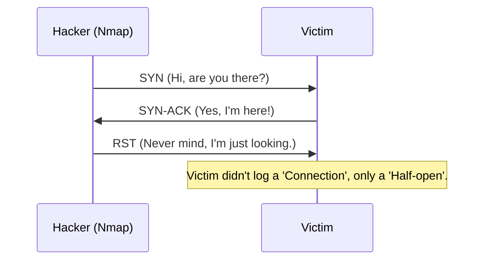

# Network Scanning and Enumeration (Nmap)

## 1. Beginner-friendly Hinglish Explanation 🇮🇳
Bhai, **Network Scanning** hacking ka pehla kadam hai—jaise kisi chori se pehle ghar ki "Recce" (Reconnaissance) karna. 

Aapko pata karna hota hai ki "Network mein kitne computer hain?", "Unmein kaunsi window khuli hai?" (Ports), aur "Andar kaunsa software chal raha hai?" (Services). **Nmap** (Network Mapper) is kaam ka "Godfather" hai. Yeh ek aisa tool hai jo kisi bhi computer par "Knock" karke bata deta hai ki woh computer "Zinda" hai ya nahi aur wahan se hacker ke liye kaunsa rasta khula hai.

---

## 2. Deep Technical Explanation
- **Port States**:
    - **Open**: Service is listening (Target!).
    - **Closed**: Port is reachable but no service.
    - **Filtered**: Firewall is blocking the probe.
- **Scanning Types**:
    - **TCP Connect (`-sT`)**: Completes the 3-way handshake. (Easy to detect).
    - **SYN Scan (`-sS`)**: "Half-open" scan. Sends SYN, gets SYN-ACK, then sends RST. (Stealthy).
    - **UDP Scan (`-sU`)**: Harder because UDP doesn't have handshakes.
- **OS Discovery (`-O`)**: Guessing the OS based on how the TCP stack responds.

---

## 3. Attack Flow Diagrams
**The 'Stealth SYN Scan' (The Ninja Knock):**

---

## 4. Real-world Attack Examples
- **WannaCry (2017)**: Hackers used Nmap-like tools to find computers with Port 445 (SMB) open to the internet and then used the "EternalBlue" exploit to infect millions.
- **Port Knocking**: A defense where a server keeps all ports "Closed" until a hacker sends a "Secret knock" (specific sequence of pings) to open the port.

---

## 5. Defensive Mitigation Strategies
- **Close Unused Ports**: If you don't need a port, close it in the firewall.
- **Intrusion Detection (IDS)**: Tools like **Snort** or **Suricata** that see someone "Scanning" the network and automatically block their IP.
- **Honeypots**: Creating a "Fake" server with open ports to trick hackers and record their activity.

---

## 6. Failure Cases
- **IDS Blocking**: If you scan too fast, the firewall will block you instantly. (Use `-T1` or `-T2` for slow/stealth scanning).
- **Inaccurate Versioning**: Nmap might guess the wrong software version if the server is configured to "Lie" (Banner Grabbing).

---

## 7. Debugging and Investigation Guide
- **`nmap -sn 192.168.1.0/24`**: Finding all "Live" IPs in a network.
- **`nmap -sV -p 80,443 target.com`**: Checking the exact version of the web server.
- **`nmap --script vuln target.com`**: Using Nmap Scripts (NSE) to automatically find common bugs.

---

| Metric | Simple Ping | Nmap Scan |
|---|---|---|
| Info Provided | "Is it alive?" | Ports, OS, Services, Vulnerabilities |
| Speed | Instant | Seconds to Minutes |
| Detection Risk | Low | High |

---

## 9. Security Best Practices
- **Regular Internal Scans**: Scan your own network every week to see if a developer accidentally opened a new, insecure port.
- **Banner Grabbing Defense**: Configure your servers to NOT show their version (e.g., change "Apache 2.4.5" to just "Web Server").

---

## 10. Production Hardening Techniques
- **Zero-Trust**: Not trusting anyone just because they are "Inside" the network. Every connection must be authenticated.
- **Dynamic Firewalls**: Firewalls that change rules based on the user's behavior.

---

## 11. Monitoring and Logging Considerations
- **'Port Scanning' Alerts**: Your SIEM should alert you if a single IP address tries to "Touch" 1,000 different ports in 10 seconds.

---

## 12. Common Mistakes
- **Scanning without Permission**: In many countries, even a simple Nmap scan on a company you don't work for can be considered a criminal act.
- **Assuming 'Filtered = Safe'**: A filtered port means there's a firewall, but the service behind it might still be vulnerable if you can find a way to bypass the filter.

---

## 13. Compliance Implications
- **PCI-DSS**: Specifically requires regular "Network Discovery" and "Vulnerability Scanning" to ensure no new unauthorized devices are connected.

---

## 14. Interview Questions
1. What is a 'SYN Scan' and why is it called 'Stealthy'?
2. What are 'NSE' scripts in Nmap?
3. How do you find the Operating System of a remote target using Nmap?

---

## 15. Latest 2026 Security Patterns and Threats
- **Zmap / Masscan**: Tools that can scan the *entire internet* in under 1 hour.
- **AI-Native Nmap**: Tools that use AI to predict which ports are likely open based on the company's tech stack.
- **IPv6 Scanning Challenges**: Since IPv6 has 2^128 addresses, old-school "Sequential" scanning is impossible. Hackers are using "Target Prediction" algorithms.
	
