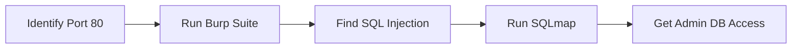

# 🛡️ Penetration Testing: The Ethical Hacking Basics (Security Guide)
> **Level:** Beginner → Expert | **Goal:** Master Reconnaissance, Scanning, and Exploitation Basics (Hinglish)

---

## 📋 Is Guide Se Kya Seekhoge

| Topic | Importance |
|-------|------------|
| 1. What is Pen Testing? | Ethical vs Malicious Hacking |
| 2. The 5 Phases | Recon, Scan, Exploit, Maintain, Reports |
| 3. Network Reconnaissance | Gathering info (Nmap) |
| 4. Vulnerability Scanning | Automatic tools (Nessus/OpenVAS) |
| 5. Exploitation Basics | Gaining access |
| 6. Reporting & Fixes | Secure documentation |

---

## 1. 🏗️ What is Pen Testing?

Penetration Testing (Ethical Hacking) ka matlab hai **Aapni hi app par attack karke weakness dhundna** taki hacker se pehle use fix kiya ja sake.

- **Vulnerability Assessment (VA):** Sirf kamiyan list karna.
- **Penetration Testing (PT):** Un kamiyon ko use karke system mein dakhil hona.

---

## 🏁 2. The 5 Phases of Pen Testing

1. **Reconnaissance (Footprinting):** System ki jankari (IP, Domain, Employee info) nikalna.
2. **Scanning (Enumeration):** Ports, Services, Vulnerabilities check karna.
3. **Exploitation (Gaining Access):** System mein dakhil hona (SQL Injection, Brute-force).
4. **Maintaining Access:** Persistence banana (Backdoor) login credentials ke baad.
5. **Analysis & Reporting:** Poora report banakar fix suggest karna.

---

## 🕵️ 3. Phase 1 & 2: Recon & Scanning

Sabse popular tool **Nmap** hai.

```bash
# Terminal command service detection
# nmap -sV 192.168.1.1 # Version detection scan
# nmap -p 80,443,8000 domain.com # Targeted port scan logic
```

---

## 💣 4. Phase 3: Exploitation Tools

AI models ke liye exploitation usually **Weights substitution** ya **Prompt Injection** hota hai. General apps mein:

- **Metasploit:** Known exploits ki library.
- **Burp Suite:** Web traffic intercept aur proxy security check.
- **John the Ripper:** Password cracking.



---

## 🛡️ 5. Red Team vs Blue Team

- **Red Team:** Attackers (Pen testers). Inka kaam hai todna.
- **Blue Team:** Defenders (SOC analysts). Inka kaam hai detector lagana aur block karna.
- **Purple Team:** Dono milkar security improve karte hain strategy discussions se.

---

## 📝 6. Writing the Report (Critical!)

Ek achha report isme divide hota hai:
1. **Executive Summary:** Boss ke liye (Low risk vs High risk).
2. **Technical Details:** Developer ke liye (Steps to reproduce).
3. **Remediation:** Kya change karein code mein (Risk fix).

---

## 🧪 Exercises — Hacking Scenarios!

### Challenge 1: The Port 21 Alert! ⭐⭐
**Scenario:** Aapne Nmap chalaya aur dekha ki base server ka Port 21 (FTP) open hai but user login anonymous enabled hai. 
Question: Is vulnerability ka impact kya hai aur fix kya hoga?
<details><summary>Answer</summary>
Hacker **Anonymous Login** se server ki internal files download/upload kar sakta hai. Fix: Anonymous FTP access disable karein aur SSH/SFTP (Port 22) secure access use karein password rotation ke saath.
</details>

---

## 🔗 Resources
- [TryHackMe (Learn by playing labs)](https://tryhackme.com/)
- [Hack The Box (Advanced Hacking labs)](https://www.hackthebox.com/)
- [Metasploit Unleashed (Free Course)](https://www.offsec.com/metasploit-unleashed/)
