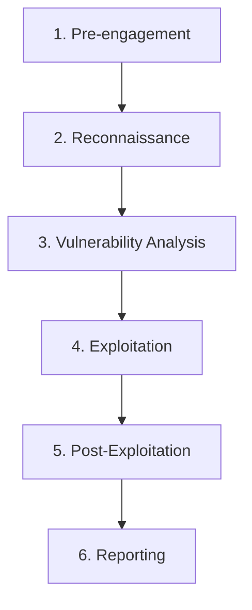

# Pentesting Methodologies: Hacking with a Plan

## 1. Beginner-friendly Hinglish Explanation 🇮🇳
Bhai, **Pentesting Methodologies** ka matlab hai "Hacking karne ka ek professional aur systematic tareeka." 

Hacking sirf random commands run karna nahi hai. Yeh ek process hai, jaise ek doctor patient ko check karta hai. Pehle history poonchna (Recon), phir test karvana (Scanning), phir bimari dhundna (Vulnerability Analysis), aur phir treatment karna (Exploitation). Bina sahi methodology ke, tum zaruri cheezein miss kar doge aur client ko adhuri report doge. Is module mein hum seekhenge industry-standard frameworks jaise OWASP aur PTES.

---

## 2. Deep Technical Explanation
Standard Pentesting Methodologies provide a roadmap for ethical hackers:
- **PTES (Penetration Testing Execution Standard)**: The most comprehensive standard covering 7 stages: Pre-engagement, Intelligence Gathering, Threat Modeling, Vulnerability Analysis, Exploitation, Post-Exploitation, and Reporting.
- **OWASP WSTG (Web Security Testing Guide)**: Specifically for web apps, it covers 11 categories of testing (Auth, Session, Input Validation, etc.).
- **OSSTMM (Open Source Security Testing Methodology Manual)**: Focuses on the "Operational" security and facts of the environment.
- **NIST SP 800-115**: The US government's standard for technical security testing.

---

## 3. Attack Flow Diagrams
**The PTES Lifecycle:**

---

## 4. Real-world Attack Examples
- **Bug Bounty Hunters**: Most successful hunters (like those on HackerOne) have their own "Methodology" or "Checklist." They don't just wander around; they systematically test every parameter and every endpoint.
- **Red Team Engagements**: When a Red Team attacks a corporation, they follow a methodology to ensure they remain "Stealthy" and achieve their objective (e.g., getting the CEO's emails) without being caught by the SOC.

---

## 5. Defensive Mitigation Strategies
- **Engagement Scoping**: Defining exactly what the pentester can and cannot touch (e.g., "Don't touch the production database during business hours").
- **Rules of Engagement (RoE)**: A document that describes how the test will be performed and what tools are allowed.

---

## 6. Failure Cases
- **Skipping the Recon phase**: Jumping straight to exploitation without understanding the target often leads to "Noise" that gets you blocked by a firewall immediately.
- **No Documentation**: If a pentester finds a bug but can't explain how they found it, the developers won't be able to fix it.

---

## 7. Debugging and Investigation Guide
- **Engagement Management Tools**: Using tools like **Dradis** or **Klarity** to track findings in real-time as a team.
- **Burp Suite Project Files**: Saving the state of your manual testing so you can resume later.

---

## 8. Tradeoffs
| Methodology | Specialization | Complexity |
|---|---|---|
| OWASP | Web Apps | High |
| PTES | General Pentest | Medium |
| NIST | Compliance/Gov | High |

---

## 9. Security Best Practices
- **Always get written permission (LOA)**: The "Letter of Authorization" is your only defense against being arrested for hacking.
- **Continuous Learning**: Methodologies change as technology changes (e.g., Cloud pentesting vs. Network pentesting).

---

## 10. Production Hardening Techniques
- **Purple Teaming**: An engagement where the Attackers (Red) and Defenders (Blue) work together in real-time to test and improve the security of the app.

---

## 11. Monitoring and Logging Considerations
- **Whitelist the Pentest IP**: Usually, we DON'T whitelist the pentester because we want to test our detection, but sometimes we do it to test the application logic more deeply.

---

## 12. Common Mistakes
- **Treating a Pentest as a Vulnerability Scan**: A scan is automated; a pentest is manual and looks for logic flaws that tools can't see.
- **Missing the "Cleanup" phase**: Leaving "Backdoors" or "Webshells" on the client's server after the test is finished.

---

## 13. Compliance Implications
- **PCI-DSS Requirement 11.3**: Mandates that an annual penetration test must be conducted using a "Standardized Methodology."

---

## 14. Interview Questions
1. Explain the difference between a Black Box, White Box, and Grey Box pentest.
2. What are the 7 stages of the PTES framework?
3. Why is "Post-Exploitation" important in a professional pentest?

---

## 15. Latest 2026 Security Patterns and Threats
- **Breach and Attack Simulation (BAS)**: Using automated bots that follow these methodologies 24/7 to find holes before a human does.
- **AI Red Teaming Frameworks**: New methodologies developed specifically to test AI/LLM applications for jailbreaks and data poisoning.
- **Shift-Left Pentesting**: Integrating tiny "Mini-pentests" into the development phase of a specific feature.
