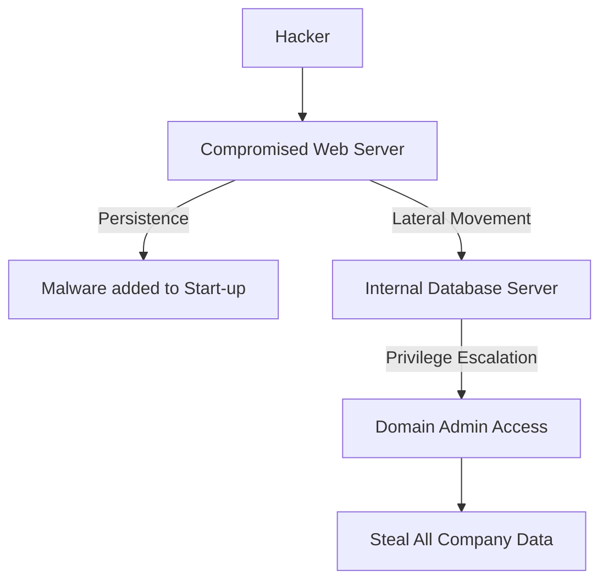

# Post-Exploitation and Persistence: Staying in the System

## 1. Beginner-friendly Hinglish Explanation 🇮🇳
Bhai, **Post-Exploitation** ka matlab hai "Andar ghusne ke baad kya karein?" aur **Persistence** ka matlab hai "Wapas kaise aayein?"

Ek baar hacker ko system ka access mil gaya, toh uska kaam khatam nahi hota. Woh sabse pehle apni "Power" badhata hai (Privilege Escalation), phir dusre computers par koodta hai (Lateral Movement), aur end mein ek "Chorni darwaza" (Backdoor) bana deta hai taaki agar admin server restart bhi kar de, toh hacker wapas aa sake. Yeh phase sabse zyada "Chori" (Data Exfiltration) wala phase hota hai.

---

## 2. Deep Technical Explanation
Post-exploitation is what happens after a successful breach.
- **Privilege Escalation**: Moving from a low-level user (e.g., `guest`) to a high-level user (e.g., `root` or `SYSTEM`).
- **Lateral Movement**: Moving from one compromised machine to another machine on the same internal network.
- **Persistence**: Ensuring access remains even after a reboot. Techniques include:
    - **Cron Jobs / Scheduled Tasks**: Running the malware every 10 minutes.
    - **Registry Keys**: Windows-specific way to start programs on boot.
    - **Web Shells**: Hidden files on a web server that act as a backdoor.
- **Pivoting**: Using a compromised machine as a "Bridge" to talk to a hidden internal network.

---

## 3. Attack Flow Diagrams
**Lateral Movement & Persistence:**

---

## 4. Real-world Attack Examples
- **Stuxnet**: Used advanced persistence techniques to hide inside PLC controllers for years, surviving updates and reboots.
- **APT (Advanced Persistent Threats)**: Groups like APT28 often stay inside a government network for 6+ months without being detected, moving silently from one PC to another.

---

## 5. Defensive Mitigation Strategies
- **EDR (Endpoint Detection & Response)**: Tools like **SentinelOne** or **CrowdStrike** that watch for "Suspicious Behavior" (e.g., a text editor suddenly trying to change a Registry Key).
- **Network Segmentation**: Putting "Walls" between different parts of the company so a hacker can't "Pivot" from the Guest Wi-Fi to the Database.
- **MFA for Internal Tools**: Even if a hacker has a password, they can't log in without the second factor.

---

## 6. Failure Cases
- **Detection during Lateral Movement**: Many hackers get caught here because internal network traffic is easier to monitor than external traffic.
- **Leaving "Footprints"**: Forgetting to delete the malware files or log entries, allowing the Blue Team to see exactly what happened.

---

## 7. Debugging and Investigation Guide
- **Mimikatz**: A tool used to dump passwords from the memory of a Windows machine.
- **BloodHound**: A tool that uses "Graph Theory" to find the shortest path to becoming a Domain Admin.
- **LinPEAS / WinPEAS**: Automated scripts that find 100+ ways to escalate privileges on a local machine.

---

## 8. Tradeoffs
| Technique | Stealth | Reliability |
|---|---|---|
| Web Shell | High | Low (Easily deleted) |
| Registry Key | Medium | High |
| Kernel Rootkit | Very High | Very Low (Can crash system) |

---

## 9. Security Best Practices
- **Least Privilege Architecture**: Nobody should be an "Admin" on their daily-use laptop.
- **Clean Source of Truth**: Periodically wipe and redeploy servers from a "Gold Image" to kill any hidden persistence.

---

## 10. Production Hardening Techniques
- **File Integrity Monitoring (FIM)**: Alerts you if a system file (like `/etc/passwd`) is modified by anyone.
- **Just-In-Time (JIT) Access**: Admins only get "Admin" rights for 1 hour when they need to do work; the rest of the time, they are normal users.

---

## 11. Monitoring and Logging Considerations
- **Event ID 4624 (Windows)**: Successful login logs. Very useful for spotting "Impossible Travel" (a user logging in from NY and London at the same time).
- **Netflow Logs**: Monitoring "East-West" traffic (traffic moving inside your network).

---

## 12. Common Mistakes
- **Assuming "Inside" is Safe**: Many companies spend millions on the "Perimeter" (Firewall) but have zero security for their internal servers.
- **Using the same password for all servers**: If one server is hacked, the hacker can use that password to log into every other server (Pass-the-Hash).

---

## 13. Compliance Implications
- **HIPAA / GDPR**: A breach is defined not just by "Access" but by "Persistence." If a hacker is inside for 30 days, the legal fines are much higher.

---

## 14. Interview Questions
1. What is the difference between Privilege Escalation and Lateral Movement?
2. How does a hacker maintain "Persistence" on a Linux server?
3. What is "Pivoting" and why is it used?

---

## 15. Latest 2026 Security Patterns and Threats
- **Living off the Land (LotL)**: Hackers using official tools (like PowerShell or Python) already on the server to stay hidden, instead of uploading their own malware.
- **In-Memory Only Malware**: Malware that never touches the "Hard Drive," making it invisible to traditional Anti-Virus.
- **Cloud Persistence**: Creating a hidden "User" or "API Key" in the AWS IAM settings to stay in the cloud forever.
