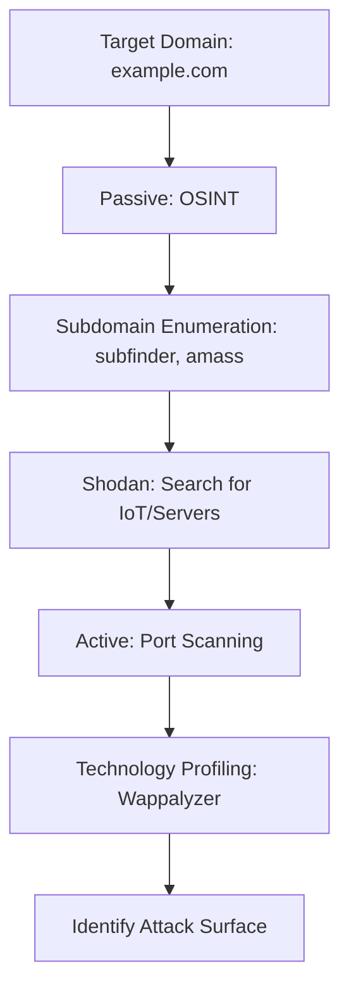

# Reconnaissance and Footprinting: The Art of Information Gathering

## 1. Beginner-friendly Hinglish Explanation 🇮🇳
Bhai, **Reconnaissance** (ya simply Recon) ka matlab hai "Target ke baare mein jaankari ikhatta karna." 

Jaise chori karne se pehle chor ghar ki "Raikii" (Recce) karta hai—kitne log hain, CCTV kahan hai, kutta hai ya nahi—waise hi ek hacker attack se pehle app ki jaankari nikalta hai. "Kaunsa server chal raha hai? Kaunse employees LinkedIn par active hain? Kya unka koi purana code GitHub par khula pada hai?" Jitna zyada Recon, utna hi asaan Attack. Hacker apna 70% time isi kaam mein lagate hain.

---

## 2. Deep Technical Explanation
Recon is divided into two main types:
1. **Passive Recon**: Gathering information without directly interacting with the target. (e.g., searching Google, LinkedIn, WHOIS). It is undetectable.
2. **Active Recon**: Directly interacting with the target's servers. (e.g., pinging, port scanning, visiting the website). This can be detected by firewalls.

Key areas of focus:
- **Network Footprinting**: Finding IP ranges, subdomains, and DNS records.
- **Organization Footprinting**: Finding employee names, email patterns, and job postings (which reveal technology stacks).
- **Technical Footprinting**: Finding OS versions, web server types, and open ports.

---

## 3. Attack Flow Diagrams
**The Recon Pipeline:**

---

## 4. Real-world Attack Examples
- **Capital One Breach**: The attacker found a misconfigured server by scanning the public IP ranges of AWS. This "Active Recon" found the "Open Door."
- **Social Engineering via Recon**: A hacker finds a new employee on LinkedIn, sees they are a "Junior Dev," and sends them a fake "Onboarding PDF" that contains malware.

---

## 5. Defensive Mitigation Strategies
- **Attack Surface Management (ASM)**: Tools that continuously scan your own company just like a hacker would, alerting you to new "Open Doors."
- **Whois Privacy**: Hiding the contact details of the domain owner.
- **Strict Social Media Policies**: Educating employees not to post photos of their ID cards or office desks on Instagram.

---

## 6. Failure Cases
- **Leaked GitHub Secrets**: A developer commits code with an API key to a public repository. Recon tools like `truffleHog` find this in seconds.
- **Shadow IT**: An employee creates a "Test Server" in the cloud and forgets about it. It becomes a perfect entry point for hackers.

---

## 7. Debugging and Investigation Guide
- **theHarvester**: A tool to find emails, subdomains, and hostnames from public sources.
- **SpiderFoot**: A massive automation tool for OSINT (Open Source Intelligence).

---

## 8. Tradeoffs
| Method | Detectability | Detail |
|---|---|---|
| Passive (OSINT) | Zero | Low/Medium |
| Active (Scanning) | High | Very High |

---

## 9. Security Best Practices
- **Periodic Self-Recon**: Perform a "Google Search" and "GitHub Search" for your own company name every month to see what's leaked.
- **Monitor Subdomains**: Use tools like `crt.sh` to see every SSL certificate issued for your domain.

---

## 10. Production Hardening Techniques
- **Deceptive Tech**: Using "Honeypots" (fake servers) to detect when a hacker is performing Active Recon on your network.
- **Security.txt**: Creating a `/security.txt` file on your website to tell ethical hackers how to report vulnerabilities they find during their recon.

---

## 11. Monitoring and Logging Considerations
- **Threat Intelligence Feeds**: Subscribing to feeds that tell you about new malicious IPs that are currently scanning the internet.
- **DNS Monitoring**: Alerting on any new subdomains created for your organization.

---

## 12. Common Mistakes
- **Assuming "Nobody is looking"**: Hackers use automated bots that scan the entire internet (0.0.0.0 to 255.255.255.255) every single day.
- **Forgetting "Dev" Subdomains**: `dev.app.example.com` is often much less secure than `www.example.com`.

---

## 13. Compliance Implications
- **GDPR**: Recon can sometimes reveal PII (Personally Identifiable Information) about employees that should be protected.

---

## 14. Interview Questions
1. What is the difference between Active and Passive Reconnaissance?
2. How do you find subdomains of a target organization?
3. What is OSINT and why is it useful for a pentester?

---

## 15. Latest 2026 Security Patterns and Threats
- **AI-Driven OSINT**: AI tools that can crawl the web and build a "Psychological Profile" of a target employee in seconds for phishing.
- **Cloud-Bucket Hunting**: Automated scanning for "Misconfigured S3 Buckets" across the entire cloud provider's IP space.
- **Graph-Based Recon**: Using tools like **Maltego** to visualize the massive connections between IPs, domains, and people.
