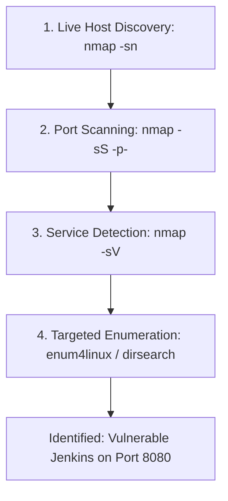

# Scanning and Enumeration: Finding the Cracks

## 1. Beginner-friendly Hinglish Explanation 🇮🇳
Bhai, **Scanning and Enumeration** ka matlab hai "Deewar par hath maar kar dekhna ki kahan se kh खोkhli (Hollow) hai." 

Recon mein humne sirf ghar ko bahar se dekha tha. Scanning mein hum "Ghar ke darwaze" (Ports) khat-khatate (Knock) hain yeh dekhne ke liye ki kaunsa khula hai. "Kya Port 80 khula hai? Kya wahan ek purana web server chal raha hai?" **Enumeration** usse bhi ek step aage hai—hum un "Khule darwazo" ke andar jhaank kar dekhte hain ki "Andar kaun baitha hai? Kya user 'admin' hai? Kya system version purana hai?" Yeh woh phase hai jahan humein asli "Target" milta hai attack ke liye.

---

## 2. Deep Technical Explanation
Scanning and Enumeration involves deeper interaction with the target to gather specific details.
- **Port Scanning**: Identifying open ports (TCP/UDP) on a target IP.
- **Service Discovery**: Identifying what application is running on that port (e.g., Apache 2.4.49).
- **Banner Grabbing**: Reading the welcome message or "Header" sent by a service.
- **Vulnerability Scanning**: Automatically checking if the discovered versions have known exploits (CVEs).
- **Enumeration Types**: 
    - **SNMP Enumeration**: Finding network device details.
    - **SMB Enumeration**: Finding shared folders and users on Windows.
    - **DNS Enumeration**: Finding all hostnames and internal IP addresses.

---

## 3. Attack Flow Diagrams
**Scanning to Enumeration Workflow:**

---

## 4. Real-world Attack Examples
- **WannaCry (SMB Enumeration)**: The malware scanned the internet for Port 445 (SMB). If it was open, it enumerated the version to see if it was vulnerable to "EternalBlue."
- **Directory Brute-forcing**: A hacker scans a website and finds a hidden folder `/admin/backup.sql` using a tool like `gobuster`. This is "Web Enumeration."

---

## 5. Defensive Mitigation Strategies
- **Firewall Filtering**: Close all ports except the ones absolutely necessary (e.g., only 80 and 443).
- **Disable Banner Grabbing**: Configure your server NOT to show its version number in the HTTP headers (e.g., `Server: Apache` instead of `Server: Apache/2.4.49`).
- **IPS (Intrusion Prevention System)**: Automatically block any IP that tries to scan 100 ports in 1 second.

---

## 6. Failure Cases
- **"Loud" Scanning**: Running a heavy scan that crashes the server or triggers every alarm in the building.
- **Stale Data**: Scanning once and assuming the results stay the same forever. Servers change, ports open/close.

---

## 7. Debugging and Investigation Guide
- **Nmap**: The king of scanning tools. `nmap -A -T4 target.com`.
- **Netcat (nc)**: The "Swiss Army Knife" for manual banner grabbing.
- **Nikto**: A dedicated scanner for web server misconfigurations.

---

## 8. Tradeoffs
| Scan Type | Stealth | Accuracy |
|---|---|---|
| Connect Scan (-sT) | Low | High |
| Stealth SYN Scan (-sS) | High | High |
| UDP Scan (-sU) | Medium | Low (Unreliable) |

---

## 9. Security Best Practices
- **Regular Internal Scanning**: Scan your own network every week to find "Rogue" devices or new open ports.
- **Egress Filtering**: Control not just who comes "In," but also which servers can talk "Out" (prevents a hacked server from calling home).

---

## 10. Production Hardening Techniques
- **Port Knocking**: Keeping all ports "Closed" until a specific sequence of "Knocks" (pings to specific ports) is received.
- **Honey-Ports**: Opening a fake port that, if touched, immediately blacklists the attacker's IP.

---

## 11. Monitoring and Logging Considerations
- **SIEM Alerts**: Creating a rule: "If more than 10 closed ports are touched by a single IP within 1 minute, trigger an alert."

---

## 12. Common Mistakes
- **Scanning without a Scope**: Accidentally scanning a printer or a medical device and causing it to stop working.
- **Trusting the "Default" Port**: Thinking that because Port 80 is closed, there's no web server (it might be running on 8080 or 8888).

---

## 13. Compliance Implications
- **PCI-DSS**: Requires "Quarterly External Vulnerability Scans" by an Approved Scanning Vendor (ASV).

---

## 14. Interview Questions
1. What is the difference between a TCP SYN scan and a TCP Connect scan?
2. How do you enumerate users on a Windows machine via SMB?
3. What is "Banner Grabbing" and how can it be prevented?

---

## 15. Latest 2026 Security Patterns and Threats
- **ZMap & Masscan**: Tools that can scan the *entire internet* in under 45 minutes. Speed is now the attacker's biggest advantage.
- **Cloud-Native Enumeration**: Using specialized tools to enumerate "Serverless" functions and "Cloud Metadata Services" (IMDS).
- **Invisible Scanning**: Using botnets to spread the scan over thousands of different IPs, making it impossible to block a "Single" scanner.
