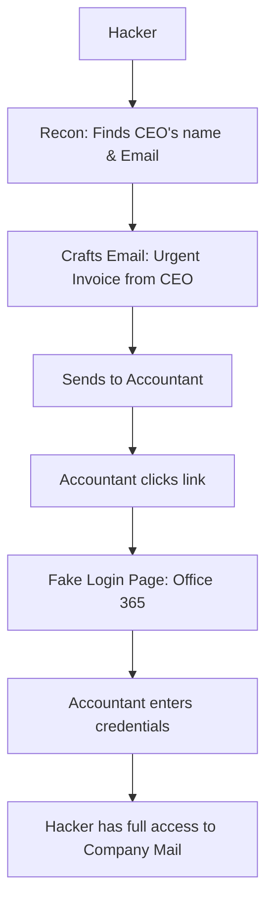

# Social Engineering and Phishing: Hacking the Human

## 1. Beginner-friendly Hinglish Explanation 🇮🇳
Bhai, **Social Engineering** ka matlab hai "Computer ki jagah insan ko hack karna." 

Duniya ka sabse mahanga firewall bhi fail ho jata hai agar koi employee galti se hacker ko apna password phone par bata de. Hacker dosti karke, darakar (Fear), ya lalach (Greed) dekar aapse info nikalwa lete hain. **Phishing** iska sabse bada part hai—yani nakli emails bhejkar aapko link par click karwana. Yaad rakho: "Hardware ko patch karna asaan hai, lekin dimaag (Wetware) ko patch karna mushkil."

---

## 2. Deep Technical Explanation
Social engineering exploits human psychology rather than technical flaws.
- **Phishing**: Sending broad, generic emails to thousands of people.
- **Spear Phishing**: Targeted attacks against a specific person or company.
- **Whaling**: Targeting high-level executives (CEOs, CFOs).
- **Vishing**: Voice phishing (phone calls).
- **Smishing**: SMS phishing (text messages).
- **Pretexting**: Creating a fabricated scenario (e.g., "I'm from the IT helpdesk, we have a server emergency").
- **Baiting**: Leaving a malware-infected USB drive in a parking lot.

---

## 3. Attack Flow Diagrams
**The Phishing Lifecycle:**

---

## 4. Real-world Attack Examples
- **Twitter Breach (2020)**: Hackers used "Vishing" (phone calls) to trick Twitter employees into giving up their internal admin tools. They then hijacked accounts like Elon Musk and Barack Obama for a Bitcoin scam.
- **Uber Breach (2022)**: A teenager used "MFA Fatigue"—sending hundreds of login prompts to an employee's phone until they finally clicked "Approve" just to make it stop.

---

## 5. Defensive Mitigation Strategies
- **MFA (Multi-Factor Authentication)**: Even if the hacker gets the password, they can't get the 2nd code.
- **Security Awareness Training**: Teaching employees to check the "Sender" email address and not click suspicious links.
- **Email Sandboxing**: Tools like **Mimecast** or **Proofpoint** that "Click" the link in a virtual machine first to see if it's malicious.

---

## 6. Failure Cases
- **MFA Fatigue**: Users clicking "Yes" on their phone without thinking because they are busy.
- **Look-alike Domains**: Using `g00gle.com` instead of `google.com`. A busy human eye often misses this.

---

## 7. Debugging and Investigation Guide
- **Gophish**: An open-source toolkit for running "Fake" phishing campaigns to test your own employees.
- **Email Header Analysis**: Looking at the `Received` headers to see where the email *actually* came from.

---

## 8. Tradeoffs
| Metric | Technical Exploit | Social Engineering |
|---|---|---|
| Reliability | Variable (Patches) | High (Humans are humans) |
| Stealth | High | Low (People talk) |
| Cost | High | Low |

---

## 9. Security Best Practices
- **"Trust but Verify"**: If the CEO asks for a bank transfer via email, call them on their known phone number to confirm.
- **FIDO2 / Security Keys**: Using physical keys (like Yubikey) which are immune to phishing.

---

## 10. Production Hardening Techniques
- **External Email Warning**: Adding a big red banner to any email coming from outside the company: "[EXTERNAL EMAIL: BE CAREFUL]".
- **DMARC/SPF/DKIM**: Email protocols that make it harder for hackers to "Spoof" your company's domain.

---

## 11. Monitoring and Logging Considerations
- **Failed Login Spikes**: Monitoring for a sudden increase in failed logins from different parts of the world.
- **Reported Emails**: A "Phish" button in Outlook/Gmail so employees can instantly alert the security team.

---

## 12. Common Mistakes
- **Shaming Employees**: If an employee falls for a test phish, don't punish them—train them. If you punish them, they will hide real attacks in the future.
- **Thinking "I'm too smart to be hacked"**: Everyone can be tricked given the right amount of stress or the right context.

---

## 13. Compliance Implications
- **SOC2 / HIPAA**: Requires documented proof of annual security awareness training for all employees with access to data.

---

## 14. Interview Questions
1. What is the difference between Phishing and Spear Phishing?
2. What is "MFA Fatigue" and how do you prevent it?
3. How would you handle a situation where a high-level executive's email is compromised?

---

## 15. Latest 2026 Security Patterns and Threats
- **AI Deepfakes (Vishing)**: Hackers using AI to perfectly mimic the voice of a CEO or a manager during a phone call.
- **QR Code Phishing (Quishing)**: Hiding malicious links in QR codes on posters or in emails, which bypass most email scanners.
- **Browser-in-the-Browser (BitB)**: Creating a fake "Pop-up window" that looks exactly like a real Chrome/Windows login box inside a webpage.
