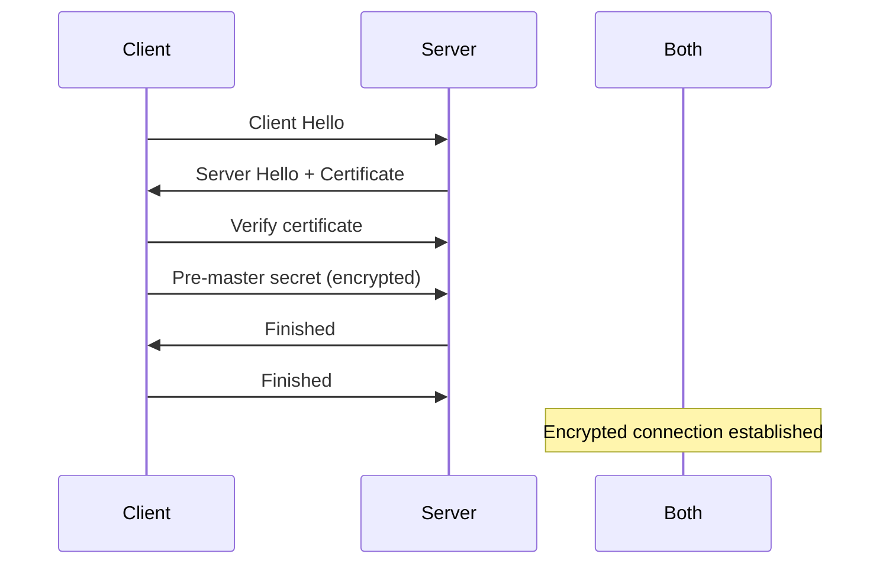

# 🔐 Cryptography Beginner Guide
> **Level:** Beginner → Intermediate | **Language:** Hinglish | **Goal:** Master PKI, TLS, encryption

---

## 🧭 Core Concepts (Concept-First)

- Symmetric: AES
- Asymmetric: RSA, ECC
- Hashing: SHA-256
- PKI: Certificates
- TLS: Handshake

---

## 1. 🔒 Symmetric Encryption

```python
from cryptography.fernet import Fernet

# Generate key
key = Fernet.generate_key()
cipher = Fernet(key)

# Encrypt
message = b"Secret message"
encrypted = cipher.encrypt(message)
print(encrypted)

# Decrypt
decrypted = cipher.decrypt(encrypted)
print(decrypted)  # b'Secret message'
```

---

## 2. 🔑 Asymmetric Encryption (RSA)

```python
from cryptography.hazmat.primitives.asymmetric import rsa
from cryptography.hazmat.primitives import serialization

# Generate key pair
private_key = rsa.generate_private_key(
    public_exponent=65537,
    key_size=2048
)
public_key = private_key.public_key()

# Encrypt with public key
from cryptography.hazmat.primitives import hashes
from cryptography.hazmat.primitives.asymmetric import padding

message = b"Secret"
encrypted = public_key.encrypt(
    message,
    padding.OAEP(
        mgf=padding.MGF1(algorithm=hashes.SHA256()),
        algorithm=hashes.SHA256()
    )
)

# Decrypt with private key
decrypted = private_key.decrypt(
    encrypted,
    padding.OAEP(
        mgf=padding.MGF1(algorithm=hashes.SHA256()),
        algorithm=hashes.SHA256()
    )
)
```

---

## 3. #️⃣ Hashing

```python
import hashlib

# SHA-256
data = "password123"
hash_value = hashlib.sha256(data.encode()).hexdigest()
print(hash_value)

# SHA-256 with salt
import secrets
salt = secrets.token_hex(16)
salted_hash = hashlib.pbkdf2_hmac(
    'sha256',
    data.encode(),
    salt.encode(),
    100000
)
```

---

## 4. 📜 TLS Handshake



---

## ✅ Checklist

- [ ] Symmetric vs asymmetric samjho
- [ ] TLS handshake explain kar sakte ho
- [ ] Hashing use kar sakte ho
- [ ] Certificates understand kar sakte ho