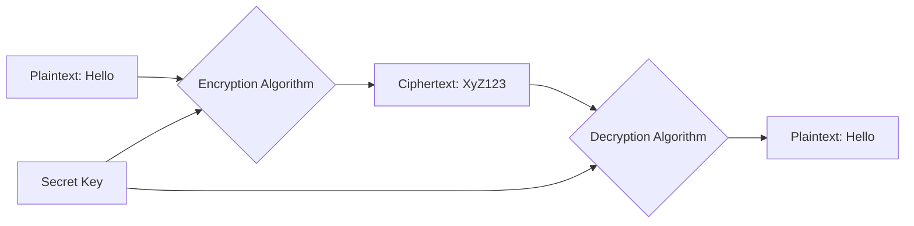

# Introduction to Cryptography: The Science of Secrecy

## 1. Beginner-friendly Hinglish Explanation 🇮🇳
Bhai, **Cryptography** ka matlab hai "Messages ko gupt (Secret) rakhne ki kala." 

Bachpan mein hum "Secret codes" use karte the na, jaise 'A' ki jagah 'B' likhna? Yeh wahi hai, bas super-advanced level par. Aaj ki duniya mein bina cryptography ke internet chal hi nahi sakta. Tumhare bank passwords, WhatsApp messages, aur ATM transactions sab cryptography ki wajah se safe hain. Iska main kaam hai yeh ensure karna ki "Sirf sahi insan message padh sake" (Confidentiality) aur "Raste mein koi message badal na sake" (Integrity).

---

## 2. Deep Technical Explanation
Cryptography is the practice and study of techniques for secure communication in the presence of adversarial behavior.
- **Plaintext**: The original message (e.g., "Hello").
- **Ciphertext**: The encrypted message (e.g., "Gdkkn").
- **Cipher**: The algorithm used for encryption and decryption (e.g., AES, RSA).
- **Key**: A secret piece of information (like a password) used by the cipher to produce a specific ciphertext.
- **Cryptanalysis**: The study of breaking cryptographic systems.

---

## 3. Attack Flow Diagrams
**The Encryption Process:**

---

## 4. Real-world Attack Examples
- **Enigma Machine (WWII)**: The Germans used a complex machine to encrypt military orders. Alan Turing and his team broke it, which is considered a turning point in history and the birth of modern computer science.
- **WEP (Wi-Fi Security)**: The original Wi-Fi encryption was broken because of a "Weak IV" (Initialization Vector). A hacker could crack a Wi-Fi password in minutes.

---

## 5. Defensive Mitigation Strategies
- **Never Roll Your Own Crypto**: Don't try to write your own encryption algorithm. Always use standard, peer-reviewed libraries like **OpenSSL** or **libsodium**.
- **Key Length**: Use long keys. For 2026, AES-256 and RSA-3072/4096 are the minimum recommended standards.
- **Entropy**: Ensure your keys are truly "Random." If a hacker can guess how you generate your keys, they can break the encryption.

---

## 6. Failure Cases
- **Using Obsolete Algorithms**: Using MD5 or SHA-1 for hashing. These are now considered "Broken" because they are too fast and prone to collisions.
- **Exposed Keys**: Storing your encryption keys in the same place as your encrypted data. (Like leaving the key in the lock of a safe).

---

## 7. Debugging and Investigation Guide
- **OpenSSL Command Line**: The "Swiss Army Knife" for testing certificates and encrypting files manually.
- **CyberChef**: A web tool by GCHQ for encoding, decoding, and analyzing various cryptographic formats.

---

## 8. Tradeoffs
| Feature | Security | Performance |
|---|---|---|
| Strong Encryption (AES-256) | High | Slower |
| Weak Encryption (DES) | Zero | Fast |
| No Encryption | Zero | Fastest |

---

## 9. Security Best Practices
- **Encryption at Rest**: Encrypt data on the hard drive.
- **Encryption in Transit**: Encrypt data as it moves over the network (TLS).
- **Salt your Hashes**: Adding random data to passwords before hashing to prevent "Rainbow Table" attacks.

---

## 10. Production Hardening Techniques
- **HSM (Hardware Security Module)**: Using a physical device to store keys so they never even touch the computer's memory.
- **KMS (Key Management Service)**: Using cloud services like AWS KMS to manage the "Life cycle" (Creation, Rotation, Deletion) of your keys.

---

## 11. Monitoring and Logging Considerations
- **Key Usage Logs**: Monitoring "Who used the master key?" and "When?".
- **Certificate Expiry Alerts**: Nothing kills an app faster than an expired SSL certificate.

---

## 12. Common Mistakes
- **Confusing Encoding with Encryption**: `Base64` is NOT encryption. Anyone can decode it in 1 second.
- **Reusing a Nonce/IV**: If you use the same "Initialization Vector" twice with the same key, a hacker can recover the original message.

---

## 13. Compliance Implications
- **FIPS 140-2**: A US government standard that specifies which cryptographic modules are allowed for protecting sensitive data.

---

## 14. Interview Questions
1. What is the difference between Hashing and Encryption?
2. Why is it dangerous to write your own cryptographic algorithm?
3. What is a "Salt" and why do we use it with passwords?

---

## 15. Latest 2026 Security Patterns and Threats
- **Post-Quantum Cryptography (PQC)**: New algorithms designed to be safe even after Quantum Computers are built (e.g., Dilithium, Kyber).
- **Homomorphic Encryption**: A futuristic tech that allows you to "Process" data while it is still encrypted (no need to decrypt it to calculate a sum).
- **Zero-Knowledge Proofs (ZKP)**: Proving you know a secret (like a password) without actually telling the secret to the server.
