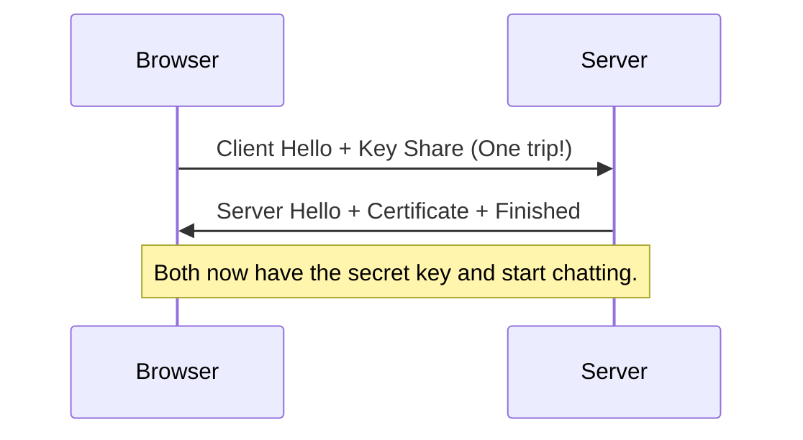

# TLS 1.3 and Secure Communication: The Internet's Shield

## 1. Beginner-friendly Hinglish Explanation 🇮🇳
Bhai, **TLS (Transport Layer Security)** woh "Suraksha Kavach" hai jo internet par aapki baaton ko "Secret" rakhta hai. 

Jab aap kisi website par `https://` dekhte ho, toh uska matlab hai ki aapka browser aur server **TLS** use kar rahe hain. Purane versions (jaise SSL 3.0 ya TLS 1.0) mein bahut saari galtiyan thi jo hackers ko aapki baatein sunne (Eavesdropping) ka mauka deti thi. **TLS 1.3** sabse naya aur "Super-Fast" version hai jo na sirf secure hai, balki purani saari kamzoriyo (Weak ciphers) ko hamesha ke liye khatam kar deta hai.

---

## 2. Deep Technical Explanation
- **TLS Handshake**: The process where a browser and server agree on:
    1. **Version**: Which TLS to use? (1.2 or 1.3).
    2. **Cipher Suite**: Which encryption math to use?
    3. **Authentication**: Verifying the server's certificate.
    4. **Key Exchange**: Creating a shared symmetric key.
- **TLS 1.3 Improvements**:
    - **1-RTT Handshake**: Connects in half the time of TLS 1.2.
    - **Removed Weak Ciphers**: Blocks old, broken math like MD5, RC4, and SHA-1.
    - **PFS by Default**: Every session is unique; stealing one key doesn't unlock others.

---

## 3. Attack Flow Diagrams
**The 'TLS 1.3' Handshake (Speed and Security):**

---

## 4. Real-world Attack Examples
- **POODLE (2014)**: An attack that forced servers to "Downgrade" to the old, broken SSL 3.0 version to steal session cookies. TLS 1.3 prevents this "Downgrade Attack."
- **Heartbleed (2014)**: A bug in the OpenSSL library that allowed hackers to "Peek" into the server's RAM and steal encryption keys and user passwords.

---

## 5. Defensive Mitigation Strategies
- **Disable Old Versions**: Ensure your server only allows TLS 1.2 and 1.3. Block TLS 1.1, 1.0, and all SSL versions.
- **HSTS**: Forces the browser to never even "Try" a non-secure HTTP connection.
- **ALPN**: Allowing the server and browser to negotiate the fastest protocol (like HTTP/3) securely over TLS.

---

## 6. Failure Cases
- **Self-Signed Certificates**: Browsers will block the connection.
- **Cipher Mismatch**: If the browser only knows "Math A" and the server only knows "Math B," the connection will fail.
- **SNI Leakage**: In older TLS, the "Name" of the website you were visiting was sent in plain text, allowing your ISP or Government to track you.

---

## 7. Debugging and Investigation Guide
- **`nmap --script ssl-enum-ciphers -p 443 google.com`**: Checking which TLS versions and ciphers a website supports.
- **SSL Labs (Qualys)**: The best tool for a deep audit of your TLS settings.
- **`openssl s_client -connect google.com:443`**: Connecting to a server via terminal to see its full certificate chain.

---

| Feature | TLS 1.2 | TLS 1.3 |
|---|---|---|
| Handshake Speed | 2 Round Trips | 1 Round Trip |
| Privacy | SNI is plain text | SNI is Encrypted (ECH) |
| Security | Supports weak ciphers | Strict/Secure only |

---

## 9. Security Best Practices
- **Use Let's Encrypt**: Free, automated, and secure certificates for everyone.
- **Monitor for 'Revocation'**: Ensure your server supports **OCSP Stapling** to let browsers know if a certificate has been canceled.

---

## 10. Production Hardening Techniques
- **ECH (Encrypted Client Hello)**: The latest extension for TLS 1.3 that hides even the "Domain Name" you are visiting from anyone watching the network.
- **0-RTT Mode**: Allowing a returning user to send data in the very first packet. (Careful: This has a small "Replay Attack" risk!).

---

## 11. Monitoring and Logging Considerations
- **TLS Version Spikes**: Alerting if suddenly 50% of your traffic is trying to use "TLS 1.0"—this is likely a hacker's bot looking for old vulnerabilities.

---

## 12. Common Mistakes
- **Assuming 'HTTPS = 100% Safe'**: A hacker can have a perfectly valid HTTPS certificate on their *own* phishing site. HTTPS only proves you are talking to "Someone" securely, it doesn't prove that "Someone" is not a criminal.
- **Certificate Expiry**: Not setting up an automated reminder to renew certificates.

---

## 13. Compliance Implications
- **PCI-DSS**: Specifically prohibits the use of TLS 1.0 and 1.1. You must use TLS 1.2+ to pass the audit.

---

## 14. Interview Questions
1. What are the main improvements in TLS 1.3 over 1.2?
2. What is a 'Cipher Suite'?
3. How does 'Perfect Forward Secrecy' (PFS) work?

---

## 15. Latest 2026 Security Patterns and Threats
- **PQ-TLS**: Using "Post-Quantum" math in the TLS handshake to protect against future quantum computers.
- **HTTP/3 (QUIC)**: A new protocol that integrates TLS 1.3 directly into the transport layer for even faster and more secure connections.
- **AI-Native Traffic Inspection**: New firewalls that can "Inspect" encrypted traffic for patterns of malware without actually decrypting the data.
	
